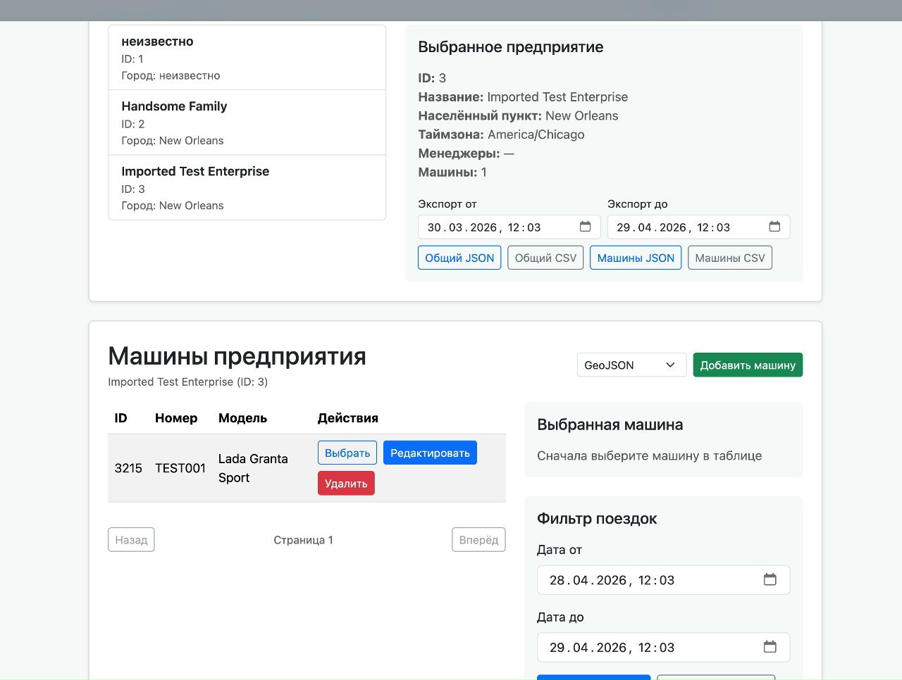
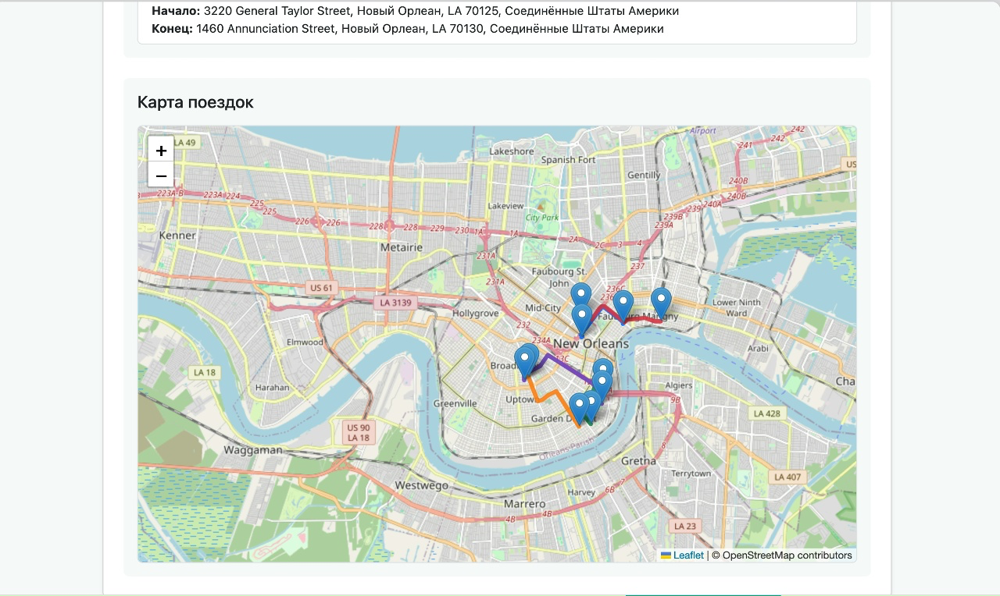
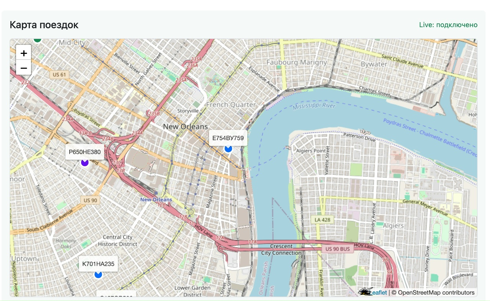

# Auto Parking

Auto Parking — учебный проект сервиса управления автопарком на FastAPI. Проект включает
REST/WebSocket API, статический веб-интерфейс, Telegram-бота, событийное
взаимодействие через Kafka, PostgreSQL/PostGIS, Redis и мониторинг (Prometheus, Grafana, OpenTel).


## Технологический стек

Backend

* Python 3.12
* FastAPI
* SQLAlchemy + Alembic 

Хранение данных

* PostgreSQL
* PostGIS
* Redis

Асинхронная обработка и интеграции

* Apache Kafka

Инфраструктура

* Docker
* Docker Compose

Мониторинг и наблюдаемость

* Prometheus
* OpenTelemetry
* Grafana
* Grafana Tempo

Тестирование

* Pytest — модульное и интеграционное тестирование
* Playwright — end-to-end тестирование
* Locust — нагрузочное тестирование

Интеграцировано с Telegram Bot API.

Версии и зависимости зафиксированы в pyproject и poetry.

## Features 

- управление предприятиями, автомобилями, водителями, поездками и отчётами;
     - 
- импорт и экспорт данных, GPS-треки и live-обновления карты;
     - 
     - 
- доступ c ролями и Telegram-интерфейс;
- уведомления и аудит через отдельные микросервисы;
- метрики, трассировки, дашборды и operational alerts;

## Docker-образы

Образы автоматически собираются и публикуются в GitHub Container Registry при
push в `main` (см. [CI/CD](docs/ci-cd.md)). Все образы публичные — тянутся без логина:

```bash
docker pull ghcr.io/vahdunn/auto-parking/app:latest
docker pull ghcr.io/vahdunn/auto-parking/notification-service:latest
docker pull ghcr.io/vahdunn/auto-parking/audit-service:latest
docker pull ghcr.io/vahdunn/auto-parking/frontend:latest
```

Каждый образ также тегируется по SHA коммита. Список пакетов:
[github.com/VahDunn/auto-parking/pkgs/container](https://github.com/VahDunn?tab=packages&repo_name=auto-parking).

## Карта документации

- [Локальная разработка](docs/development/local-setup.md)
- [Конфигурация](docs/configuration.md)
- [Архитектура](docs/architecture/project-structure.md)
- [Тестирование](docs/testing/README.md)
- [CI](docs/ci-cd.md)
- [Деплой](docs/deployment.md)
- [Мониторинг](docs/monitoring/README.md)
- [Миграции, live-tracking и пр.](docs/operations/README.md)

После запуска API публикует интерактивную OpenAPI-документацию на `/docs`.
Адреса локальных сервисов, команды запуска и проверок намеренно собраны в
руководстве по локальной разработке.

