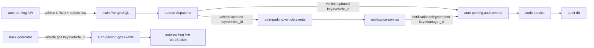
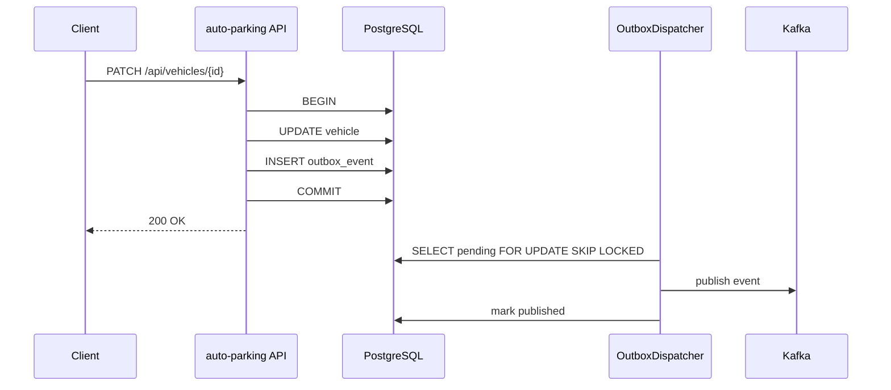

# Kafka в проекте Auto Parking

Этот документ объясняет, как в проекте устроен брокер сообщений Kafka, где лежат настройки, как создаются топики, как работает партиционирование и как Python-код публикует и читает события.

## Коротко

Kafka в проекте используется как event bus между основным приложением и микросервисами.

Сейчас через Kafka идут три потока:

| Топик | Партиции | Ключ | Кто пишет | Кто читает |
| --- | ---: | --- | --- | --- |
| `auto-parking.vehicle.events` | 3 | `vehicle_id` | основной API | `notification-service` |
| `auto-parking.audit.events` | 3 | `entity_id` или другой стабильный id | основной API, `notification-service` | `audit-service` |
| `auto-parking.gps.events` | 6 | `vehicle_id` | генератор live-треков | основной API для live-карты |

Главная идея такая:



Redis в этой схеме не является брокером. Он используется как cache/session registry, например для связи `user_id -> telegram_chat_id` после логина в Telegram-боте.

## Outbox в основном приложении

Для CRUD-событий машин основной API не публикует сообщения в Kafka прямо из HTTP-запроса. Вместо этого используется transactional outbox.

Зачем это нужно:

- машина и событие сохраняются в одной транзакции PostgreSQL;
- если Kafka временно недоступна, HTTP-операция не теряет событие;
- dispatcher позже перечитает pending-записи из `outbox_event` и отправит их в Kafka;
- публикация получается at-least-once, поэтому обработчики должны быть идемпотентными.

Поток выглядит так:



Код:

- модель таблицы: `auto_parking/db/models/outbox_event.py`;
- репозиторий: `auto_parking/repo/outbox.py`;
- dispatcher: `auto_parking/service/outbox.py`;
- подключение в приложении: `auto_parking/main.py`;
- запись событий при CRUD машин: `auto_parking/service/vehicle.py`;
- миграция: `alembic/versions/8d42b0e9f1c3_outbox_events.py`.

Настройки:

```env
OUTBOX_DISPATCHER_ENABLED=true
OUTBOX_DISPATCHER_BATCH_SIZE=100
OUTBOX_DISPATCHER_POLL_INTERVAL_SECONDS=1
OUTBOX_DISPATCHER_RETRY_DELAY_SECONDS=5
OUTBOX_DISPATCHER_MAX_ATTEMPTS=10
```

Если `KAFKA_BOOTSTRAP_SERVERS` не задан, dispatcher не стартует. Это удобно для тестов и локальных запусков без Kafka. В docker-compose Kafka задана, поэтому dispatcher работает.

## Где лежит Kafka

### Docker Compose

Основные настройки Kafka лежат в `docker-compose.yaml`.

Сервис Kafka:

```yaml
kafka:
  image: apache/kafka:3.9.1
  container_name: auto_parking_kafka
  restart: unless-stopped
  environment:
    KAFKA_NODE_ID: "1"
    KAFKA_PROCESS_ROLES: broker,controller
    KAFKA_CONTROLLER_QUORUM_VOTERS: 1@kafka:9093
    KAFKA_LISTENERS: PLAINTEXT://:9092,CONTROLLER://:9093
    KAFKA_ADVERTISED_LISTENERS: PLAINTEXT://kafka:9092
    KAFKA_LISTENER_SECURITY_PROTOCOL_MAP: CONTROLLER:PLAINTEXT,PLAINTEXT:PLAINTEXT
    KAFKA_CONTROLLER_LISTENER_NAMES: CONTROLLER
    KAFKA_AUTO_CREATE_TOPICS_ENABLE: "false"
    KAFKA_OFFSETS_TOPIC_REPLICATION_FACTOR: "1"
    KAFKA_TRANSACTION_STATE_LOG_REPLICATION_FACTOR: "1"
    KAFKA_TRANSACTION_STATE_LOG_MIN_ISR: "1"
    KAFKA_GROUP_INITIAL_REBALANCE_DELAY_MS: "0"
```

Что это значит:

- `apache/kafka:3.9.1` - официальный образ Kafka.
- `KAFKA_PROCESS_ROLES: broker,controller` - Kafka работает в KRaft-режиме, без ZooKeeper. Один контейнер одновременно и брокер, и controller.
- `KAFKA_NODE_ID: "1"` - id единственного узла.
- `KAFKA_LISTENERS` - Kafka слушает порт `9092` для клиентов и `9093` для controller-взаимодействия.
- `KAFKA_ADVERTISED_LISTENERS: PLAINTEXT://kafka:9092` - другим контейнерам Kafka представляется как `kafka:9092`.
- `PLAINTEXT` - без TLS и авторизации. Это нормально для учебного docker-compose, но не для production.
- `KAFKA_AUTO_CREATE_TOPICS_ENABLE: "false"` - топики нельзя создавать случайно при первом publish. Их создает отдельный init-сервис.
- replication factor для служебных топиков равен `1`, потому что брокер один.
- данные Kafka хранятся в volume `kafka_data`.

### Init-сервис

Топики создаются сервисом `kafka-init`:

```yaml
kafka-init:
  build: .
  depends_on:
    kafka:
      condition: service_healthy
  environment:
    KAFKA_BOOTSTRAP_SERVERS: ${KAFKA_BOOTSTRAP_SERVERS:-kafka:9092}
  command: >
    python -m event_bus.init_topics
```

Он запускается после того, как Kafka стала healthy, и выполняет Python-модуль `event_bus.init_topics`.

Зачем это нужно:

- топики создаются явно;
- количество партиций хранится в коде;
- сервисы стартуют только после успешной инициализации топиков;
- если топик уже есть, init-сервис не ломается.

## Где описаны топики

Все топики описаны в одном месте: `event_bus/topics.py`.

```python
VEHICLE_EVENTS_TOPIC = "auto-parking.vehicle.events"
AUDIT_EVENTS_TOPIC = "auto-parking.audit.events"
GPS_EVENTS_TOPIC = "auto-parking.gps.events"

KAFKA_TOPICS = (
    KafkaTopicSpec(
        name=VEHICLE_EVENTS_TOPIC,
        partitions=3,
        replication_factor=1,
        key_description="vehicle_id",
        description="CRUD-события машин для подписчиков бизнес-событий",
    ),
    KafkaTopicSpec(
        name=AUDIT_EVENTS_TOPIC,
        partitions=3,
        replication_factor=1,
        key_description="entity_id, иначе event_id",
        description="Единый поток audit-событий от сервисов проекта",
    ),
    KafkaTopicSpec(
        name=GPS_EVENTS_TOPIC,
        partitions=6,
        replication_factor=1,
        key_description="vehicle_id",
        description="Live GPS-точки генератора треков",
    ),
)
```

Если нужен новый топик, сначала надо добавить его сюда. После этого надо пересобрать образ и запустить `kafka-init`.

## Как создаются топики

Создание топиков реализовано в `event_bus/init_topics.py`.

Алгоритм:

1. Подключиться к Kafka через `AIOKafkaAdminClient`.
2. Прочитать список существующих топиков.
3. Для каждого топика из `KAFKA_TOPICS`:
   - если топика нет, создать его;
   - если топик есть, но партиций меньше, увеличить количество партиций;
   - если партиций больше, ничего не удалять, только вывести warning;
   - если все совпадает, просто залогировать, что топик уже есть.

Важный момент: Kafka не умеет уменьшать количество партиций у существующего топика. Поэтому `kafka-init` может только создать топик или увеличить число партиций.

Команда, которую запускает compose:

```bash
python -m event_bus.init_topics
```

Локально через Docker:

```bash
docker-compose up kafka kafka-init
```

## Что такое топик, партиция и ключ

### Топик

Топик - это именованный поток сообщений. Например:

```text
auto-parking.vehicle.events
```

Можно думать о топике как о журнале событий. Продюсеры пишут в него сообщения, консьюмеры читают.

### Партиция

Партиция - это часть топика. Один топик может быть разбит на несколько партиций.

Зачем нужны партиции:

- больше параллелизма;
- можно читать один топик несколькими consumer instance;
- Kafka хранит порядок сообщений внутри одной партиции.

Важное правило: Kafka гарантирует порядок только внутри одной партиции, не во всем топике.

### Ключ

Ключ сообщения нужен, чтобы Kafka выбрала партицию.

Если сообщения отправляются с одинаковым ключом, Kafka будет класть их в одну и ту же партицию. Это дает порядок для конкретной сущности.

Пример:

```text
vehicle_id = 1 -> partition 0
vehicle_id = 2 -> partition 2
vehicle_id = 3 -> partition 1
```

Поэтому в проекте:

- события одной машины отправляются с ключом `vehicle_id`;
- GPS-точки одной машины отправляются с ключом `vehicle_id`;
- audit-события стараются отправляться с ключом сущности, к которой относятся.

## Почему партиции именно такие

### `auto-parking.vehicle.events`, 3 партиции

Это поток CRUD-событий машин:

- `vehicle.created`
- `vehicle.updated`
- `vehicle.deleted`

Ключ: `vehicle_id`.

Зачем 3 партиции:

- можно параллелить обработку событий по разным машинам;
- события одной машины остаются в правильном порядке;
- для учебного проекта этого достаточно.

### `auto-parking.audit.events`, 3 партиции

Это общий поток audit-событий:

- события от основного API;
- события от `notification-service`;
- в будущем сюда могут писать другие сервисы.

Ключ: обычно `entity_id`, иногда другой стабильный id.

Зачем 3 партиции:

- audit может принимать события от разных сервисов;
- можно масштабировать `audit-service`;
- порядок важен скорее по конкретной сущности, а не по всему потоку.

### `auto-parking.gps.events`, 6 партиций

Это поток live GPS-точек.

Ключ: `vehicle_id`.

Зачем 6 партиций:

- GPS-событий потенциально больше, чем CRUD-событий;
- разные машины можно обрабатывать параллельно;
- точки одной машины остаются в порядке.

## Как Python связан с Kafka

Python-код не работает с `AIOKafkaProducer` и `AIOKafkaConsumer` напрямую из бизнес-логики. Между бизнес-кодом и Kafka есть маленькая библиотека `event_bus`.

Структура:

```text
event_bus/
  contracts.py     # EventEnvelope, EventProducer, EventConsumer
  kafka.py         # реализация через aiokafka
  topics.py        # список топиков и партиций
  init_topics.py   # создание топиков
```

### EventEnvelope

Все события заворачиваются в единый формат `EventEnvelope`.

Он лежит в `event_bus/contracts.py`.

Поля:

```python
event_id: str
event_type: str
version: int
occurred_at: datetime
producer: str
entity: str
entity_id: int | str | None
correlation_id: str | None
payload: dict
```

Пример события:

```json
{
  "event_id": "7f8734fc-a0b2-4ff9-9dae-632e4ebc7d23",
  "event_type": "vehicle.updated",
  "version": 1,
  "occurred_at": "2026-06-26T05:14:48+00:00",
  "producer": "auto-parking-api",
  "entity": "vehicle",
  "entity_id": 1,
  "correlation_id": null,
  "payload": {
    "vehicle_id": 1,
    "vehicle_number": "Е754ВУ759",
    "enterprise_id": 2,
    "manager_user_ids": [2],
    "color": "green"
  }
}
```

`EventEnvelope` умеет сериализоваться в JSON:

```python
event.to_json()
```

И восстанавливаться из JSON:

```python
EventEnvelope.from_json(raw)
```

### EventProducer

Абстракция продюсера:

```python
class EventProducer(Protocol):
    async def publish(
        self,
        topic: str,
        event: EventEnvelope,
        *,
        key: str | None = None,
    ) -> None:
        pass

    async def close(self) -> None:
        pass
```

Реализация Kafka лежит в `event_bus/kafka.py`:

```python
class KafkaEventProducer:
    async def publish(self, topic, event, *, key=None):
        producer = await self._ensure_started()
        await producer.send_and_wait(
            topic,
            event.to_json().encode("utf-8"),
            key=key.encode("utf-8") if key else None,
        )
```

Особенности:

- producer стартует лениво при первом publish;
- используется `send_and_wait`, то есть код ждет подтверждения отправки;
- `acks="all"`, Kafka должна подтвердить запись;
- key кодируется в bytes и передается Kafka.

### EventConsumer

Абстракция консьюмера:

```python
class EventConsumer(Protocol):
    async def subscribe(self, topics: Sequence[str], handler: EventHandler) -> None:
        pass

    async def stop(self) -> None:
        pass
```

Реализация Kafka:

```python
class KafkaEventConsumer:
    async def subscribe(self, topics, handler):
        self._consumer = AIOKafkaConsumer(
            *topics,
            bootstrap_servers=self._bootstrap_servers,
            group_id=self._group_id,
            auto_offset_reset=self._auto_offset_reset,
            enable_auto_commit=False,
        )
        await self._consumer.start()
        async for message in self._consumer:
            event = EventEnvelope.from_json(message.value)
            await handler(event)
            await self._consumer.commit()
```

Особенности:

- `group_id` определяет consumer group;
- `enable_auto_commit=False`, offset коммитится вручную;
- после успешной обработки вызывается `commit`;
- если payload невалидный, сообщение логируется и тоже коммитится;
- если handler упал, offset не коммитится сразу, сообщение может быть обработано повторно.

## Consumer group

Consumer group - это группа читателей одного топика.

Если несколько экземпляров сервиса имеют один `group_id`, Kafka распределяет партиции между ними.

Например, у `notification-service` group id:

```text
auto-parking-notification-service
```

Если запустить 3 экземпляра `notification-service`, Kafka может распределить 3 партиции `auto-parking.vehicle.events` между ними.

У `audit-service` group id:

```text
auto-parking-audit-service
```

Он читает audit topic и пишет события в audit-db.

У live GPS сделано иначе:

```python
group_id=f"auto-parking-gps-live-{os.getpid()}-{uuid4()}"
```

То есть каждый процесс API получает уникальную consumer group. Это сделано специально: live WebSocket-клиенты могут быть подключены к разным worker-процессам, и каждый worker должен видеть весь поток GPS-событий.

## Где создаются producer и consumer

### Основное приложение

Фабрики лежат в `auto_parking/deps/events.py`.

```python
@lru_cache
def get_event_producer() -> EventProducer:
    return KafkaEventProducer(_kafka_bootstrap_servers())

def get_event_consumer(group_id: str, *, auto_offset_reset: str = "earliest") -> EventConsumer:
    return KafkaEventConsumer(
        bootstrap_servers=_kafka_bootstrap_servers(),
        group_id=group_id,
        auto_offset_reset=auto_offset_reset,
    )
```

Bootstrap servers берутся из настройки:

```text
KAFKA_BOOTSTRAP_SERVERS
```

В Docker Compose значение по умолчанию:

```text
kafka:9092
```

### Notification service

Фабрики лежат в `notification_service/integrations/events/factory.py`.

```python
def create_event_producer(settings: Settings) -> EventProducer:
    return KafkaEventProducer(_kafka_bootstrap_servers(settings))

def create_event_consumer(settings: Settings) -> EventConsumer:
    return KafkaEventConsumer(
        bootstrap_servers=_kafka_bootstrap_servers(settings),
        group_id=settings.kafka_notification_consumer_group,
    )
```

`notification-service`:

- читает `auto-parking.vehicle.events`;
- отправляет Telegram-уведомления;
- пишет результат отправки в `auto-parking.audit.events`.

### Audit service

Фабрика лежит в `audit_service/integrations/events/factory.py`.

```python
def create_event_consumer(settings: Settings) -> EventConsumer:
    return KafkaEventConsumer(
        bootstrap_servers=_kafka_bootstrap_servers(settings),
        group_id=settings.kafka_audit_source_consumer_group,
    )
```

`audit-service`:

- читает `auto-parking.audit.events`;
- пишет события в свою БД `audit-db`.

## Реальные потоки событий

### 1. Изменение машины

Когда основной API создает, обновляет или удаляет машину, `VehicleService` публикует событие.

Код находится в `auto_parking/service/vehicle.py`.

```python
event = EventEnvelope.create(
    event_type=event_type,
    producer="auto-parking-api",
    entity="vehicle",
    entity_id=resolved_vehicle_id,
    payload=payload,
)

await self._publish_event(
    topic=self._event_topic,
    event=event,
    key=str(resolved_vehicle_id),
    log_name="vehicle",
)

await self._publish_event(
    topic=self._audit_event_topic,
    event=event,
    key=str(resolved_vehicle_id),
    log_name="audit",
)
```

То есть одно изменение машины уходит в два топика:

- `auto-parking.vehicle.events` - для бизнес-подписчиков;
- `auto-parking.audit.events` - для аудита.

### 2. Telegram notification service

`notification-service` стартует в `notification_service/main.py`.

```python
await consumer.subscribe([VEHICLE_EVENTS_TOPIC], service.handle)
```

Он читает `auto-parking.vehicle.events`, берет из payload список `manager_user_ids`, достает `telegram_chat_id` из Redis и отправляет сообщение в Telegram.

После отправки он публикует audit-событие:

```python
await self._audit_event_producer.publish(
    self._audit_topic,
    event,
    key=str(manager_id),
)
```

### 3. Audit service

`audit-service` стартует в `audit_service/main.py`.

```python
await consumer.subscribe([AUDIT_EVENTS_TOPIC], _handle_event)
```

Каждое событие из audit topic записывается в отдельную audit-db.

### 4. Live GPS

Генератор треков публикует GPS-точки:

```python
await producer.publish(GPS_EVENTS_TOPIC, event, key=str(vehicle_id))
```

Основное приложение слушает `auto-parking.gps.events` и прокидывает точки в WebSocket:

```python
await self._consumer.subscribe([GPS_EVENTS_TOPIC], self.handle_event)
```

Внутри `GpsRealtimeHub` Kafka-события попадают в RxPY `Subject`, проходят pipeline и отправляются клиентам карты.

## Как пользоваться из кода

### Опубликовать событие из основного приложения

```python
from auto_parking.deps.events import get_event_producer
from auto_parking.ports.events import EventEnvelope, VEHICLE_EVENTS_TOPIC


async def publish_vehicle_updated(vehicle_id: int) -> None:
    producer = get_event_producer()
    event = EventEnvelope.create(
        event_type="vehicle.updated",
        producer="auto-parking-api",
        entity="vehicle",
        entity_id=vehicle_id,
        payload={
            "vehicle_id": vehicle_id,
        },
    )
    await producer.publish(
        VEHICLE_EVENTS_TOPIC,
        event,
        key=str(vehicle_id),
    )
```

### Подписаться на топик

```python
from auto_parking.deps.events import get_event_consumer
from auto_parking.ports.events import EventEnvelope, VEHICLE_EVENTS_TOPIC


async def handle_vehicle_event(event: EventEnvelope) -> None:
    print(event.event_type, event.payload)


async def run_consumer() -> None:
    consumer = get_event_consumer(
        group_id="my-local-consumer",
        auto_offset_reset="earliest",
    )
    await consumer.subscribe([VEHICLE_EVENTS_TOPIC], handle_vehicle_event)
```

### Создать событие в микросервисе

В микросервисе не надо импортировать `auto_parking`. Используй локальные ports и factory.

Пример из `notification-service`:

```python
from notification_service.integrations.events import create_event_producer
from notification_service.ports.events import AUDIT_EVENTS_TOPIC, EventEnvelope

producer = create_event_producer(settings)

event = EventEnvelope.create(
    event_type="notification.telegram.sent",
    producer="notification-service",
    entity="telegram_notification",
    entity_id=manager_id,
    payload={"manager_user_id": manager_id},
)

await producer.publish(AUDIT_EVENTS_TOPIC, event, key=str(manager_id))
```

## Команды для проверки Kafka

### Поднять Kafka и создать топики

```bash
docker-compose up -d kafka kafka-init
```

### Поднять сервисы, которые используют Kafka

```bash
docker-compose --profile notifications --profile audit up -d
```

Для Telegram-бота:

```bash
docker-compose --profile bot --profile notifications --profile audit up -d
```

### Посмотреть список топиков

```bash
docker-compose exec kafka \
  /opt/kafka/bin/kafka-topics.sh \
  --bootstrap-server localhost:9092 \
  --list
```

Ожидаемые топики:

```text
auto-parking.audit.events
auto-parking.gps.events
auto-parking.vehicle.events
```

### Посмотреть описание топика

```bash
docker-compose exec kafka \
  /opt/kafka/bin/kafka-topics.sh \
  --bootstrap-server localhost:9092 \
  --describe \
  --topic auto-parking.vehicle.events
```

Там можно увидеть:

- количество партиций;
- replication factor;
- лидеров партиций;
- replicas;
- ISR.

В нашем compose брокер один, поэтому replication factor равен `1`.

### Почитать сообщения из топика

```bash
docker-compose exec kafka \
  /opt/kafka/bin/kafka-console-consumer.sh \
  --bootstrap-server localhost:9092 \
  --topic auto-parking.vehicle.events \
  --from-beginning \
  --property print.key=true \
  --property key.separator=" | "
```

Чтобы выйти, нажми `Ctrl+C`.

### Посмотреть consumer group

```bash
docker-compose exec kafka \
  /opt/kafka/bin/kafka-consumer-groups.sh \
  --bootstrap-server localhost:9092 \
  --describe \
  --group auto-parking-notification-service
```

Полезные поля:

- `CURRENT-OFFSET` - до какого offset дочитал consumer;
- `LOG-END-OFFSET` - последний offset в Kafka;
- `LAG` - сколько сообщений еще не обработано;
- `CONSUMER-ID` - конкретный экземпляр consumer;
- `PARTITION` - какая партиция назначена consumer.

Если `LAG` растет, consumer не успевает или упал.

## Как добавить новый Kafka-поток

1. Решить, нужен новый топик или можно использовать существующий.

   Например, для нового audit-события новый топик не нужен, есть `auto-parking.audit.events`.

2. Если нужен новый топик, добавить его в `event_bus/topics.py`.

3. Выбрать ключ.

   Хороший ключ - стабильный id сущности:

   - `vehicle_id`;
   - `enterprise_id`;
   - `manager_id`;
   - `trip_id`.

4. Описать payload.

   Payload должен быть JSON-совместимым: строки, числа, bool, list, dict, `None`.

5. Публиковать через `EventProducer`, а не напрямую через `AIOKafkaProducer`.

6. Читать через `EventConsumer`, а не напрямую через `AIOKafkaConsumer`.

7. Сделать handler идемпотентным.

   Kafka может доставить сообщение повторно, если consumer упал до commit.

8. Добавить тесты на:

   - правильный topic;
   - правильный key;
   - payload;
   - поведение consumer handler.

## Важные ограничения текущей реализации

### Нет transactional outbox

Сейчас основной API сначала пишет изменения в БД, потом публикует событие в Kafka.

Если БД успешно сохранилась, а Kafka в этот момент недоступна, событие может потеряться.

Для production лучше сделать outbox:

1. В той же транзакции с бизнес-изменением записывать событие в таблицу `outbox`.
2. Отдельный background worker читает `outbox`.
3. Worker публикует событие в Kafka.
4. После успешной публикации помечает событие отправленным.

### Нет DLQ

DLQ - dead letter queue, отдельный топик для сообщений, которые не удалось обработать.

Сейчас если handler падает, сообщение не коммитится сразу и может быть прочитано повторно. Но отдельного топика для проблемных сообщений нет.

Для production стоит добавить:

- retry policy;
- ограничение количества retry;
- DLQ topic;
- алертинг по DLQ.

### Один брокер

В docker-compose Kafka запущена одним брокером. Это удобно для локальной разработки, но не дает отказоустойчивости.

Для production обычно нужно:

- минимум 3 брокера;
- replication factor 3;
- `min.insync.replicas`;
- TLS/SASL;
- мониторинг lag и broker health.

### Не хранить секреты в payload

В Kafka-сообщениях не должно быть паролей, JWT, Telegram token и других секретов.

Если нужен id пользователя или chat id, надо понимать, что это тоже чувствительные данные и хранить их осознанно.

## Мини-чеклист

Если что-то не работает:

1. Проверить, что Kafka healthy:

   ```bash
   docker-compose ps kafka
   ```

2. Проверить, что `kafka-init` завершился с кодом 0:

   ```bash
   docker-compose ps kafka-init
   ```

3. Проверить список топиков:

   ```bash
   docker-compose exec kafka /opt/kafka/bin/kafka-topics.sh --bootstrap-server localhost:9092 --list
   ```

4. Проверить, что сервис видит `KAFKA_BOOTSTRAP_SERVERS`:

   ```bash
   docker-compose exec auto-parking sh -lc 'echo $KAFKA_BOOTSTRAP_SERVERS'
   ```

5. Проверить lag consumer group:

   ```bash
   docker-compose exec kafka /opt/kafka/bin/kafka-consumer-groups.sh \
     --bootstrap-server localhost:9092 \
     --describe \
     --group auto-parking-notification-service
   ```

6. Проверить логи consumer:

   ```bash
   docker-compose logs --tail=100 notification-service audit-service auto-parking
   ```
