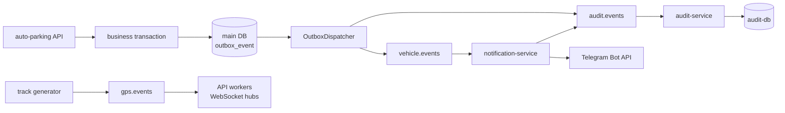

# Kafka и transactional outbox

Kafka используется как event bus между основным API, notification service,
audit service и live GPS pipeline. Этот документ фиксирует только текущую
проектную реализацию: contracts, topics, publication paths, delivery semantics
и известные ограничения.

Общий контекст системы находится в
[архитектурном обзоре](project-structure.md), локальный запуск — в
[руководстве разработчика](../development/local-setup.md), production — в
[руководстве по деплою](../deployment.md), а tracing событий — в
[monitoring](../monitoring/README.md).

## Топология событий



Transactional outbox применяется к vehicle CRUD основного API. Audit events от
notification service и GPS events публикуются напрямую: для них такой гарантии
сейчас нет.

## Topics

Канонический catalog находится в
[`event_bus/topics.py`](../../event_bus/topics.py).

| Topic | Partitions | Message key | Producers | Consumers |
| --- | ---: | --- | --- | --- |
| `auto-parking.vehicle.events` | 3 | `vehicle_id` | Outbox dispatcher основного API | `notification-service` |
| `auto-parking.audit.events` | 3 | Идентификатор сущности; для notification events — `manager_id` | Outbox dispatcher, `notification-service` | `audit-service` |
| `auto-parking.gps.events` | 6 | `vehicle_id` | Track generator | Live GPS consumers API |

Одинаковый key отправляет события одной сущности в одну partition и сохраняет
порядок внутри неё. Глобального порядка между partitions нет.

### Создание topics

`KAFKA_AUTO_CREATE_TOPICS_ENABLE=false`, поэтому topics не создаются неявно.
Одноразовый compose service `kafka-init` запускает
`python -m event_bus.init_topics` после healthcheck broker.

Инициализатор:

1. создаёт отсутствующий topic по `KAFKA_TOPICS`;
2. увеличивает число partitions, если их меньше catalog;
3. не пытается уменьшить partitions и выводит warning, если их уже больше;
4. безопасно завершается, если конфигурация совпадает.

Изменение replication factor существующего topic этим init-процессом не
выполняется.

## Event contract

Все сервисы используют `EventEnvelope` из
[`event_bus/contracts.py`](../../event_bus/contracts.py).

| Поле | Назначение |
| --- | --- |
| `event_id` | UUID события и ключ идемпотентности |
| `event_type` | Тип события, например `vehicle.updated` |
| `version` | Версия payload contract |
| `occurred_at` | UTC timestamp возникновения события |
| `producer` | Логическое имя producer |
| `entity` / `entity_id` | Связанная доменная сущность |
| `correlation_id` | Связь с исходным бизнес-событием, если она есть |
| `payload` | JSON-совместимые данные события |

Envelope сериализуется в UTF-8 JSON. Секреты, JWT и пароли в payload помещать
нельзя. Изменение обязательных полей payload требует новой версии contract и
backward-compatible consumer либо согласованной миграции всех участников.

## Vehicle CRUD: текущий outbox path

FastAPI dependency wiring создаёт `VehicleService` с `OutboxRepository`.
Для create/update/delete сервис выполняет в одной PostgreSQL transaction:

```text
INSERT/UPDATE/DELETE vehicle
+ INSERT outbox_event(topic=vehicle.events)
+ INSERT outbox_event(topic=audit.events)
COMMIT
```

Обе outbox rows содержат один business `EventEnvelope` и один `event_id`, но
разные topics. Unique constraint `(topic, event_id)` защищает от повторной
строки для той же пары, но не отменяет возможность повторной Kafka-публикации.

HTTP response не ждёт Kafka. Если broker недоступен, business transaction всё
равно сохраняется, а pending event остаётся в основной БД.

Код пути:

| Этап | Файл |
| --- | --- |
| Создание business event | `auto_parking/service/vehicle.py` |
| Outbox repository | `auto_parking/repo/outbox.py` |
| ORM model | `auto_parking/db/models/outbox_event.py` |
| Dispatcher | `auto_parking/service/outbox.py` |
| Lifecycle wiring | `auto_parking/main.py` |
| Schema migration | `alembic/versions/8d42b0e9f1c3_outbox_events.py` |

### Dispatcher

`OutboxDispatcher` запускается в каждом API process, если одновременно заданы
`OUTBOX_DISPATCHER_ENABLED=true` и `KAFKA_BOOTSTRAP_SERVERS`. Несколько
workers безопасно разбирают batch через `FOR UPDATE SKIP LOCKED`.

Для каждой pending row dispatcher:

1. восстанавливает `EventEnvelope` из JSONB;
2. вызывает producer с сохранёнными topic и key;
3. при успехе ставит `status=published` и `published_at`;
4. при ошибке увеличивает `attempts` и планирует следующую попытку;
5. после лимита переводит row в `status=failed`.

| Setting | Default |
| --- | ---: |
| `OUTBOX_DISPATCHER_ENABLED` | `true` |
| `OUTBOX_DISPATCHER_BATCH_SIZE` | `100` |
| `OUTBOX_DISPATCHER_POLL_INTERVAL_SECONDS` | `1` |
| `OUTBOX_DISPATCHER_RETRY_DELAY_SECONDS` | `5` |
| `OUTBOX_DISPATCHER_MAX_ATTEMPTS` | `10` |

Повторная публикация возможна, если Kafka приняла message, а process завершился
до commit статуса `published`. Это нормальная at-least-once семантика outbox.

Автоматической очистки published rows и автоматического replay failed rows пока
нет.

## Direct publication paths

Outbox не является общей обёрткой для любого producer:

| Producer | Событие | Поведение при ошибке |
| --- | --- | --- |
| `notification-service` | `notification.telegram.sent/failed` в audit topic | Ошибка логируется; локального outbox/retry нет |
| Track generator | `vehicle.gps` в GPS topic | Точка уже сохранена в PostgreSQL; live event может быть потерян |

Новый DB-bound event основного API не следует добавлять через прямой publish
после commit: он должен записываться в outbox той же transaction. Прямой путь
допустим только когда потеря события явно приемлема либо producer имеет другой
durable mechanism.

## Consumers и consumer groups

| Consumer | Group | Зачем |
| --- | --- | --- |
| `notification-service` | `auto-parking-notification-service` | Экземпляры делят vehicle partitions между собой |
| `audit-service` | `auto-parking-audit-service` | Экземпляры делят audit partitions между собой |
| Каждый API worker live GPS | `auto-parking-gps-live-<pid>-<uuid>` | Каждый process получает весь GPS stream для своих WebSocket clients |

Общий adapter `KafkaEventConsumer` использует
`enable_auto_commit=false` и `auto_offset_reset=earliest` по умолчанию.
Live GPS явно использует `latest`.

Текущее поведение loop:

- valid event коммитится после успешного handler;
- невалидный JSON/contract логируется и коммитится, чтобы не блокировать
  partition;
- exception handler логируется без немедленного commit.

При этом loop продолжает чтение. Последующий успешный cumulative commit может
продвинуть offset за ранее упавшее сообщение. Поэтому текущая реализация не
гарантирует retry каждого handler failure; отдельной retry policy и DLQ нет.

## Идемпотентность

At-least-once producer требует, чтобы consumers переносили duplicates.

- Audit repository вставляет по уникальному `event_id` через
  `ON CONFLICT DO NOTHING`; повтор безопасен.
- Notification service не хранит processed `event_id`. Duplicate vehicle event
  может привести к повторному Telegram-сообщению.
- GPS pipeline делает только process-local
  `distinct_until_changed` по координатам и времени; это не durable
  deduplication.

Добавляя consumer side effect, нужно выбрать idempotency key и хранить результат
в durable storage до commit Kafka offset.

## Producer semantics

`KafkaEventProducer` создаётся лениво и использует `acks="all"`. В текущей
Compose-топологии replication factor равен 1, поэтому подтверждение означает
запись единственного broker, а не отказоустойчивый quorum.

Producer и consumer adapters находятся в
[`event_bus/kafka.py`](../../event_bus/kafka.py). Приложение и workers
импортируют их через собственные `ports/integrations`, чтобы бизнес-код не
зависел напрямую от AIOKafka.

## Как добавить новый поток

1. Проверить, нельзя ли использовать существующий topic.
2. Зафиксировать producer, consumers, owner и retention ожидания.
3. Добавить `KafkaTopicSpec` в `event_bus/topics.py`.
4. Выбрать стабильный bounded key по сущности, порядок которой важен.
5. Описать и версионировать payload.
6. Для изменения БД и события использовать одну transaction и outbox.
7. Реализовать consumer idempotency, retry budget и DLQ/recovery policy.
8. Добавить unit/integration tests на topic, key, envelope, duplicate и failure.
9. Обновить архитектуру, operations и monitoring.

Не увеличивайте число partitions без оценки consumer parallelism и key
distribution: уменьшить его обратно Kafka не позволяет.

## Ограничения текущей топологии

- Один broker совмещает broker/controller роли в KRaft.
- Replication factor равен 1.
- Kafka listener использует PLAINTEXT без TLS/SASL.
- Нет DLQ и гарантированного per-message retry для consumers.
- Notification side effect не дедуплицирован.
- Failed/published outbox rows требуют ручного lifecycle management.
- Outbox не сохраняет OpenTelemetry trace context; notification и audit workers
  не создают полноценный cross-service trace.
- Consumer lag и broker health не экспортируются отдельным Kafka exporter.

Эта конфигурация подходит для локальной разработки и учебного single-server
стенда, но не является production HA topology. Production-подготовка описывается
в [deployment](../deployment.md), наблюдаемость — в
[monitoring](../monitoring/README.md).
