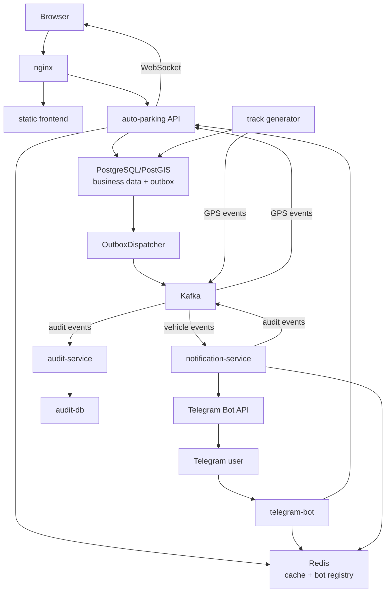

# Архитектура

Документ описывает текущее устройство системы: runtime-компоненты, владение
данными, основные потоки и границы кода. Команды запуска находятся в
[руководстве по локальной разработке](../development/local-setup.md), а
production-процедуры — в [руководстве по деплою](../deployment.md).

## Кратко

Auto Parking состоит из основного FastAPI-приложения, статического frontend,
Telegram-бота и двух Kafka consumers: сервиса уведомлений и сервиса аудита.
Основные бизнес-данные хранятся в PostgreSQL/PostGIS, быстрые чтения и
Telegram-привязки — в Redis, межпроцессные события — в Kafka. Audit service
владеет отдельной PostgreSQL базой. Nginx является единой HTTP/WebSocket точкой
входа.

## Структура



Модуль `event_bus/` на схеме не показан: это общая Python-библиотека с
контрактами и Kafka adapters, которую импортируют приложение и workers.

## Компоненты и ответственность

| Компонент | Назначение                                                                                                 |
|---|------------------------------------------------------------------------------------------------------------|
| `nginx` | HTTP/WebSocket ingress, маршрутизация запросов к frontend и API                                            |
| `frontend` | Статический браузерный интерфейс пользователя                                                              |
| `auto-parking` | REST/WebSocket API, авторизация, бизнес-логика, управление парковками, outbox dispatcher, live GPS consumer |
| `telegram-bot` | Некоторые ручки и уведомления через Telegram-чат                                                           |
| `notification-service` | Обработка vehicle events и отправка уведомлений через бот                                                  |
| `audit-service` | Идемпотентное сохранение audit events                                                                      |
| `event_bus` | Библиотека для шины событий, каталог топиков, producer/consumer, инициализация топиков             |
| Monitoring | Сбор метрик, трассировка, дашборды и алертинг                                                              |
## Владение данными

| Хранилище | Владелец                                        | Данные                                                                                                |
| --- |-------------------------------------------------|-------------------------------------------------------------------------------------------------------|
| Main PostgreSQL/PostGIS | `auto-parking`                                  | Пользователи, предприятия, машины, водители, поездки, GPS-точки, отчёты, уведомления и `outbox_event` |
| Audit PostgreSQL | `audit-service`                                 | Неизменяемое хранилище аудита с уникальным `event_id`                                                 |
| Redis | Основное приложение, bot и notification service | Кэш сущностей/отчётов и registry `user_id -> telegram_chat_id`                                        |
| Kafka | Общая транспортная шина                         | Бизнес-сущности, аудит и live GPS event стримы                                                        |

Redis не является брокером сообщений. Audit service не пишет в основную БД, а
основное приложение не пишет напрямую в audit DB.

## Основные потоки

### Обычный HTTP-запрос

```text
browser / bot
-> nginx или internal HTTP
-> FastAPI controller
-> service
-> repository
-> PostgreSQL / Redis / external integration
-> response
```

Контроллер отвечает за HTTP-контракт и проверку доступа. Бизнес-сценарий живёт
в `service/`, SQL и загрузка relations — в `repo/`.

### CRUD автомобиля и transactional outbox

Для create/update/delete автомобиля основной API выполняет в одной PostgreSQL
транзакции:

```text
INSERT/UPDATE/DELETE vehicle
+ INSERT outbox_event(topic=vehicle.events)
+ INSERT outbox_event(topic=audit.events)
COMMIT
```

Обе outbox rows содержат один `EventEnvelope` и один `event_id`, но разные
топики. Констрейнт `(topic, event_id)` защищает от повторной записи той же
пары, но не озащищает повторной публикации в Kafka (трейдофф).

HTTP-запрос не публикует vehicle event напрямую и не ждёт Kafka. Если брокер
недоступен, business transaction всё равно сохраняется, а pending event остаётся в
основной БД. `OutboxDispatcher` разбирает такие строки батчами через
`FOR UPDATE SKIP LOCKED`, что позволяет безопасно запускать несколько workers
параллельно. Повторная публикация возможна, если Kafka приняла message, а process
завершился до commit статуса `published` — это нормальная at-least-once семантика
outbox.

Outbox — не общая обёртка для любого. Audit events от `notification-service`
и GPS events от track generator публикуются напрямую: у них гарантии нет и
потеря live-события допустима.

### Topics и envelope

Каталог топиков — в [`event_bus/topics.py`](../../event_bus/topics.py),
контракт события — в [`event_bus/contracts.py`](../../event_bus/contracts.py).

| Topic | Message key | Producers | Consumers |
| --- | --- | --- | --- |
| `auto-parking.vehicle.events` | `vehicle_id` | Outbox dispatcher основного API | `notification-service` |
| `auto-parking.audit.events` | Идентификатор сущности; для notification events — `manager_id` | Outbox dispatcher, `notification-service` | `audit-service` |
| `auto-parking.gps.events` | `vehicle_id` | Track generator | Live GPS consumers API |

Все сервисы обмениваются `EventEnvelope`:

| Поле | Назначение |
| --- | --- |
| `event_id` | UUID события и ключ идемпотентности |
| `event_type` | Тип события, например `vehicle.updated` |
| `version` | Версия payload contract |
| `occurred_at` | UTC timestamp возникновения события |
| `producer` | Логическое имя producer |
| `entity` / `entity_id` | Связанная доменная сущность |
| `correlation_id` | Связь с исходным бизнес-событием, если есть |
| `payload` | JSON-совместимые данные события |

Envelope сериализуется в UTF-8 JSON. Секреты, JWT и пароли в payload помещать
нельзя. Изменение обязательных полей payload требует новой версии контрактов и
и обратной совместимости консьюмера либо согласованной миграции всех участников.

At-least-once продюсер требует, чтобы консьюмеры переносили дупликацию. Audit
repository делает `ON CONFLICT DO NOTHING` по `event_id`; notification service
processed-state не хранит, поэтому дубликат эвента может привести к
повторному Telegram-сообщению.

### Telegram-уведомление и аудит

```text
vehicle event
-> notification-service
-> Redis lookup of telegram_chat_id
-> Telegram Bot API
-> notification audit event
-> audit-service
-> audit-db
```

Audit service подавляет повторную запись одного `event_id`. Notification
service пока не хранит deduplication state, поэтому повторная Kafka-доставка
может повторить Telegram-сообщение.

### Live GPS

```text
track generator
-> persist GPS point in main PostgreSQL
-> direct Kafka GPS event
-> one consumer per API worker
-> process-local RxPY/WebSocket hub
-> connected browser clients
```

У каждого API worker собственные WebSocket и уникальная Kafka
consumer group. Поэтому каждый worker получает GPS stream и отправляет его своим
клиентам. GPS publish не использует outbox: сохранённая точка останется в БД,
даже если live-событие не удалось отправить.

## Организация кода

### Основное приложение

```text
auto_parking/
  api/             HTTP/WebSocket routes и schemas
  core/            config, security, errors, domain models
  filter/          объекты фильтрации запросов
  service/         бизнес-сценарии и outbox dispatcher
  repo/            SQLAlchemy queries и persistence
  db/              engine, ORM models, SQLAdmin, DB events
  ports/           контракты cache, events и geocoding
  integrations/    Redis, Kafka, Geoapify, Prometheus, OpenTelemetry
  deps/            FastAPI dependency wiring / composition
  realtime/        Kafka -> RxPY -> WebSocket GPS pipeline
  bot/             Telegram client и сценарии
  minor_utilities/ CLI и seed/smoke utilities
  observability/   access/performance logging
```

Основное направление зависимостей:

```text
api -> service -> repo -> db
          |
          v
        ports <- integrations

deps собирает concrete implementations на границе приложения.
```

### Workers

`notification_service/` и `audit_service/` имеют собственные `core`,
`ports`, `integrations`, `service` и `main.py`. Audit service дополнительно
содержит собственные `db` и `repo`. Они могут импортировать `event_bus`, но
не должны зависеть от FastAPI controllers, repositories или services основного
приложения.

### Общая библиотека событий

```text
event_bus/
  contracts.py    EventEnvelope и protocols
  kafka.py        AIOKafka producer/consumer adapters
  topics.py       каталог топиков
  init_topics.py  идемпотентная инициализация topics
```

## Варианты compose 

- `docker-compose.yaml` — локальная разработка, observability, опции.
- `docker-compose.e2e.yaml` — изолированный E2E-стенд со своими контейнерами и
  томами.
- `deploy/docker-compose.prod.yaml` — single-server deployment из готовых
  образов.

Состав и команды этих окружений документируются отдельно:
[local setup](../development/local-setup.md),
[testing](../testing/README.md) и [deployment](../deployment.md).

## Архитектурные ограничения

- Локальная и production Compose-топология использует один Kafka broker с
  replication factor 1; TLS/SASL не настроены.
- Outbox даёт at-least-once publish, поэтому дубликаты являются нормальным
  сценарием.
- Consumer retry policy и DLQ отсутствуют.
- Published/failed outbox rows автоматически не очищаются, реплея также нет.
- WebSocket state находится в памяти API workers; Kafka обеспечивает оборот
  GPS-событий между воркерами, но не хранит клиентские подключения.
- Notification и audit воркеры пока не имеют собственного полноценного
  OpenTelemetry.

Эксплуатационные особенности и способы проверки вынесены в
[operations](../operations/README.md) и
[monitoring](../monitoring/README.md).


