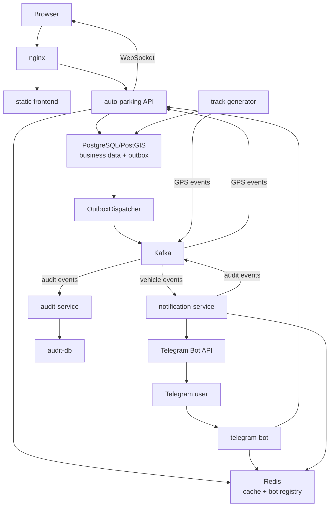

# Архитектура Auto Parking

Документ описывает текущее устройство системы: runtime-компоненты, владение
данными, основные потоки и границы кода. Команды запуска находятся в
[руководстве по локальной разработке](../development/local-setup.md), а
production-процедуры — в [руководстве по деплою](../deployment.md).

## Система в одном абзаце

Auto Parking состоит из основного FastAPI-приложения, статического frontend,
Telegram-бота и двух Kafka consumers: сервиса уведомлений и сервиса аудита.
Основные бизнес-данные хранятся в PostgreSQL/PostGIS, быстрые чтения и
Telegram-привязки — в Redis, межпроцессные события — в Kafka. Audit service
владеет отдельной PostgreSQL базой. Nginx является единой HTTP/WebSocket точкой
входа.

## Runtime-топология



`event_bus/` на схеме не показан как процесс: это общая Python-библиотека с
контрактами и Kafka adapters, которую импортируют приложение и workers.

## Компоненты и ответственность

| Компонент | Ответственность | Что ему не принадлежит |
| --- | --- | --- |
| `nginx` | HTTP/WebSocket ingress, маршрутизация к frontend и API | Бизнес-логика и данные |
| `frontend` | Статический браузерный интерфейс | Прямой доступ к БД |
| `auto-parking` | REST/WebSocket API, авторизация, бизнес-сценарии, outbox dispatcher, live GPS consumer | Audit DB |
| `telegram-bot` | Long polling, диалоги, вызовы основного HTTP API, привязка Telegram chat | Прямые SQL-запросы к бизнес-БД |
| `notification-service` | Обработка vehicle events и отправка Telegram-уведомлений | Основная PostgreSQL и audit DB |
| `audit-service` | Идемпотентное сохранение audit events | Основная PostgreSQL |
| `event_bus` | Event envelope, topic catalog, producer/consumer adapters, topic init | Собственный runtime и хранилище |
| Monitoring stack | Метрики, traces, dashboards, alerts | Бизнес-данные |

## Владение данными

| Хранилище | Владелец | Данные |
| --- | --- | --- |
| Main PostgreSQL/PostGIS | `auto-parking` | Пользователи, предприятия, машины, водители, поездки, GPS-точки, отчёты, уведомления и `outbox_event` |
| Audit PostgreSQL | `audit-service` | Неизменяемая проекция Kafka audit events с уникальным `event_id` |
| Redis | Основное приложение, bot и notification service | Кэш сущностей/отчётов и registry `user_id -> telegram_chat_id` |
| Kafka | Общий transport | Vehicle, audit и live GPS event streams |

Redis не является брокером сообщений. Audit service не пишет в основную БД, а
основное приложение не пишет напрямую в audit DB.

## Основные потоки

### Обычный HTTP-запрос

```text
browser / bot
-> nginx или internal HTTP
-> FastAPI controller
-> service
-> repository
-> PostgreSQL / Redis / external integration
-> response
```

Контроллер отвечает за HTTP-контракт и проверку доступа. Бизнес-сценарий живёт
в `service/`, SQL и загрузка relations — в `repo/`.

### CRUD автомобиля и transactional outbox

```text
vehicle create/update/delete
-> одна PostgreSQL transaction:
     business change
     + outbox row for vehicle topic
     + outbox row for audit topic
-> commit
-> OutboxDispatcher
-> Kafka
```

HTTP-запрос не публикует vehicle event напрямую. Подробные гарантии и ограничения
описаны в [Kafka-документации](kafka.md).

### Telegram-уведомление и аудит

```text
vehicle event
-> notification-service
-> Redis lookup of telegram_chat_id
-> Telegram Bot API
-> notification audit event
-> audit-service
-> audit-db
```

Audit service подавляет повторную запись одного `event_id`. Notification
service пока не хранит deduplication state, поэтому повторная Kafka-доставка
может повторить Telegram-сообщение.

### Live GPS

```text
track generator
-> persist GPS point in main PostgreSQL
-> direct Kafka GPS event
-> one consumer per API worker
-> process-local RxPY/WebSocket hub
-> connected browser clients
```

У каждого API worker собственные WebSocket connections и уникальная Kafka
consumer group. Поэтому каждый worker получает GPS stream и отправляет его своим
клиентам. GPS publish не использует outbox: сохранённая точка останется в БД,
даже если live-событие не удалось отправить.

## Организация кода

### Основное приложение

```text
auto_parking/
  api/             HTTP/WebSocket routes и schemas
  core/            config, security, errors, domain models
  filter/          объекты фильтрации запросов
  service/         бизнес-сценарии и outbox dispatcher
  repo/            SQLAlchemy queries и persistence
  db/              engine, ORM models, SQLAdmin, DB events
  ports/           контракты cache, events и geocoding
  integrations/    Redis, Kafka, Geoapify, Prometheus, OpenTelemetry
  deps/            FastAPI dependency wiring / composition
  realtime/        Kafka -> RxPY -> WebSocket GPS pipeline
  bot/             Telegram client и сценарии
  minor_utilities/ CLI и seed/smoke utilities
  observability/   access/performance logging
```

Основное направление зависимостей:

```text
api -> service -> repo -> db
          |
          v
        ports <- integrations

deps собирает concrete implementations на границе приложения.
```

### Workers

`notification_service/` и `audit_service/` имеют собственные `core`,
`ports`, `integrations`, `service` и `main.py`. Audit service дополнительно
содержит собственные `db` и `repo`. Они могут импортировать `event_bus`, но
не должны зависеть от FastAPI controllers, repositories или services основного
приложения.

### Общая библиотека событий

```text
event_bus/
  contracts.py    EventEnvelope и protocols
  kafka.py        AIOKafka producer/consumer adapters
  topics.py       канонический catalog topics
  init_topics.py  идемпотентная инициализация topics
```

## Инфраструктурные варианты

- `docker-compose.yaml` — локальная разработка, observability и optional
  profiles.
- `docker-compose.e2e.yaml` — изолированный E2E-стенд со своими containers и
  volumes.
- `deploy/docker-compose.prod.yaml` — single-server deployment из готовых
  images.

Состав и команды этих окружений документируются отдельно:
[local setup](../development/local-setup.md),
[testing](../testing/README.md) и [deployment](../deployment.md).

## Архитектурные ограничения

- Локальная и production Compose-топология использует один Kafka broker с
  replication factor 1; TLS/SASL не настроены.
- Outbox даёт at-least-once publish, поэтому duplicates являются нормальным
  сценарием.
- Consumer retry policy и DLQ пока отсутствуют.
- Published/failed outbox rows автоматически не очищаются и не replay-ятся.
- WebSocket state находится в памяти API workers; Kafka обеспечивает fan-out
  GPS-событий между workers, но не хранит клиентские подключения.
- Notification и audit workers пока не имеют собственного полноценного
  OpenTelemetry bootstrap.

Эксплуатационные последствия и способы проверки вынесены в
[operations](../operations/README.md) и
[monitoring](../monitoring/README.md).

## Правила для изменений

1. Не переносить бизнес-логику в controllers.
2. Не выполнять SQL вне repositories и специализированных persistence services.
3. Для DB-bound событий основного API использовать transactional outbox.
4. Сохранять межсервисные contracts в `event_bus` и версионировать payload.
5. Выбирать стабильный Kafka key по сущности, порядок которой важен.
6. Проектировать consumers с учётом повторной доставки.
7. Не использовать Redis как замену Kafka.
8. Не смешивать владение основной и audit DB.
