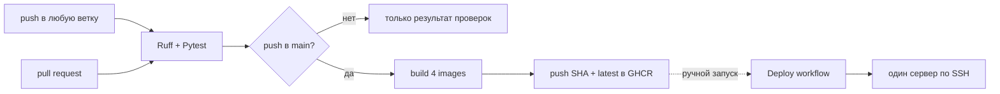

# CI/CD

В проекте настроены два независимых GitHub Actions workflow:

- `CI` проверяет Python-код и после успешного push в `main` публикует Docker images;
- `Deploy` вручную разворачивает выбранный тег images на одном сервере по SSH.

Автоматического deployment после merge нет. Ручной workflow не является gate для
CI и не связан с конкретным запуском сборки.

## Источники конфигурации

| Файл | Назначение |
| --- | --- |
| `.github/workflows/ci.yml` | проверки, сборка и публикация images |
| `.github/workflows/deploy.yml` | ручной deployment по SSH |
| `githooks/pre-commit` | опциональная локальная проверка Ruff |
| `Dockerfile` | image основного приложения |
| `notification_service/Dockerfile` | image сервиса уведомлений |
| `audit_service/Dockerfile` | image сервиса аудита |
| `frontend/Dockerfile` | image статического frontend |
| `deploy/docker-compose.prod.yaml` | production stack |

Production-настройка сервера, порядок deployment и rollback описаны в
[`deployment.md`](deployment.md).

## Фактический pipeline



## Локальный pre-commit hook

Репозиторий содержит `githooks/pre-commit`, который выполняет:

```bash
poetry run ruff check .
```

Hook не включается автоматически после clone. Для его активации один раз выполните:

```bash
git config core.hooksPath githooks
chmod +x githooks/pre-commit
```

Это локальная вспомогательная проверка, а не серверный gate: пользователь может не
включить hook или обойти его. Канонический результат проверок даёт job `checks` в
GitHub Actions.

## Workflow `CI`

### Триггеры

`CI` запускается на:

- каждый `push` в любую ветку;
- каждый `pull_request`.

Фильтров по веткам и путям нет. Поэтому изменения только документации также запускают
Python-проверки, а push в любую feature-ветку запускает `checks`.

### Job `checks`

Job работает на `ubuntu-latest` с Python `3.12` и service container
`postgis/postgis:16-3.4`. Для тестов создаётся база `auto_parking_test` на
`localhost:5432`.

Последовательность команд:

```bash
python -m pip install poetry
poetry install --with dev --no-interaction
poetry run ruff check .
poetry run pytest tests
```

Workflow задаёт `RUN_INTEGRATION=1` и `TEST_DATABASE_URL`, поэтому команда Pytest
включает помеченные `integration` тесты, а не только unit-тесты. Для основного
приложения, тестовых fixtures и audit-подключения используется один PostGIS service
container.

### Gate публикации images

Job `images` имеет `needs: checks` и запускается только при одновременном выполнении
двух условий:

1. `checks` завершился успешно;
2. событие — `push` в `refs/heads/main`.

На pull request и push в другие ветки images не собираются и не публикуются.

Сам workflow не настраивает GitHub branch protection и не доказывает, что merge
заблокирован при красном `checks`. Required status checks настраиваются отдельно в
параметрах репозитория.

## Docker images

После успешного push в `main` Buildx последовательно собирает и публикует четыре
image в GHCR:

| Image | Build context | Dockerfile | Процессы в production |
| --- | --- | --- | --- |
| `app` | `.` | `Dockerfile` | API, Telegram bot, Alembic, `kafka-init` |
| `notification-service` | `.` | `notification_service/Dockerfile` | отправка Telegram-уведомлений |
| `audit-service` | `.` | `audit_service/Dockerfile` | запись audit events |
| `frontend` | `./frontend` | `frontend/Dockerfile` | статические файлы через Nginx |

Namespace формируется из lowercase-владельца репозитория:

```text
ghcr.io/<github-owner>/auto-parking/<image>
```

Каждый image получает два тега:

- полный `GITHUB_SHA` — для точного выбора версии при deployment;
- `latest` — указатель на последний успешно собранный push в `main`.

`latest` изменяемый. Для контролируемого deployment и rollback используйте SHA.
Buildx cache хранится в GitHub Actions cache отдельно для каждого image.

Публикация четырёх images не атомарна: каждый build step сразу обновляет свой SHA-tag
и `latest`. Если следующий step упадёт или два запуска `CI` пересекутся, часть
`latest` может указывать на другой commit. Перед deployment по SHA проверяйте успех
всего job `images`; `latest` не гарантирует согласованный release из четырёх images.

Для публикации используется автоматически выданный `GITHUB_TOKEN`. Workflow имеет
`contents: read` и `packages: write`; отдельный PAT для CI-сборки не нужен.

## Workflow `Deploy`

`Deploy` запускается только через `workflow_dispatch` и принимает два input:

| Input | Default | Назначение |
| --- | --- | --- |
| `image_tag` | `latest` | единый тег всех четырёх application images |
| `deploy_path` | `/opt/auto-parking` | каталог Compose stack на сервере |

Workflow не проверяет, что `image_tag` был создан текущим commit или успешным
запуском `CI`. Несуществующий или недоступный тег обнаружится только на этапе
`docker compose pull`.

Job не использует GitHub `environment`, поэтому в YAML нет environment-specific
approval, protection rules или сериализации deployment.

## GitHub secrets

### Обязательные для `Deploy`

| Secret | Назначение |
| --- | --- |
| `DEPLOY_HOST` | адрес сервера |
| `DEPLOY_USER` | SSH-пользователь с доступом к Docker и каталогу deployment |
| `DEPLOY_SSH_KEY` | приватный SSH-ключ этого пользователя |
| `GHCR_USERNAME` | пользователь для `docker login ghcr.io` |
| `GHCR_TOKEN` | token с доступом на чтение private GHCR packages |

Для `GHCR_TOKEN` нужен как минимум доступ `read:packages`; для private repository
могут потребоваться дополнительные права, зависящие от visibility package и
репозитория.

### Опциональные

| Secret | Default | Назначение |
| --- | --- | --- |
| `DEPLOY_PORT` | `22` | порт для команд `ssh` и `scp` |
| `IMAGE_NAMESPACE` | `<github-owner>/auto-parking` | переопределение GHCR namespace |

Текущее ограничение нестандартного SSH-порта: шаг `ssh-keyscan` обращается к
`DEPLOY_HOST` без `DEPLOY_PORT`. Если порт `22` недоступен, workflow может завершиться
до первого `ssh`, даже если `DEPLOY_PORT` задан правильно.

Production-пароли PostgreSQL, `JWT_SECRET_KEY`, `TELEGRAM_BOT_TOKEN` и остальные
runtime secrets workflow не получает. Они хранятся в `.env` на сервере.

## Что не входит в CI gates

Текущий workflow не запускает:

- Playwright E2E-тесты;
- Locust-нагрузочные тесты;
- Mypy или Pyright;
- `ruff format --check`;
- сборку Docker images на pull request;
- `docker compose config` или smoke test собранных images;
- vulnerability scan, SBOM или подпись images;
- frontend lint/test;
- deployment в staging или production.

Эти проверки нельзя считать пройденными только на основании зелёного `CI`.

## Ограничения воспроизводимости

- Poetry устанавливается без фиксированной версии.
- Dockerfiles используют version ranges из `pyproject.toml` или явных `pip install`;
  `poetry.lock` при сборке application images не используется.
- Base images и GitHub Actions указаны по изменяемым tags, а не по digest/commit SHA.
- Повторная сборка одного commit в другое время может получить другие patch-версии
  зависимостей или base image.
- Публикация набора images не атомарна, а SHA-tags не защищены от перезаписи.
- В workflow нет `concurrency`, поэтому параллельные ручные deployments не
  сериализуются.
