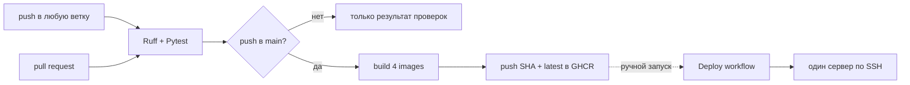

# CI/CD

В проекте настроены два независимых GitHub Actions:

- `CI` проверяет код и после успешного push в `main` публикует Docker images;
- `Deploy` вручную разворачивает выбранный тег images на одном сервере по SSH.

Автоматического deployment после мержа нет. 

## Источники конфигурации

| Файл | Назначение |
| --- | --- |
| `.github/workflows/ci.yml` | проверки, сборка и публикация images |
| `.github/workflows/deploy.yml` | ручной deployment по SSH |
| `githooks/pre-commit` | опциональная локальная проверка Ruff |
| `Dockerfile` | image основного приложения |
| `notification_service/Dockerfile` | image сервиса уведомлений |
| `audit_service/Dockerfile` | image сервиса аудита |
| `frontend/Dockerfile` | image статического frontend |
| `deploy/docker-compose.prod.yaml` | production stack |

Production-настройка сервера, порядок deployment и rollback описаны в
[`deployment.md`](deployment.md).

## Фактический pipeline



## Локальный pre-commit hook

Репозиторий содержит `githooks/pre-commit`, который выполняет:

```bash
poetry run ruff check .
```

Хук не включается автоматически после клонирования. Для его активации один раз выполните:

```bash
git config core.hooksPath githooks
chmod +x githooks/pre-commit
```

## Workflow `CI`

### Триггеры

`CI` запускается на:

- каждый пуш в любую ветку;
- каждый МР/ПР.

Фильтров по веткам и путям нет. Любые изменения запускают проверки кода.

### Job `checks`

Job работает на `ubuntu-latest` с Python `3.12` и service container
`postgis/postgis:16-3.4`. Для тестов создаётся база `auto_parking_test` на
`localhost:5432`.

Последовательность команд:

```bash
python -m pip install poetry
poetry install --with dev --no-interaction
poetry run ruff check .
poetry run pytest tests
```

Workflow задаёт `RUN_INTEGRATION=1` и `TEST_DATABASE_URL`, поэтому команда Pytest
включает помеченные как интеграционные тесты, а не только юниты. Для основного
приложения, тестовых фикстур и подключения аудита используется один PostGIS контейнер.

### Gate публикации images

Джоба `images` живет с `needs: checks` и запускается только при одновременном выполнении
двух условий:

1. `checks` завершился успешно;
2. событие — `push` в `refs/heads/main`.

На пуллреквест и пуш в другие ветки образы не собираются и не публикуются.

Сам workflow не настраивает защиту веток и не доказывает, что мердж
заблокирован при красном `checks`. Это настраивается отдельно в
параметрах репозитория.

## Docker images

После успешного пуша в main Buildx последовательно собирает и публикует четыре
образа в GHCR:

| Образ                  | Контекст     | Dockerfile | Процессы |
|------------------------|--------------| --- | --- |
| `app`                  | `.`          | `Dockerfile` | API, Telegram bot, Alembic, `kafka-init` |
| `notification-service` | `.`          | `notification_service/Dockerfile` | отправка Telegram-уведомлений |
| `audit-service`        | `.`          | `audit_service/Dockerfile` | запись audit events |
| `frontend`             | `./frontend` | `frontend/Dockerfile` | статические файлы через Nginx |

Namespace формируется из lowercase-владельца репозитория:

```text
ghcr.io/<github-owner>/auto-parking/<image>
```

Каждый image получает два тега:

- полный `GITHUB_SHA` — для точного выбора версии при deployment;
- `latest` — указатель на последний успешно собранный push в `main`.

`latest` изменяемый. Для контролируемого deployment и rollback используется SHA.
Buildx кэш хранится в GitHub Actions кэше отдельно для каждого образа.

Публикация четырёх образов не атомарна: каждый этап сразу обновляет свой SHA-tag
и `latest`. Если следующий этап упадёт или два запуска `CI` пересекутся, часть
`latest` может указывать на другой коммит. Перед деплоем по SHA нужно проверять успех
всей джобы `images`. `latest` не гарантирует согласованный релиз из четырёх images.

Для публикации используется автоматически выданный `GITHUB_TOKEN`. Workflow имеет
`contents: read` и `packages: write`; отдельный PAT для CI-сборки не нужен.

## Workflow `Deploy`

`Deploy` запускается только через `workflow_dispatch` и принимает две вводные:

| Input | Default | Назначение                       |
| --- | --- |----------------------------------|
| `image_tag` | `latest` | единый тег всех четырёх образов  |
| `deploy_path` | `/opt/auto-parking` | каталог Compose стека на сервере |

Workflow не проверяет, что `image_tag` был создан текущим коммитом или успешным
запуском `CI`. Несуществующий или недоступный тег обнаружится только на этапе
`docker compose pull`.

## GitHub secrets

### Обязательные для `Deploy`

| Secret | Назначение |
| --- | --- |
| `DEPLOY_HOST` | адрес сервера |
| `DEPLOY_USER` | SSH-пользователь с доступом к Docker и каталогу deployment |
| `DEPLOY_SSH_KEY` | приватный SSH-ключ этого пользователя |
| `GHCR_USERNAME` | пользователь для `docker login ghcr.io` |
| `GHCR_TOKEN` | token с доступом на чтение private GHCR packages |

Для `GHCR_TOKEN` нужен как минимум доступ `read:packages`;

### Опциональные

| Secret | Дефолт                        | Назначение |
| --- |-------------------------------| --- |
| `DEPLOY_PORT` | `22`                          | порт для команд `ssh` и `scp` |
| `IMAGE_NAMESPACE` | `<github-owner>/auto-parking` | переопределение GHCR namespace |

Шаг `ssh-keyscan` обращается к
`DEPLOY_HOST` без `DEPLOY_PORT`. Если порт `22` недоступен, workflow может завершиться
до первого ssh, даже если `DEPLOY_PORT` задан правильно.

Production-пароли PostgreSQL, `JWT_SECRET_KEY`, `TELEGRAM_BOT_TOKEN` и остальные
runtime secrets workflow не получает. Они хранятся в `.env` на сервере.

## Что не входит в CI gates

Текущий workflow не запускает:

- E2E-тесты;
- Locust-нагрузочные тесты;
- Mypy и ruff;
- сборку Docker образов на МР;
- `docker compose config` или smoke test собранных образов;
-  линт/тест фронтенда;
- деплой в стейдж/прод.

Эти проверки нельзя считать пройденными только на основании зелёного `CI`.
