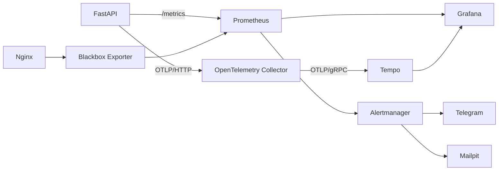

# Мониторинг

Локальный observability stack разделён на независимые потоки сигналов:

## Карта раздела

| Тема | Единственный подробный документ |
| --- | --- |
| Метрики, PromQL, dashboards, synthetic health | [Prometheus и Grafana](prometheus-grafana.md) |
| Трассировка, TraceQL, Collector и Tempo | [OpenTelemetry и Tempo](opentelemetry-tempo.md) |
| Правила, маршрутизация и расследование alert | [Alerting](alerting.md) |
| Анализ access logs | [GoAccess](goaccess.md) |

Общий состав сервисов описан здесь, а не повторяется в компонентных runbook.
Исторические результаты внедрения находятся в
[отчётах](../reports/README.md) и не являются актуальной конфигурацией.

## Компоненты локального стека

| Сервис | Адрес | Роль |
| --- | --- | --- |
| API metrics | <http://localhost/metrics> | Prometheus exposition |
| Prometheus | <http://localhost:9090> | scrape, PromQL, recording и alert rules |
| Grafana | <http://localhost:3000> | dashboards и Explore |
| Tempo | <http://localhost:3200> | хранение и поиск traces |
| OTel Collector | `localhost:4317/4318` | приём и передача OTLP |
| Alertmanager | <http://localhost:9093> | профиль `alerts`, routing/silences |
| Mailpit | <http://localhost:8025> | профиль `alerts`, локальный SMTP inbox |

Базовый стек запускается по инструкции
[локальной разработки](../development/local-setup.md). Alertmanager и Mailpit
опциональны; их запуск и необходимые secrets описаны в [Alerting](alerting.md).

## Где менять конфигурацию

| Ответственность | Файл или каталог |
| --- | --- |
| HTTP/SQL metrics | `auto_parking/integrations/monitoring/` |
| Tracing SDK и instrumentation | `auto_parking/integrations/monitoring/tracing.py` |
| Scrape jobs и rules | `monitoring/prometheus.yml`, `monitoring/alerts.yml` |
| Alert routing и templates | `monitoring/alertmanager.yml`, `monitoring/alertmanager/templates/` |
| Collector и Tempo | `monitoring/otel-collector.yml`, `monitoring/tempo.yml` |
| Grafana provisioning | `monitoring/grafana/` |
| Blackbox probe | `monitoring/blackbox.yml` |

Production Compose сейчас не включает Prometheus, Grafana, Tempo, Collector,
Alertmanager или Mailpit. Локальную схему нельзя считать готовой production
observability-платформой без отдельного деплоя, TLS/auth, retention и backup.
