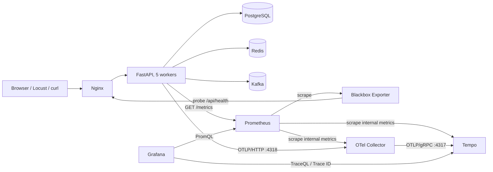
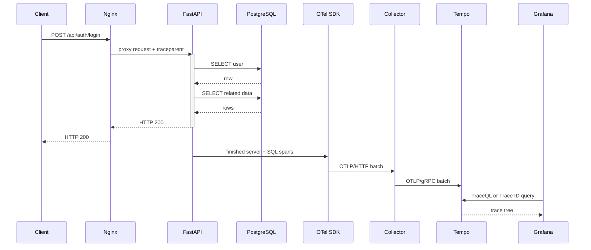
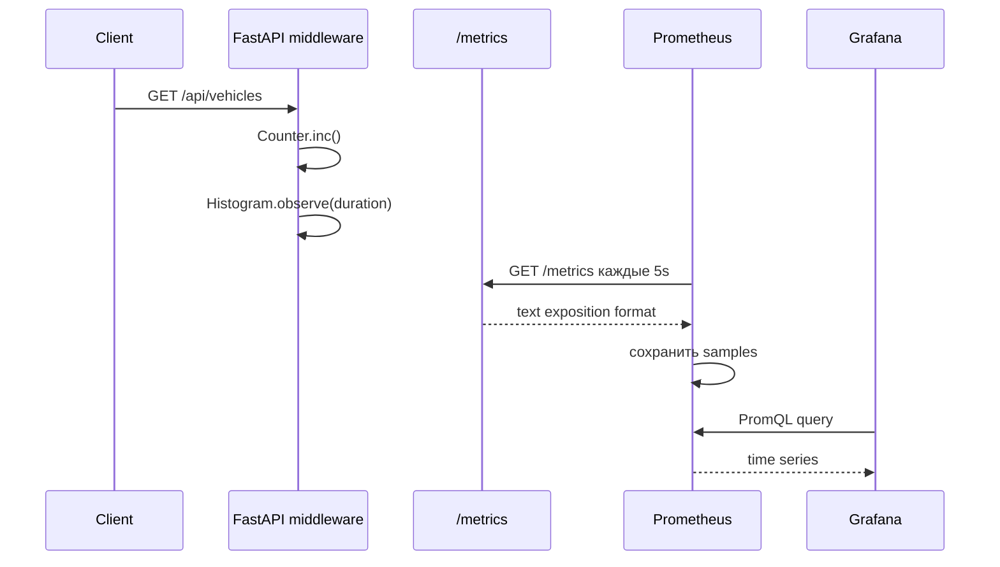
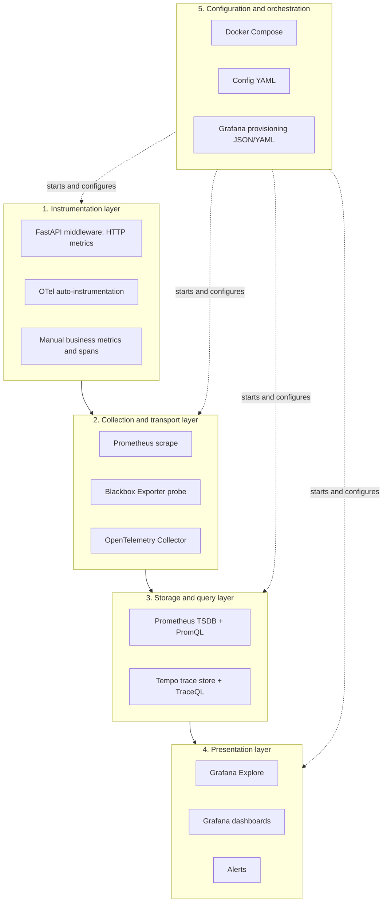
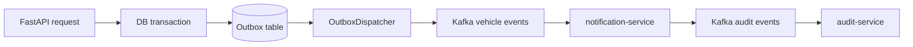
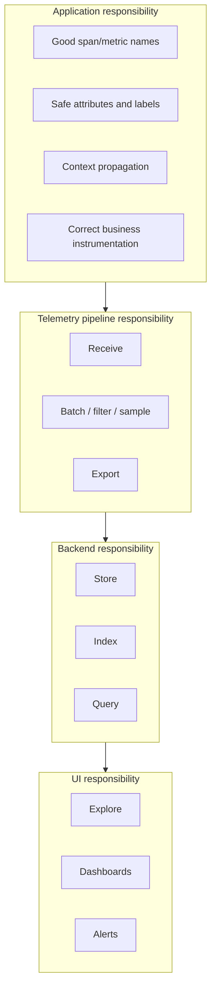

# Observability в Auto Parking: OpenTelemetry, Prometheus, Tempo и Grafana с нуля

Этот документ — подробное введение в observability на примере текущего проекта
Auto Parking. Он рассчитан на читателя, который раньше не работал с
OpenTelemetry, Prometheus, Tempo, TraceQL, PromQL и provisioning Grafana.

После прочтения вы сможете:

- объяснить назначение каждого компонента;
- проследить путь метрики и путь trace от кода до Grafana;
- искать нужные traces без заранее известного Trace ID;
- читать waterfall и находить медленные операции;
- добавить автоматическое или ручное трассирование в Python-код;
- добавить Counter, Gauge или Histogram в Prometheus;
- написать базовые TraceQL- и PromQL-запросы;
- создать или изменить Grafana-панель;
- безопасно менять конфигурацию Collector, Tempo, Prometheus и Grafana;
- диагностировать пропажу данных на любом участке pipeline;
- объяснить устройство стека другому разработчику.

> Важно: OpenTelemetry сам по себе не является хранилищем или пользовательским
> интерфейсом. В этом проекте OpenTelemetry создаёт и перевозит traces, Tempo их
> хранит, Prometheus хранит metrics, а Grafana показывает оба типа данных.

## Содержание

1. [Ментальная модель](#1-ментальная-модель)
2. [Архитектура проекта](#2-архитектура-проекта)
3. [Карта файлов](#3-карта-файлов)
4. [Запуск и первая проверка](#4-запуск-и-первая-проверка)
5. [OpenTelemetry и traces](#5-opentelemetry-и-traces)
6. [Как искать traces без Trace ID](#6-как-искать-traces-без-trace-id)
7. [Как читать trace](#7-как-читать-trace)
8. [Как добавлять traces в код](#8-как-добавлять-traces-в-код)
9. [Настройка Collector и Tempo](#9-настройка-collector-и-tempo)
10. [Prometheus и metrics](#10-prometheus-и-metrics)
11. [PromQL на практических примерах](#11-promql-на-практических-примерах)
12. [Как добавлять metrics в код](#12-как-добавлять-metrics-в-код)
13. [Grafana: Explore, dashboards и provisioning](#13-grafana-explore-dashboards-и-provisioning)
14. [Как компоненты взаимодействуют](#14-как-компоненты-взаимодействуют)
15. [Рецепты настройки под себя](#15-рецепты-настройки-под-себя)
16. [Диагностика](#16-диагностика)
17. [Как объяснить систему другому человеку](#17-как-объяснить-систему-другому-человеку)
18. [Чек-листы](#18-чек-листы)
19. [Официальная документация](#19-официальная-документация)

## 1. Ментальная модель

### 1.1. Что такое observability

Observability — способность понять внутреннее состояние системы по данным,
которые она отдаёт наружу. Обычно говорят о трёх основных сигналах:

| Сигнал | Отвечает на вопрос | Пример |
| --- | --- | --- |
| Metrics | «Что происходит с системой в целом?» | RPS, error rate, p95 latency, размер очереди. |
| Traces | «Что произошло с одним конкретным запросом?» | HTTP занял 468 мс, из них первый SQL — 49 мс. |
| Logs | «Что именно сообщило приложение в момент события?» | Текст ошибки, stack trace, служебное сообщение. |

В текущем monitoring stack полноценно настроены metrics и traces. Логи пишутся
приложением отдельно, но Loki в этот стек пока не входит.

### 1.2. Главное различие metrics и traces

Metrics агрегируют множество событий. Они компактны и хорошо отвечают на
вопросы вида:

- сколько запросов было за пять минут;
- какой сейчас RPS;
- какой p95 у `/api/vehicles`;
- какой процент health-check завершился успешно.

Trace описывает одну цепочку работы. Он отвечает на вопросы вида:

- почему именно этот запрос занял 800 мс;
- какой SQL выполнялся внутри него;
- был ли вызов Redis;
- какой дочерний span завершился ошибкой;
- в каком сервисе оборвалась распределённая операция.

Metrics хорошо находят симптом. Traces помогают найти причину.

### 1.3. Роли компонентов

| Компонент | Что делает | Чего не делает |
| --- | --- | --- |
| OpenTelemetry API/SDK | Создаёт spans, контекст и resource-атрибуты в приложении. | Не хранит историю и не рисует UI. |
| OpenTelemetry instrumentation | Автоматически оборачивает FastAPI, SQLAlchemy, Redis, HTTPX и Kafka. | Не является backend-хранилищем. |
| OpenTelemetry Collector | Принимает, обрабатывает пакетами и экспортирует telemetry. | Не является основным долговременным хранилищем. |
| Tempo | Хранит и ищет traces. | Не собирает Prometheus metrics приложения. |
| Prometheus client | Создаёт `/metrics` внутри Python-приложения. | Не отправляет traces. |
| Prometheus server | Периодически забирает metrics и хранит time series. | Не хранит spans. |
| Blackbox Exporter | Делает внешний HTTP-probe через Nginx. | Не знает внутренностей FastAPI. |
| Grafana | Запрашивает backends и визуализирует результат. | Не является источником и основным хранилищем telemetry. |

### 1.4. Словарь traces

| Термин | Значение |
| --- | --- |
| Trace | Полная причинно связанная операция. Имеет 128-битный Trace ID. |
| Span | Один участок работы внутри trace. Например HTTP handler или SQL query. |
| Root span | Верхний span операции, у которого нет родителя внутри наблюдаемой системы. |
| Parent/child | Связь между вызывающей и вложенной операцией. |
| Span kind | Роль span: `SERVER`, `CLIENT`, `PRODUCER`, `CONSUMER`, `INTERNAL`. |
| Attribute | Индексируемое поле span: route, status code, db system и т. п. |
| Event | Точечное событие внутри span, например exception или retry. |
| Resource | Атрибуты процесса/сервиса: service name, version, environment. |
| Context propagation | Перенос Trace ID и Span ID через HTTP/Kafka между компонентами. |
| Sampling | Решение, сохранять trace или отбросить его. |
| OTLP | Протокол передачи telemetry OpenTelemetry. |

### 1.5. Словарь metrics

| Термин | Значение |
| --- | --- |
| Metric | Именованное измерение, например `auto_parking_http_requests_total`. |
| Sample | Значение metric в конкретный момент времени. |
| Label | Измерение time series: `method="GET"`, `path="/api/vehicles"`. |
| Time series | Уникальная комбинация имени metric и полного набора labels. |
| Scrape | HTTP-запрос Prometheus к endpoint с metrics. |
| Counter | Монотонно растущий счётчик событий. |
| Gauge | Текущее значение, которое может расти и уменьшаться. |
| Histogram | Распределение наблюдений по bucket-границам. |
| Cardinality | Количество уникальных time series, порождённых labels. |
| PromQL | Язык запросов Prometheus. |

## 2. Архитектура проекта

### 2.1. Полная схема



Если Mermaid недоступен, та же схема текстом:

```text
Путь пользовательского запроса:
Client -> Nginx -> FastAPI -> PostgreSQL / Redis / Kafka

Путь metrics:
FastAPI /metrics <-scrape- Prometheus <-query- Grafana
Nginx <-probe- Blackbox Exporter <-scrape- Prometheus
Collector /metrics <-scrape- Prometheus
Tempo /metrics <-scrape- Prometheus

Путь traces:
FastAPI -> OTLP/HTTP -> OTel Collector -> OTLP/gRPC -> Tempo <-query- Grafana
```

### 2.2. Почему metrics и traces идут разными путями

Приложение сейчас использует две независимые библиотеки:

- `prometheus-client` создаёт metrics, которые Prometheus забирает через
  `/metrics` по pull-модели;
- OpenTelemetry SDK отправляет spans в Collector по push-модели OTLP/HTTP.

Collector не передаёт пользовательские metrics приложения в Prometheus. Он
отдаёт только собственные внутренние metrics на `:8888`, и Prometheus их
scrape-ит. Это важное различие.

### 2.3. Жизненный цикл одного HTTP trace



Nginx в текущей конфигурации проксирует запрос, но сам span не создаёт.
Collector и Tempo обслуживают telemetry pipeline, поэтому тоже не появляются
как дочерние application spans. Их исправность видна по собственным metrics и
health endpoints.

### 2.4. Жизненный цикл одной metric



### 2.5. Что происходит при отказах

| Отказ | Что продолжит работать | Что пропадёт |
| --- | --- | --- |
| Grafana недоступна | API, Prometheus, Tempo и сбор данных. | Только UI. |
| Prometheus недоступен | API и traces. | История новых metrics и dashboards Prometheus. |
| Tempo недоступен | API и metrics. | Запись/поиск новых traces; Collector начнёт retry/drop по лимитам. |
| Collector недоступен | API и metrics. | Экспорт traces из SDK. |
| Blackbox Exporter недоступен | API metrics и traces. | Внешняя синтетическая health-проверка. |
| `/metrics` API недоступен | Сам API может ещё отвечать. | Application metrics target станет down. |

### 2.6. Структура по слоям

Архитектура разделена не по названиям продуктов, а по ответственности каждого
слоя:



#### Instrumentation layer

На этом слое приложение решает, какие наблюдения имеют смысл:

- middleware считает HTTP requests и latency;
- instrumentors автоматически создают технические spans;
- разработчик добавляет бизнес-spans и metrics;
- код выбирает безопасные names, attributes и labels;
- context propagation связывает операции.

Этот слой находится рядом с application code, потому что только приложение
знает семантику операции. Collector не может догадаться, что блок кода является
`trip.detect_stops`, если приложение не сообщило об этом.

#### Collection and transport layer

Здесь данные отделяются от business process:

- Prometheus по расписанию scrape-ит metrics;
- Blackbox Exporter имитирует внешнего HTTP-клиента;
- Collector принимает push telemetry, ограничивает память, batch-ит и
  экспортирует traces.

API не должен знать детали Tempo storage, а Grafana не должна напрямую
подключаться к каждому worker.

#### Storage and query layer

Metrics и traces имеют разные модели данных:

- Prometheus хранит числовые time series и вычисляет PromQL;
- Tempo хранит деревья spans и вычисляет TraceQL.

Один универсальный datastore здесь не используется: специализированные
backends проще и эффективнее решают свои задачи.

#### Presentation layer

Grafana объединяет backends на уровне пользовательского опыта:

- dashboards дают постоянные operational views;
- Explore позволяет исследовать неизвестную проблему;
- alerting превращает PromQL condition в сигнал оператору.

Grafana не помещена в путь обработки пользовательского request. Её отказ не
ломает API и не останавливает сбор данных.

#### Configuration and orchestration layer

Docker Compose и version-controlled configs делают локальный стек
воспроизводимым:

- одинаковые service names и ports;
- закреплённые image versions;
- volumes для состояния;
- health/dependency order;
- provisioning datasources и dashboards из Git.

UI используется для исследования и проектирования, а repository files остаются
source of truth.

### 2.7. Почему система организована именно так

#### Почему две telemetry pipeline, а не одна

Текущие application metrics уже естественно представлены Prometheus client
objects и pull endpoint. Traces требуют контекста, parent/child hierarchy и
push-export после завершения span. Разделение сохраняет простую модель каждого
сигнала:

```text
Metrics: current aggregate state, Prometheus pull
Traces: finished operation trees, OTLP push
```

OpenTelemetry умеет работать и с metrics, но миграция существующих Prometheus
metrics в OTel не даёт автоматической пользы сама по себе и добавляет ещё один
слой преобразования. Поэтому сейчас приложение оставляет metrics на проверенном
direct Prometheus path, а OTel отвечает за traces.

#### Почему Collector находится между API и Tempo

Технически SDK можно направить прямо в Tempo OTLP receiver. Collector добавлен
как стабильная граница между приложением и backend:

- приложение знает один OTLP endpoint;
- backend можно заменить без изменения business code;
- batching и retry централизованы;
- можно добавить sampling, filtering, redaction и resource enrichment;
- можно разветвить одни spans в несколько exporters;
- internal pipeline metrics доступны Prometheus;
- security/TLS/auth можно сосредоточить в одном месте.

Для нескольких сервисов выигрыш становится больше: каждый producer отправляет
в один Collector, а не конфигурирует каждый backend отдельно.

#### Почему используется Tempo

Tempo — специализированный trace backend с поддержкой OpenTelemetry/OTLP и
TraceQL. Он хранит spans и позволяет Grafana искать trace по service, route,
duration, status и attributes. Prometheus для этого не подходит: его модель —
числовые time series, а не деревья произвольных spans.

Локально выбран monolithic Tempo:

- один container;
- нет отдельного cluster control plane;
- local volume вместо внешнего object storage;
- проще запускать и диагностировать разработчику.

Это осознанная dev-оптимизация, не готовая production topology.

#### Почему Prometheus scrape-ит API напрямую

Pull model даёт Prometheus контроль над частотой, timeout и состоянием target.
Если scrape не удался, `up=0` сам становится metric. API не требуется очередь
или retry для metrics; оно лишь отдаёт текущее агрегированное состояние.

Prometheus обращается к `auto-parking:8000`, минуя Nginx, потому что этот target
проверяет именно metrics endpoint приложения. Внешний путь проверяется отдельно
Blackbox Exporter.

#### Почему нужен отдельный Blackbox Exporter

Успешный scrape `auto-parking:8000/metrics` не доказывает, что пользовательский
маршрут через Nginx работает. Возможна ситуация:

```text
FastAPI и /metrics доступны внутри Docker,
но Nginx route, DNS или proxy config сломан.
```

Blackbox Exporter проверяет цепочку, близкую к пользовательской:

```text
Blackbox Exporter -> Nginx -> /api/health -> FastAPI
```

Поэтому внутренний white-box monitoring и внешний black-box monitoring
дополняют друг друга.

#### Почему Grafana вынесена отдельно от хранилищ

Один UI может работать сразу с Prometheus и Tempo. Dashboards не завязаны на
application runtime, а storage продолжает принимать данные при restart
Grafana. Такое разделение также позволяет менять визуализацию без изменения
instrumentation.

#### Почему Grafana настраивается файлами

Provisioning решает проблемы UI-only configuration:

- изменения проходят code review;
- dashboard можно восстановить после очистки volume;
- окружения получают одинаковые UID и URL;
- история изменений хранится в Git;
- не нужно вручную кликать datasource после каждого deploy.

Цена — provisioned dashboard нельзя считать безопасно сохранённым, пока его JSON
не перенесён обратно в repository.

#### Почему API использует multiprocess metrics

Пять Uvicorn workers повышают concurrency, но имеют отдельную память. Без
multiprocess mode `/metrics` показывал бы состояние только одного случайного
worker. Файлы в `PROMETHEUS_MULTIPROC_DIR` позволяют endpoint агрегировать
Counter/Histogram всех процессов.

Directory очищается до старта, чтобы данные умерших процессов не смешивались с
новым запуском.

#### Почему health и metrics исключены из traces

Оба endpoint вызываются каждые пять секунд автоматически. Они создали бы
постоянный поток малоинформативных traces, увеличивали storage и скрывали
пользовательские requests в Explore. Их состояние лучше представлено metrics:

```text
up
probe_success
probe_duration_seconds
```

#### Почему root sampling ограничен SERVER и CONSUMER

Фоновые SQL polling loops технически создают client operations даже без
пользовательского request. Если разрешить любой root span, Tempo будет заполнен
оторванными `SELECT` traces. Entry-point policy создаёт trace только там, где
начинается осмысленная единица работы:

- входящий HTTP request;
- consumed message.

Dependency spans сохраняются, когда являются детьми такой операции.

#### Почему используются Docker service names

Внутри Compose network:

```text
http://prometheus:9090
http://tempo:3200
http://otel-collector:4318
```

`localhost` внутри container означает сам container. Service names дают
стабильный DNS независимо от случайного container IP. Host ports `3000`, `3200`,
`4317`, `4318`, `9090` опубликованы только для локальной разработки и проверки.

### 2.8. Компромиссы текущей структуры

| Решение | Плюс | Ограничение |
| --- | --- | --- |
| Prometheus client напрямую | Просто и привычно для Python. | OTel metrics/exemplar correlation не используется. |
| Пять workers + multiprocess | Реалистичная concurrency и корректные totals. | Ограничения Gauge/custom collectors/exemplars. |
| Head sampling | Дёшево и принимается у producer. | Не знает заранее, будет ли trace error/slow. |
| Collector | Централизованная обработка и backend abstraction. | Ещё один сервис и участок отказа. |
| Monolithic Tempo + local volume | Минимум локальной инфраструктуры. | Не production HA, локальная durability/retention. |
| File provisioning Grafana | Воспроизводимость и Git history. | UI-изменения нужно экспортировать в JSON. |
| Blackbox через internal Nginx DNS | Проверяет proxy route в Compose. | Не проверяет внешний интернет/LB/TLS. |
| Nginx без OTel instrumentation | Простая proxy-конфигурация. | В trace нет отдельного Nginx span. |

### 2.9. Когда архитектуру стоит расширять

| Ситуация | Возможное изменение |
| --- | --- |
| Появились notification/audit microservices | Подключить OTel SDK к каждому и проверить Kafka propagation. |
| Нужны traces всех errors и части normal traffic | Collector tail sampling. |
| Нужен переход graph point → trace | Пересмотреть multiprocess metrics path и добавить exemplars. |
| Нужен service dependency graph | Tempo metrics-generator/span metrics. |
| Нужна production durability | Object storage, retention, HA topology. |
| Нужны централизованные logs | Добавить Loki/OTel logs и correlation fields. |
| Нужен внешний availability check | Probe публичного URL из независимого окружения. |
| Растёт число targets | Service discovery вместо большого static config. |

## 3. Карта файлов

### 3.1. Код приложения

| Путь | Ответственность | Когда редактировать |
| --- | --- | --- |
| `auto_parking/integrations/monitoring/tracing.py` | Provider, exporter, sampler и auto-instrumentation. | Добавить библиотеку, изменить sampling/resource/export. |
| `auto_parking/integrations/monitoring/prometheus.py` | HTTP middleware, custom metrics и `/metrics`. | Добавить labels, buckets или общие HTTP metrics. |
| `auto_parking/integrations/monitoring/__init__.py` | Публичные функции monitoring package. | При добавлении нового setup/shutdown helper. |
| `auto_parking/main.py` | Подключение metrics/tracing к FastAPI lifecycle. | При изменении порядка запуска или shutdown. |
| `auto_parking/core/config.py` | Типизированные настройки и env aliases. | При добавлении новой переменной конфигурации. |
| `pyproject.toml` | Python-зависимости OTel и Prometheus. | При подключении нового instrumentor/exporter. |
| `tests/unit/test_opentelemetry_tracing.py` | Тесты provider, sampler и instrumentors. | При любом изменении tracing setup. |
| `tests/unit/test_prometheus_metrics.py` | Тесты HTTP labels и metrics middleware. | При изменении metric names/labels/path logic. |

### 3.2. Инфраструктура

| Путь | Что внутри | После изменения |
| --- | --- | --- |
| `docker-compose.yaml` | Сервисы, образы, порты, volumes и env. | `docker compose config -q`, затем recreate нужного сервиса. |
| `monitoring/otel-collector.yml` | OTLP receiver, processors, Tempo exporter, Collector metrics. | Validate и restart `otel-collector`. |
| `monitoring/tempo.yml` | OTLP ingestion и локальное trace storage. | Verify и restart `tempo`. |
| `monitoring/prometheus.yml` | Scrape jobs и глобальный interval. | `promtool check config`, restart `prometheus`. |
| `monitoring/blackbox.yml` | HTTP probe `/api/health`. | Restart `blackbox-exporter`. |
| `nginx/nginx.conf` | Внешняя маршрутизация к API/frontend. | Validate/restart Nginx. |

### 3.3. Grafana provisioning

| Путь | Назначение |
| --- | --- |
| `monitoring/grafana/provisioning/datasources/prometheus.yml` | Datasource `Prometheus`, UID `prometheus`. |
| `monitoring/grafana/provisioning/datasources/tempo.yml` | Datasource `Tempo`, UID `tempo`. |
| `monitoring/grafana/provisioning/dashboards/dashboards.yml` | Где Grafana ищет dashboard JSON. |
| `monitoring/grafana/dashboards/auto-parking-api.json` | Общий API dashboard. |
| `monitoring/grafana/dashboards/auto-parking-request-mix.json` | Типы и объём запросов. |
| `monitoring/grafana/dashboards/auto-parking-response-time.json` | Average и latency percentiles. |
| `monitoring/grafana/provisioning/alerting/empty.yml` | Место для provisioning Grafana alerts; сейчас пусто. |

В контейнере эти файлы видны по другим путям:

```text
host: monitoring/grafana/dashboards/
  -> container: /var/lib/grafana/dashboards/

host: monitoring/grafana/provisioning/
  -> container: /etc/grafana/provisioning/
```

Редактировать нужно файлы на host, а не копии внутри контейнера.

### 3.4. Документация

| Путь | Назначение |
| --- | --- |
| `docs/monitoring/observability-guide.md` | Этот подробный учебник. |
| `docs/monitoring/opentelemetry-tempo.md` | Короткая эксплуатационная шпаргалка по traces. |
| `docs/monitoring/prometheus-grafana.md` | Короткая шпаргалка по metrics и dashboards. |
| `opentel.md` | Отчёт о выполненной работе и контрольной нагрузке. |

## 4. Запуск и первая проверка

### 4.1. Запуск стека

Из корня проекта:

```bash
docker compose up -d --build nginx prometheus tempo otel-collector grafana
```

Compose автоматически поднимет зависимости API: PostgreSQL, Redis, Kafka,
migrations, frontend, Blackbox Exporter и остальные необходимые сервисы.

### 4.2. Основные адреса

| Интерфейс | Адрес | Для чего |
| --- | --- | --- |
| Приложение | <http://localhost> | Создавать реальный трафик. |
| API metrics | <http://localhost/metrics> | Посмотреть raw Prometheus exposition. |
| Prometheus | <http://localhost:9090> | Targets, PromQL и raw series. |
| Prometheus targets | <http://localhost:9090/targets> | Проверить scrape health. |
| Grafana | <http://localhost:3000> | Dashboards и Explore. |
| Grafana Explore | <http://localhost:3000/explore> | PromQL и TraceQL. |
| Tempo readiness | <http://localhost:3200/ready> | Проверить backend traces. |

Локальный логин Grafana: `admin` / `admin`.

### 4.3. Проверка контейнеров

```bash
docker compose ps
```

Для observability особенно важны:

```text
auto-parking
nginx
blackbox-exporter
prometheus
otel-collector
tempo
grafana
```

### 4.4. Проверка targets

Откройте <http://localhost:9090/targets>. В состоянии `UP` должны быть:

- `auto-parking-api`;
- `auto-parking-health`;
- `blackbox-exporter`;
- `otel-collector`;
- `tempo`;
- `prometheus`.

CLI-проверка:

```bash
curl -fsS http://localhost:9090/api/v1/targets
```

### 4.5. Создание тестовых данных observability

Один обычный запрос уже создаёт metric и trace:

```bash
curl -fsS -o /dev/null http://localhost/openapi.json
```

Короткая read-only нагрузка:

```bash
poetry run locust \
  -f load_tests/locustfile.py ReadOnlyUser \
  --host http://localhost \
  --headless \
  -u 1 \
  -r 1 \
  -t 15s \
  --only-summary \
  --exit-code-on-error 1
```

После неё поставьте в Grafana диапазон `Last 15 minutes` и refresh `5s`.

## 5. OpenTelemetry и traces

### 5.1. Что именно подключено

В `setup_tracing()` подключено автоматическое трассирование:

```python
FastAPIInstrumentor.instrument_app(...)
SQLAlchemyInstrumentor().instrument(...)
HTTPXClientInstrumentor().instrument(...)
RedisInstrumentor().instrument(...)
AIOKafkaInstrumentor().instrument(...)
```

Поэтому без ручного кода появляются spans для:

- входящих FastAPI requests;
- SQLAlchemy connections и statements;
- исходящих HTTPX requests;
- Redis commands;
- AIOKafka producers и consumers.

Эта автоматика действует только внутри Python process, где был вызван
`setup_tracing()`. Сейчас это основной FastAPI process; отдельные
notification/audit workers требуют собственного bootstrap. Kafka receive span
также не заменяет business `process` span вокруг handler — подробности в
разделе 8.15.

### 5.2. Provider, Resource, Processor и Exporter

Упрощённая версия текущей инициализации:

```python
resource = Resource.create(
    {
        "service.name": "auto-parking-api",
        "service.namespace": "auto-parking",
        "service.version": "1.0.0",
        "deployment.environment.name": "dev",
    }
)

provider = TracerProvider(resource=resource, sampler=...)
exporter = OTLPSpanExporter(
    endpoint="http://otel-collector:4318/v1/traces"
)
provider.add_span_processor(BatchSpanProcessor(exporter))
trace.set_tracer_provider(provider)
```

Значение частей:

1. `Resource` описывает процесс, породивший telemetry.
2. `TracerProvider` создаёт tracers и принимает sampling decisions.
3. `BatchSpanProcessor` буферизует finished spans и отправляет их пакетами.
4. `OTLPSpanExporter` кодирует spans в OTLP и посылает Collector.
5. Instrumentors используют этот provider при создании spans.

### 5.3. Resource attributes и span attributes

Resource attributes одинаковы для всех spans процесса:

```text
service.name = auto-parking-api
service.namespace = auto-parking
service.version = 1.0.0
deployment.environment.name = dev
service.instance.id = <container-hostname>:<pid>
```

Span attributes относятся к одной операции:

```text
http.method = GET
http.route = /api/vehicles/{vehicle_id}
http.status_code = 200
db.system = postgresql
db.operation = SELECT
```

Resource scope в TraceQL пишется как `resource.<name>`, span scope — как
`span.<name>`.

### 5.4. Как выглядит trace в проекте

Контрольный login trace имел такую форму:

```text
POST /api/auth/login                      SERVER   468 ms
├── connect                               CLIENT     0.2 ms
├── SELECT user                           CLIENT    48.6 ms
├── SELECT user enterprises               CLIENT     2.7 ms
├── SELECT vehicles                       CLIENT     1.9 ms
├── SELECT drivers                        CLIENT     0.8 ms
└── ... ещё SQL spans
```

Trace ID этой исторической проверки:

```text
c0dec0dec0dec0dec0dec0dec0dec0de
```

Для ежедневной работы лучше искать traces по route, service, status и duration,
а не сохранять конкретные IDs.

### 5.5. Context propagation

Для HTTP OpenTelemetry Python использует W3C Trace Context. Заголовок имеет
формат:

```text
traceparent: 00-<32 hex trace id>-<16 hex parent span id>-<flags>
```

Пример:

```text
traceparent: 00-c0dec0dec0dec0dec0dec0dec0dec0de-1234567890abcdef-01
```

Если downstream-сервис поддерживает W3C Trace Context, он извлечёт context и
создаст child span с тем же Trace ID. Для Kafka instrumentor переносит context в
message headers. Если один из компонентов не извлекает или не передаёт context,
цепочка распадётся на несколько traces.

### 5.6. Sampling в текущем проекте

Используется `ParentBased` sampler:

```text
Есть sampled parent -> дочерний span сохраняется.
Есть unsampled parent -> дочерний span не сохраняется.
Нет parent -> решение принимает EntryPointSampler.
```

`EntryPointSampler` разрешает новые root traces только для:

- `SpanKind.SERVER` — входящий HTTP;
- `SpanKind.CONSUMER` — получение Kafka message.

Root `CLIENT`, `PRODUCER` и `INTERNAL` spans от фонового polling отбрасываются.
Так outbox SQL-loop не заполняет Tempo тысячами несвязанных traces в простое.

Затем применяется `TraceIdRatioBased`:

| `OTEL_TRACE_SAMPLE_RATIO` | Поведение |
| --- | --- |
| `1.0` | Сохранять 100% новых entry-point traces. Удобно локально. |
| `0.1` | Примерно 10%. |
| `0.01` | Примерно 1%. |
| `0.0` | Не создавать новые traces, кроме пришедших sampled parents. |

Sampling ratio — head sampling: решение принимается до выполнения операции.
SDK ещё не знает, будет ли запрос медленным или ошибочным.

### 5.7. Почему `/metrics` и `/api/health` не видны в Tempo

В Compose задано:

```text
OTEL_PYTHON_FASTAPI_EXCLUDED_URLS=.*/metrics$,.*/api/health$
```

Это намеренно:

- Prometheus обращается к `/metrics` каждые пять секунд;
- Blackbox Exporter обращается к `/api/health` каждые пять секунд;
- без исключения эти технические запросы доминировали бы в trace search.

Чтобы временно увидеть health traces, удалите соответствующий regex, recreate
API и помните, что объём traces заметно вырастет.

### 5.8. Как OpenTelemetry понимает, что именно трассировать

OpenTelemetry не анализирует Python-код «по смыслу» и не угадывает бизнес-шаги.
Границы spans появляются тремя способами.

#### Framework middleware/hooks

FastAPI instrumentor подключается к ASGI lifecycle. Он знает момент получения
request и момент завершения response, поэтому создаёт `SERVER` span на весь
handler:

```text
ASGI request started -> SERVER span start
route handler + middleware -> span is current
ASGI response finished -> SERVER span end
```

Route, method, URL и status берутся из ASGI scope/request/response.

#### Обёртки методов клиентской библиотеки

Instrumentors monkey-patch/wrap известные методы конкретной версии библиотеки:

```text
SQLAlchemy execute -> CLIENT SQL span
HTTPX send -> CLIENT HTTP span
Redis execute_command -> CLIENT Redis span
AIOKafkaProducer.send -> PRODUCER span
AIOKafkaConsumer.getone/getmany -> CONSUMER receive span
```

Instrumentor знает техническую семантику вызова: имя topic, SQL operation,
HTTP method, Redis command. Он не знает, зачем бизнесу выполняется операция.

#### Ручной instrumentation API

Разработчик сам отмечает смысловую границу:

```python
with tracer.start_as_current_span("trip.detect_stops"):
    ...
```

Именно manual spans нужны для участков, которые не совпадают с вызовом известной
библиотеки.

#### Как строится parent/child tree

OpenTelemetry хранит текущий span в async-compatible context. Когда внутри
FastAPI `SERVER` span выполняется SQL, SQLAlchemy instrumentor видит current
context и создаёт `CLIENT` child. Когда HTTPX отправляет request, propagator
помещает context в `traceparent`, чтобы другой сервис продолжил trace.

```text
current context = HTTP SERVER span
  -> SQL wrapper creates child of current
  -> HTTPX wrapper creates child and injects its context downstream
```

Если current context отсутствует, новый instrumented call может стать root.
Текущий `EntryPointSampler` специально отбрасывает бессмысленные root client/
producer/internal spans.

#### Что OpenTelemetry не «считает» в текущей конфигурации

В проекте OpenTelemetry настроен на signal `traces`. Он не считает HTTP request
totals, RPS или p95 для application dashboards. Эти metrics считает отдельный
код на `prometheus-client`.

OTel instrumentor создаёт отдельные spans, а не агрегированные counters:

```text
100 HTTP requests -> до 100 traces/spans после sampling
100 HTTP requests -> один растущий Prometheus Counter с несколькими labelsets
```

Collector и Tempo отдают собственные internal metrics, но это telemetry о
pipeline, а не замена application metrics.

## 6. Как искать traces без Trace ID

### 6.1. Поиск через Grafana Search builder

1. Откройте <http://localhost:3000/explore>.
2. Выберите datasource `Tempo`.
3. Выберите query type `Search`.
4. Поставьте time range, например `Last 15 minutes` или `Last 1 hour`.
5. Добавьте filter `Service Name` = `auto-parking-api`.
6. При необходимости добавьте route, status, span name или duration.
7. Нажмите `Run query`.

Search builder удобен, когда вы ещё не знаете TraceQL. Пустой Search/`{}` тоже
может показать traces, но широкий запрос читает больше данных.

### 6.2. Первый TraceQL-запрос

В Explore выберите query type `TraceQL`:

```traceql
{ resource.service.name = "auto-parking-api" }
```

Это основной способ найти все traces приложения без ID.

### 6.3. Поиск по route

```traceql
{ resource.service.name = "auto-parking-api" && span.http.route = "/api/vehicles" }
```

Для route с path-параметром используйте шаблон FastAPI, а не конкретный ID:

```traceql
{ span.http.route = "/api/vehicles/{vehicle_id}" }
```

Точное имя параметра нужно посмотреть в span attributes или определении router.

### 6.4. Поиск по HTTP-методу и статусу

```traceql
{ resource.service.name = "auto-parking-api" && span.http.method = "POST" }
```

```traceql
{ resource.service.name = "auto-parking-api" && span.http.status_code >= 500 }
```

4xx:

```traceql
{ resource.service.name = "auto-parking-api" && span.http.status_code >= 400 && span.http.status_code < 500 }
```

### 6.5. Медленные traces и spans

Trace целиком дольше 500 ms:

```traceql
{ resource.service.name = "auto-parking-api" && trace:duration > 500ms }
```

Любой span дольше 100 ms:

```traceql
{ resource.service.name = "auto-parking-api" && duration > 100ms }
```

Конкретный медленный route:

```traceql
{ resource.service.name = "auto-parking-api" && span.http.route = "/api/vehicles" && duration > 100ms }
```

### 6.6. Поиск SQL

Любой PostgreSQL span:

```traceql
{ resource.service.name = "auto-parking-api" && span.db.system = "postgresql" }
```

Медленный PostgreSQL span:

```traceql
{ span.db.system = "postgresql" && duration > 50ms }
```

Только `SELECT`:

```traceql
{ span.db.system = "postgresql" && span.db.operation = "SELECT" }
```

Trace, где login вызвал PostgreSQL descendant span:

```traceql
{ name = "POST /api/auth/login" } >> { span.db.system = "postgresql" }
```

`>>` означает «descendant»: справа ищется span-потомок span из левой части.

### 6.7. Поиск ошибок

Span с OpenTelemetry status `ERROR`:

```traceql
{ resource.service.name = "auto-parking-api" && status = error }
```

HTTP 5xx надёжнее искать отдельно, потому что status и HTTP code — разные поля:

```traceql
{ resource.service.name = "auto-parking-api" && span.http.status_code >= 500 }
```

Комбинация ошибки и latency:

```traceql
{ resource.service.name = "auto-parking-api" && status = error && duration > 100ms }
```

### 6.8. Поиск по окружению и экземпляру

```traceql
{ resource.deployment.environment.name = "dev" }
```

```traceql
{ resource.service.instance.id =~ ".*:13" }
```

Instance ID полезен при разборе проблемы одного worker, но PID меняется после
recreate.

### 6.9. Поиск по root operation

```traceql
{ trace:rootService = "auto-parking-api" && trace:rootName = "GET /api/vehicles" }
```

Trace-level intrinsics обычно эффективнее, чем широкое сканирование arbitrary
attributes.

### 6.10. Как сужать поиск

Практический алгоритм:

```text
1. Выбрать правильный time range.
2. Ограничить service.name.
3. Ограничить route или rootName.
4. Добавить status/error.
5. Добавить duration.
6. Открыть 2–3 результата и сравнить waterfall.
```

Пример постепенного уточнения:

```traceql
{ resource.service.name = "auto-parking-api" }
```

```traceql
{ resource.service.name = "auto-parking-api" && span.http.route = "/api/vehicles" }
```

```traceql
{ resource.service.name = "auto-parking-api" && span.http.route = "/api/vehicles" && trace:duration > 100ms }
```

### 6.11. Если query ничего не возвращает

Проверяйте по порядку:

1. Выбран ли datasource `Tempo`, а не `Prometheus`.
2. Не слишком ли узкий time range.
3. Был ли трафик после запуска tracing.
4. Совпадает ли route с `http.route` в реальном span.
5. Не исключён ли URL через `OTEL_PYTHON_FASTAPI_EXCLUDED_URLS`.
6. Не равен ли sampling ratio нулю.
7. Работают ли API, Collector и Tempo.
8. Есть ли рост `otelcol_receiver_accepted_spans`.

## 7. Как читать trace

### 7.1. Waterfall

Горизонтальная полоса показывает время жизни span. Отступ слева показывает
parent/child hierarchy.

Смотрите на:

- общую длительность root span;
- самый длинный дочерний span;
- последовательные одинаковые SQL spans;
- параллельные spans;
- большие пустые промежутки без child spans;
- красный/error status;
- повторные retries;
- неожиданные вызовы зависимостей.

### 7.2. Critical path

Critical path — цепочка операций, реально определяющая общую latency. Нельзя
просто сложить все durations: параллельные spans перекрываются во времени.

Пример:

```text
HTTP root: 500 ms
├── SQL A: 300 ms
├── HTTPX B: 300 ms  (шёл параллельно SQL A)
└── serialize: 100 ms
```

Общее время близко к 400–500 ms, а не к 700 ms.

### 7.3. Span details

При открытии span проверьте:

- `name` и `kind`;
- start time и duration;
- status;
- resource attributes;
- span attributes;
- events/exceptions;
- parent span ID;
- instrumentation scope и version.

### 7.4. Как интерпретировать типичные картины

| Картина | Возможная причина | Следующий шаг |
| --- | --- | --- |
| Один SQL занимает почти весь trace | Медленный query/lock/index problem. | Взять `db.statement`, выполнить `EXPLAIN ANALYZE`. |
| Много одинаковых SELECT подряд | N+1 или eager loading большого graph. | Проверить ORM loading strategy. |
| Длинный HTTP root без child spans | CPU, ожидание неинструментированной библиотеки или queueing. | Добавить manual spans вокруг подозрительных блоков. |
| HTTPX child медленный | Downstream service/network. | Инструментировать downstream и проверить propagation. |
| Redis child быстрый, затем SQL | Cache miss. | Добавить `cache.result` attribute/event. |
| Root отсутствует, но children есть | Trace начался вне наблюдаемого сервиса или parent span не был отправлен. | Проверить upstream instrumentation. |
| Trace обрывается на producer | Consumer не извлекает context либо отдельный сервис не инструментирован. | Подключить consumer instrumentation. |

### 7.5. Что trace не доказывает

Trace не заменяет:

- database execution plan;
- profiler для CPU;
- heap/memory profiler;
- системные metrics;
- логи с бизнес-контекстом;
- нагрузочный тест.

Он показывает временную и причинную структуру, после чего помогает выбрать
следующий инструмент.

## 8. Как добавлять traces в код

### 8.1. Сначала решите, нужен ли manual span

Не добавляйте manual span вокруг того, что уже автоматически инструментировано:

- FastAPI handler;
- SQLAlchemy query;
- Redis command;
- HTTPX request;
- AIOKafka send/consume.

Manual span полезен для смыслового бизнес-этапа, который иначе выглядит как
пустой участок root span:

- расчёт маршрута;
- построение отчёта;
- выбор стратегии кеширования;
- валидация большого документа;
- преобразование GPS points;
- один логический этап batch job.

Хорошее имя описывает операцию, а не функцию реализации:

```text
Хорошо: vehicle.build_summary
Хорошо: trip.detect_stops
Плохо: helper
Плохо: do_work
Плохо: VehicleService._method_42
```

### 8.2. Получение tracer

В нужном module:

```python
from opentelemetry import trace

tracer = trace.get_tracer(__name__)
```

`__name__` становится instrumentation scope. Получать tracer можно на уровне
module; OpenTelemetry API использует proxy до установки реального provider.

### 8.3. Создание дочернего span

Пример для async service method:

```python
from opentelemetry import trace
from opentelemetry.trace import SpanKind

tracer = trace.get_tracer(__name__)


async def build_vehicle_summary(vehicles: list[Vehicle]) -> VehicleSummary:
    with tracer.start_as_current_span(
        "vehicle.build_summary",
        kind=SpanKind.INTERNAL,
        attributes={
            "app.vehicle.count": len(vehicles),
            "app.summary.algorithm": "v2",
        },
    ) as span:
        result = await _calculate_summary(vehicles)
        span.set_attribute("app.summary.group_count", len(result.groups))
        return result
```

Если функция вызвана внутри sampled HTTP trace, новый span автоматически станет
дочерним. `with` завершает span и при обычном return, и при exception.

### 8.4. Обогащение уже существующего span

Иногда отдельный участок времени не нужен, но root HTTP span не хватает
бизнес-контекста:

```python
from opentelemetry import trace


async def get_vehicle(vehicle_id: int) -> Vehicle:
    span = trace.get_current_span()
    span.set_attribute("app.vehicle.lookup", "by_id")

    vehicle = await repository.get(vehicle_id)
    span.set_attribute("app.vehicle.found", vehicle is not None)
    return vehicle
```

Не записывайте в attributes:

- пароль;
- JWT/API token;
- cookie;
- персональные данные без согласованной политики;
- целый request/response body;
- бесконтрольно длинный SQL или payload.

Trace attributes допускают более высокую cardinality, чем Prometheus labels,
но всё равно влияют на storage, индекс и стоимость поиска.

### 8.5. Events

Event отмечает точку внутри span:

```python
with tracer.start_as_current_span("vehicle.load") as span:
    cached = await cache.get(cache_key)
    if cached is not None:
        span.add_event("cache.hit", {"cache.backend": "redis"})
        return cached

    span.add_event("cache.miss", {"cache.backend": "redis"})
    return await repository.get(vehicle_id)
```

Используйте attribute для состояния, по которому часто ищете, и event для
точечного события во времени.

### 8.6. Exceptions и status

```python
from opentelemetry import trace
from opentelemetry.trace import Status, StatusCode

tracer = trace.get_tracer(__name__)


async def recalculate_trip(trip_id: int) -> None:
    with tracer.start_as_current_span("trip.recalculate") as span:
        try:
            await _recalculate(trip_id)
        except TripCalculationError as exc:
            span.record_exception(exc)
            span.set_status(Status(StatusCode.ERROR, str(exc)))
            raise
```

Не проглатывайте exception ради tracing. Сначала сохраните событие/status, затем
сохраните прежнюю семантику программы (`raise`, fallback или business result).

Поиск:

```traceql
{ resource.service.name = "auto-parking-api" && status = error }
```

### 8.7. Decorator для span на всю функцию

```python
from opentelemetry import trace

tracer = trace.get_tracer(__name__)


@tracer.start_as_current_span("trip.detect_stops")
async def detect_stops(points: list[TrackPoint]) -> list[Stop]:
    ...
```

Decorator удобен для стабильной операции без сложного enrichment. Если нужно
добавлять attributes из результата или exception, context manager обычно яснее.

### 8.8. Вложенные spans

```python
with tracer.start_as_current_span("report.build"):
    with tracer.start_as_current_span("report.load_data"):
        rows = await repository.load_rows()

    with tracer.start_as_current_span("report.render_pdf") as render_span:
        render_span.set_attribute("app.report.row_count", len(rows))
        pdf = render(rows)
```

Не дробите код до span на каждую маленькую функцию. Span должен помогать понять
latency или ошибку и иметь самостоятельный диагностический смысл.

### 8.9. Важное ограничение текущего sampler для background jobs

Manual `INTERNAL` span внутри HTTP/Kafka trace сохранится как child. Но root
`INTERNAL` span фоновой задачи без parent будет отброшен `EntryPointSampler`.

Для Kafka consumer используйте правильный `SpanKind.CONSUMER`:

```python
with tracer.start_as_current_span(
    "notification.consume",
    kind=SpanKind.CONSUMER,
):
    await handle_message(message)
```

Не помечайте произвольную background job как `CONSUMER` только ради обхода
sampler. Если нужны root traces обычных jobs, расширьте sampler явным opt-in:

```python
class EntryPointSampler(Sampler):
    def should_sample(
        self,
        parent_context,
        trace_id,
        name,
        kind=None,
        attributes=None,
        links=None,
        trace_state=None,
    ) -> SamplingResult:
        explicit_background_root = bool(
            attributes and attributes.get("app.trace.root") is True
        )
        if kind not in {SpanKind.SERVER, SpanKind.CONSUMER} and not explicit_background_root:
            return SamplingResult(Decision.DROP)

        return self._delegate.should_sample(
            parent_context=parent_context,
            trace_id=trace_id,
            name=name,
            kind=kind,
            attributes=attributes,
            links=links,
            trace_state=trace_state,
        )
```

Создание opt-in root:

```python
with tracer.start_as_current_span(
    "maintenance.rebuild_cache",
    kind=SpanKind.INTERNAL,
    attributes={"app.trace.root": True},
):
    await rebuild_cache()
```

После такого изменения обязательно добавьте unit-test и проверьте отсутствие
шума в простое.

### 8.10. Подключение instrumentor для новой библиотеки

Алгоритм:

1. Найти официальный OTel instrumentor.
2. Добавить совместимую dependency.
3. Инициализировать его с текущим provider.
4. Пересобрать API image.
5. Выполнить реальную операцию.
6. Найти новый child span в Tempo.

Пример для условной библиотеки `requests`:

```bash
poetry add 'opentelemetry-instrumentation-requests@^0.62b0'
```

В `tracing.py`:

```python
from opentelemetry.instrumentation.requests import RequestsInstrumentor


def setup_tracing(...):
    ...
    RequestsInstrumentor().instrument(tracer_provider=provider)
```

Затем:

```bash
docker compose up -d --build --force-recreate auto-parking nginx
```

Не подключайте два instrumentors к одной библиотеке: это может создать
дублирующиеся spans.

### 8.11. Подключение нового сервиса

Сейчас `setup_tracing()` привязан к FastAPI и SQLAlchemy engine. Для worker без
HTTP можно вынести общую фабрику provider:

```python
from opentelemetry import trace
from opentelemetry.exporter.otlp.proto.http.trace_exporter import OTLPSpanExporter
from opentelemetry.sdk.resources import Resource
from opentelemetry.sdk.trace import TracerProvider
from opentelemetry.sdk.trace.export import BatchSpanProcessor


def create_tracer_provider(service_name: str) -> TracerProvider:
    provider = TracerProvider(
        resource=Resource.create(
            {
                "service.name": service_name,
                "service.namespace": "auto-parking",
                "deployment.environment.name": settings.app_env,
            }
        )
    )
    provider.add_span_processor(
        BatchSpanProcessor(
            OTLPSpanExporter(
                endpoint=settings.otel_exporter_otlp_traces_endpoint,
            )
        )
    )
    trace.set_tracer_provider(provider)
    return provider
```

В worker:

```python
provider = create_tracer_provider("auto-parking-notification-service")
AIOKafkaInstrumentor().instrument(tracer_provider=provider)
RedisInstrumentor().instrument(tracer_provider=provider)

try:
    await run_worker()
finally:
    provider.shutdown()
```

Также добавьте в Compose worker:

```yaml
environment:
  OTEL_TRACING_ENABLED: "true"
  OTEL_SERVICE_NAME: auto-parking-notification-service
  OTEL_EXPORTER_OTLP_TRACES_ENDPOINT: http://otel-collector:4318/v1/traces
depends_on:
  otel-collector:
    condition: service_started
```

После этого один Kafka trace сможет продолжаться в другом сервисе, если
producer inject-ит, а consumer extract-ит W3C context. AIOKafka instrumentor
делает это для поддерживаемых send/receive client calls, но outbox boundary и
выполнение business handler требуют отдельной работы из раздела 8.15.

### 8.12. Ручная propagation для собственного carrier

Это нужно только если transport не поддержан instrumentor или вы используете
собственный message envelope.

Producer:

```python
from opentelemetry.propagate import inject

carrier: dict[str, str] = {}
inject(carrier)

message = {
    "payload": payload,
    "trace_context": carrier,
}
```

Consumer:

```python
from opentelemetry import trace
from opentelemetry.propagate import extract
from opentelemetry.trace import SpanKind

tracer = trace.get_tracer(__name__)
parent_context = extract(message.get("trace_context", {}))

with tracer.start_as_current_span(
    "custom_message.consume",
    context=parent_context,
    kind=SpanKind.CONSUMER,
):
    await handle(message["payload"])
```

Нельзя одновременно полагаться на auto-instrumentation и вручную добавлять тот
же context в те же headers без проверки — получите дубли или конфликт.

### 8.13. Минимальный unit-test span API

```python
from opentelemetry.sdk.trace import TracerProvider
from opentelemetry.sdk.trace.export import SimpleSpanProcessor
from opentelemetry.sdk.trace.export.in_memory_span_exporter import (
    InMemorySpanExporter,
)


def test_manual_span_contains_attributes():
    exporter = InMemorySpanExporter()
    provider = TracerProvider()
    provider.add_span_processor(SimpleSpanProcessor(exporter))
    tracer = provider.get_tracer("test")

    with tracer.start_as_current_span("vehicle.build_summary") as span:
        span.set_attribute("app.vehicle.count", 3)

    finished = exporter.get_finished_spans()
    assert len(finished) == 1
    assert finished[0].name == "vehicle.build_summary"
    assert finished[0].attributes["app.vehicle.count"] == 3

    provider.shutdown()
```

Для application test удобнее dependency injection tracer или monkeypatch
конкретного helper, чтобы не переопределять global provider между тестами.

### 8.14. Проверка нового span end-to-end

1. Добавьте manual span.
2. Запустите unit-tests и Ruff.
3. Пересоберите API.
4. Сделайте один запрос, который проходит новый код.
5. В Grafana Explore выполните:

```traceql
{ resource.service.name = "auto-parking-api" && name = "vehicle.build_summary" }
```

6. Откройте trace и проверьте parent, duration, attributes и status.
7. Убедитесь, что в простое span не создаётся бесконечно.

### 8.15. Правильная интеграция OpenTelemetry с Kafka

Kafka требует больше внимания, чем обычный HTTP request: producer и consumer
работают в разных процессах и часто в разное время. Один и тот же trace
сохраняется только если context физически попал в Kafka message headers и был
извлечён consumer.

Бизнес-топология topics и outbox отдельно описана в
[`../architecture/kafka.md`](../architecture/kafka.md); здесь рассматривается
именно observability и context propagation.

#### Текущий Kafka-путь проекта



Основной wrapper находится в `event_bus/kafka.py`:

- producer использует `AIOKafkaProducer.send_and_wait()`;
- consumer читает `async for message in AIOKafkaConsumer`;
- offset commit выполняется после handler или после признания payload invalid.

#### Что AIOKafka instrumentor делает автоматически

В закреплённой версии `opentelemetry-instrumentation-aiokafka` instrumentor
оборачивает:

```text
AIOKafkaProducer.send
AIOKafkaConsumer.getone
AIOKafkaConsumer.getmany
```

Producer wrapper:

1. создаёт span kind `PRODUCER`;
2. добавляет `messaging.system=kafka`;
3. добавляет topic, partition, client ID и operation;
4. inject-ит текущий W3C context в Kafka headers;
5. вызывает реальный send.

Consumer wrapper:

1. получает record;
2. extract-ит W3C context из record headers;
3. создаёт `CONSUMER` receive span;
4. добавляет topic, partition, offset и consumer group.

Поиск technical Kafka spans:

```traceql
{ resource.service.name =~ "auto-parking.*" && span.messaging.system = "kafka" }
```

По topic:

```traceql
{ span.messaging.system = "kafka" && span.messaging.destination.name = "auto-parking.vehicle.events" }
```

Остальные имена topic определены в `event_bus/topics.py`.

#### Что instrumentor не понимает автоматически

Instrumentor знает вызов client library, но не знает границы вашего handler:

```python
async for message in consumer:
    event = EventEnvelope.from_json(message.value)
    await handler(event)  # бизнес-обработка
    await consumer.commit()
```

Receive span, создаваемый вокруг `getone/getmany`, заканчивается при возврате
record. Он не обязан охватывать `handler(event)`. Поэтому для latency и errors
бизнес-обработки нужен отдельный `process` span с extracted context.

#### Текущее ограничение сервисов проекта

`AIOKafkaInstrumentor` сейчас bootstrapped в основном FastAPI process. Отдельные
`notification-service` и `audit-service` пока не вызывают tracing setup и не
отправляют свои spans в Collector. То есть наличие package в общей dependency
не инструментирует автоматически каждый Python process.

Для полноценного cross-service trace нужно инициализировать provider и
instrumentors в `notification_service/main.py` и `audit_service/main.py`, как
описано в разделе 8.11.

#### Проблема outbox boundary

Outbox pattern намеренно разрывает время request и Kafka publish:

```text
HTTP request stores outbox row and finishes
                         ... позже ...
OutboxDispatcher reads row and sends Kafka message
```

В момент `OutboxDispatcher.publish()` исходный HTTP current context уже
отсутствует. Без сохранения context producer span будет новым root или будет
отброшен текущим `EntryPointSampler` как root `PRODUCER`.

`correlation_id` из business envelope полезен для поиска, но сам по себе не
является OpenTelemetry context. Trace propagation требует `traceparent` и при
необходимости `tracestate`/`baggage`.

#### Шаг 1. Сохранить context при создании outbox event

Один вариант — добавить carrier в `EventEnvelope`:

```python
from dataclasses import dataclass, field
from opentelemetry.propagate import inject


@dataclass(frozen=True, slots=True)
class EventEnvelope:
    # Остальные существующие поля...
    trace_context: dict[str, str] = field(default_factory=dict)
    payload: dict[str, Any] = field(default_factory=dict)

    @classmethod
    def create(cls, ..., payload=None) -> "EventEnvelope":
        carrier: dict[str, str] = {}
        inject(carrier)

        return cls(
            ...,
            trace_context=carrier,
            payload=payload or {},
        )

    @classmethod
    def from_dict(cls, data: dict[str, Any]) -> "EventEnvelope":
        return cls(
            ...,
            trace_context=dict(data.get("trace_context") or {}),
            payload=dict(data.get("payload") or {}),
        )
```

Текущий `to_dict()` использует `asdict`, поэтому новое поле попадёт в JSON
автоматически. Старые events должны продолжать читаться через default `{}`.

Альтернатива — отдельная JSON column `trace_context` в outbox row. Она лучше
разделяет business contract и transport metadata, но требует изменения model,
repository и migration.

#### Шаг 2. Восстановить context перед отложенным publish

В `OutboxDispatcher`:

```python
from opentelemetry import context as otel_context
from opentelemetry.propagate import extract


event = EventEnvelope.from_dict(outbox_event.payload)
parent_context = extract(event.trace_context)
token = otel_context.attach(parent_context)

try:
    await producer.publish(
        outbox_event.topic,
        event,
        key=outbox_event.key,
    )
finally:
    otel_context.detach(token)
```

Теперь вызванный внутри `AIOKafkaProducer.send` instrumentor увидит current
context, создаст `PRODUCER` child span и inject-ит уже его context в Kafka
headers.

Обязательно используйте `finally`: leaked context может ошибочно связать
следующий outbox event с предыдущим trace.

#### Шаг 3. Создать process span consumer handler

Kafka headers представлены списком пар `str, bytes`. Для default propagator их
можно превратить в carrier:

```python
def _trace_carrier(headers: list[tuple[str, bytes]] | None) -> dict[str, str]:
    if not headers:
        return {}
    return {
        key: value.decode("utf-8")
        for key, value in headers
        if value is not None
    }
```

В consumer loop:

```python
from opentelemetry import trace
from opentelemetry.propagate import extract
from opentelemetry.trace import SpanKind, Status, StatusCode

tracer = trace.get_tracer(__name__)


async def _process_message(message, handler) -> None:
    parent_context = extract(_trace_carrier(message.headers))

    with tracer.start_as_current_span(
        f"{message.topic} process",
        context=parent_context,
        kind=SpanKind.CONSUMER,
        attributes={
            "messaging.system": "kafka",
            "messaging.destination.name": message.topic,
            "messaging.operation.name": "process",
            "messaging.destination.partition.id": str(message.partition),
            "messaging.kafka.message.offset": message.offset,
        },
    ) as span:
        try:
            event = EventEnvelope.from_json(message.value)
            span.set_attribute("app.event.type", event.event_type)
            span.set_attribute("app.event.version", event.version)

            await handler(event)
            await consumer.commit()
            span.add_event("kafka.offset.committed")
        except Exception as exc:
            span.record_exception(exc)
            span.set_status(Status(StatusCode.ERROR, str(exc)))
            raise
```

Так business SQL/Redis/HTTPX calls внутри handler увидят process span как
current parent.

Если auto-instrumentation также создаёт короткий `receive` span, `receive` и
`process` отражают разные этапы и могут быть siblings от propagated producer
context. Это допустимо. Не создавайте второй ручной `send` span вокруг каждого
`AIOKafkaProducer.send`, если технический producer span уже есть.

#### Шаг 4. Bootstrap каждого consumer process

До создания `AIOKafkaConsumer`:

```python
provider = create_tracer_provider("auto-parking-notification-service")
AIOKafkaInstrumentor().instrument(tracer_provider=provider)
RedisInstrumentor().instrument(tracer_provider=provider)
HTTPXClientInstrumentor().instrument(tracer_provider=provider)

try:
    await run_consumer()
finally:
    provider.shutdown()
```

Порядок важен: instrumentors должны быть подключены до первых instrumented
operations, provider должен shutdown-иться после consumer/producer close.

#### Шаг 5. Отдельно добавить Kafka metrics

Traces не заменяют агрегаты. Для consumer полезны application metrics:

```python
from prometheus_client import Counter, Histogram

KAFKA_MESSAGES_TOTAL = Counter(
    "auto_parking_kafka_messages_total",
    "Kafka messages processed by the application.",
    ("topic", "result"),
)

KAFKA_PROCESSING_DURATION_SECONDS = Histogram(
    "auto_parking_kafka_processing_duration_seconds",
    "Kafka message processing duration in seconds.",
    ("topic",),
    buckets=(0.005, 0.01, 0.025, 0.05, 0.1, 0.25, 0.5, 1.0, 2.5, 5.0),
)
```

Обновление:

```python
from time import perf_counter

started_at = perf_counter()
result = "error"

try:
    await _process_message(message, handler)
    result = "success"
finally:
    KAFKA_MESSAGES_TOTAL.labels(
        topic=message.topic,
        result=result,
    ).inc()
    KAFKA_PROCESSING_DURATION_SECONDS.labels(
        topic=message.topic,
    ).observe(perf_counter() - started_at)
```

Не используйте `partition`, `offset`, `event_id`, message key или entity ID как
Prometheus labels. Они подходят для trace attributes/logs, но создают слишком
много time series.

Kafka worker без FastAPI должен сам открыть metrics endpoint. Для
однопроцессного notification worker:

```python
from prometheus_client import start_http_server


async def main() -> None:
    start_http_server(8001, addr="0.0.0.0")
    await run_consumer()
```

В Compose достаточно internal port:

```yaml
notification-service:
  expose:
    - "8001"
```

В `monitoring/prometheus.yml`:

```yaml
- job_name: notification-service
  static_configs:
    - targets:
        - notification-service:8001
```

Публиковать `8001` через host `ports` не требуется: Prometheus находится в той
же Compose network. Для audit worker используйте другой internal port, например
`8002`.

Consumer lag и broker metrics обычно лучше получать Kafka exporter/JMX
integration, а не вычислять вручную в каждом handler.

#### Шаг 6. Найти cross-service trace

Все Kafka traces:

```traceql
{ span.messaging.system = "kafka" }
```

Producer, после которого есть consumer descendant:

```traceql
{ span.messaging.operation.name = "send" } >> { span.messaging.operation.name = "process" }
```

Trace, прошедший через два сервиса:

```traceql
{ resource.service.name = "auto-parking-api" }
&&
{ resource.service.name = "auto-parking-notification-service" }
```

Если query по обоим services пуст, проверьте:

1. provider запущен в обоих процессах;
2. producer Kafka headers содержат `traceparent`;
3. outbox context сохранён до завершения HTTP request;
4. consumer extract-ит headers;
5. process span создаётся с extracted context;
6. sampling decision sampled;
7. оба сервиса отправляют в один Tempo tenant/backend.

#### Parent или link для долгих/повторных messages

Прямой parent/child удобен для короткого request → event → consumer flow. Для
долгих очередей, fan-out, batch и replay иногда корректнее span link:

- message может быть обработан много раз;
- один batch содержит несколько parent contexts;
- processing происходит через часы;
- нет единственного логического parent.

В таком случае extract-ите `SpanContext`, создайте новый consumer root и
передайте `links=[Link(parent_span_context)]`. Выбор должен соответствовать
семантике сообщения, а не только желанию получить красивое дерево.

#### Kafka integration checklist

- [ ] У каждого producer/consumer process есть свой `service.name`.
- [ ] SDK/provider создаётся один раз на process.
- [ ] AIOKafka instrumentor подключён до client calls.
- [ ] Context inject-ится в Kafka headers.
- [ ] Для outbox context сохраняется вместе с message metadata.
- [ ] Consumer extract-ит context до business handler.
- [ ] Handler работает внутри `CONSUMER process` span.
- [ ] Exceptions отмечают span ERROR и не ломают commit policy.
- [ ] Metrics считают success/error/latency отдельно от traces.
- [ ] Labels bounded; offset/event ID остаются attributes.
- [ ] Shutdown flush-ит provider после остановки clients.
- [ ] End-to-end TraceQL показывает оба service names.

## 9. Настройка Collector и Tempo

### 9.1. Pipeline Collector

Текущий `monitoring/otel-collector.yml` логически выглядит так:

```yaml
receivers:
  otlp:
    protocols:
      grpc:
        endpoint: 0.0.0.0:4317
      http:
        endpoint: 0.0.0.0:4318

processors:
  memory_limiter:
    check_interval: 1s
    limit_mib: 128
    spike_limit_mib: 32
  batch:
    send_batch_size: 512
    timeout: 1s

exporters:
  otlp_grpc/tempo:
    endpoint: tempo:4317
    tls:
      insecure: true

service:
  pipelines:
    traces:
      receivers: [otlp]
      processors: [memory_limiter, batch]
      exporters: [otlp_grpc/tempo]
```

Порядок pipeline:

```text
receiver -> memory_limiter -> batch -> exporter
```

- receiver принимает данные;
- memory limiter защищает Collector от uncontrolled memory growth;
- batch объединяет spans и уменьшает число network calls;
- exporter отправляет результат в Tempo.

Компонент, объявленный в YAML, но не добавленный в `service.pipelines`, не
работает.

### 9.2. OTLP/HTTP и OTLP/gRPC

В проекте используются оба transport:

```text
Python SDK -> Collector: OTLP/HTTP, port 4318, path /v1/traces
Collector -> Tempo: OTLP/gRPC, port 4317
```

Это нормальная схема. Protocol между участками не обязан совпадать.

### 9.3. Health и internal metrics Collector

```yaml
extensions:
  health_check:
    endpoint: 0.0.0.0:13133
```

Internal metrics открыты на `:8888` и scrape-ятся Prometheus job
`otel-collector`.

Полезные series:

```promql
sum(otelcol_receiver_accepted_spans)
```

```promql
sum(otelcol_exporter_sent_spans)
```

```promql
sum(otelcol_exporter_send_failed_spans)
```

Принятые и отправленные totals должны расти примерно согласованно. Небольшая
временная разница возможна из-за batch; устойчиво растущий разрыв требует
проверки queue/exporter.

### 9.4. Временный debug exporter

Для диагностики можно временно печатать telemetry в Collector logs:

```yaml
exporters:
  debug:
    verbosity: basic
  otlp_grpc/tempo:
    endpoint: tempo:4317
    tls:
      insecure: true

service:
  pipelines:
    traces:
      receivers: [otlp]
      processors: [memory_limiter, batch]
      exporters: [debug, otlp_grpc/tempo]
```

Проверка:

```bash
docker compose restart otel-collector
docker compose logs --no-color --tail=120 otel-collector
```

После диагностики удалите debug exporter: detailed output может быть большим и
содержать атрибуты приложения.

### 9.5. Удаление чувствительного attribute в Collector

Например, централизованно удалить SQL text:

```yaml
processors:
  attributes/privacy:
    actions:
      - key: db.statement
        action: delete

service:
  pipelines:
    traces:
      receivers: [otlp]
      processors: [memory_limiter, attributes/privacy, batch]
      exporters: [otlp_grpc/tempo]
```

Плюс подхода: правило применяется ко всем producers. Минус: после удаления SQL
уже нельзя исследовать в Tempo. Обычно лучше не отправлять secret из кода и
дополнительно иметь защитные Collector rules.

### 9.6. Добавление environment/resource attribute в Collector

```yaml
processors:
  resource/environment:
    attributes:
      - key: deployment.environment.name
        value: local
        action: upsert

service:
  pipelines:
    traces:
      receivers: [otlp]
      processors:
        - memory_limiter
        - resource/environment
        - batch
      exporters: [otlp_grpc/tempo]
```

В текущем проекте environment уже задаётся SDK, поэтому такой processor нужен
только для централизованного override.

### 9.7. Tail sampling

Head sampling SDK принимает решение до результата запроса. Tail sampling в
Collector может дождаться завершения trace и сохранить все errors/slow traces,
а нормальные — только частично.

Пример концептуальной конфигурации:

```yaml
processors:
  tail_sampling:
    decision_wait: 10s
    num_traces: 50000
    expected_new_traces_per_sec: 100
    policies:
      - name: errors
        type: status_code
        status_code:
          status_codes: [ERROR]
      - name: slow
        type: latency
        latency:
          threshold_ms: 500
      - name: baseline
        type: probabilistic
        probabilistic:
          sampling_percentage: 10

service:
  pipelines:
    traces:
      receivers: [otlp]
      processors: [memory_limiter, tail_sampling, batch]
      exporters: [otlp_grpc/tempo]
```

Перед включением:

- поставьте SDK ratio `1.0`, иначе Collector не увидит уже отброшенные traces;
- оцените память на ожидаемое число незавершённых traces;
- проверьте propagation между сервисами;
- протестируйте policies на staging;
- убедитесь, что `decision_wait` больше типичной trace duration.

### 9.8. Проверка Collector config

```bash
docker compose exec -T otel-collector \
  /otelcol-contrib validate \
  --config=/etc/otelcol-contrib/config.yml
```

После правки host-файла:

```bash
docker compose restart otel-collector
docker compose logs --no-color --tail=120 otel-collector
```

### 9.9. Tempo в текущем проекте

Tempo работает monolithic single-binary и хранит traces локально:

```yaml
storage:
  trace:
    backend: local
    wal:
      path: /var/tempo/wal
    local:
      path: /var/tempo/blocks
```

Docker volume `tempo_data` сохраняет данные между recreate контейнера.

```text
tempo_data -> /var/tempo
```

Такой backend удобен для локальной разработки. Для production обычно нужно
object storage, retention, backup, tenancy и security.

### 9.10. Явный retention

Пример локального retention:

```yaml
compactor:
  compaction:
    block_retention: 24h
```

Чем больше retention и sampling rate, тем больше disk usage. Перед применением
проверьте синтаксис именно для закреплённой версии Tempo.

### 9.11. Проверка Tempo config и readiness

```bash
docker compose exec -T tempo \
  /tempo \
  --config.file=/etc/tempo/tempo.yml \
  --config.verify=true
```

```bash
curl -fsS http://localhost:3200/ready
```

После изменения:

```bash
docker compose restart tempo otel-collector
```

Collector зависит от healthy Tempo, но при обычном restart полезно явно
проверить оба сервиса.

## 10. Prometheus и metrics

### 10.1. Pull model

Приложение не отправляет custom metrics в Prometheus. Оно поддерживает текущее
состояние counters/histograms и публикует его на `/metrics`. Prometheus каждые
пять секунд делает HTTP GET и сохраняет snapshot.

```text
FastAPI increments/observes -> /metrics -> Prometheus scrape -> TSDB
```

### 10.2. Текущие custom metrics

| Metric | Type | Labels | Смысл |
| --- | --- | --- | --- |
| `auto_parking_http_requests_total` | Counter | `method`, `path`, `status` | Количество всех HTTP requests кроме `/metrics`. |
| `auto_parking_http_request_duration_seconds` | Histogram | `method`, `path` | Распределение HTTP latency. |

Counter создаёт series с suffix `_total`.

Histogram создаёт:

```text
auto_parking_http_request_duration_seconds_bucket{le="..."}
auto_parking_http_request_duration_seconds_sum
auto_parking_http_request_duration_seconds_count
```

### 10.3. Middleware

Упрощённая логика:

```python
started_at = perf_counter()
status_code = 500

try:
    response = await call_next(request)
    status_code = response.status_code
    return response
finally:
    path = _route_path(request)
    duration = perf_counter() - started_at

    if request.url.path != "/metrics":
        REQUESTS_TOTAL.labels(
            method=request.method,
            path=path,
            status=str(status_code),
        ).inc()
        REQUEST_DURATION_SECONDS.labels(
            method=request.method,
            path=path,
        ).observe(duration)
```

`finally` нужен, чтобы зафиксировать exception как status 500. `/metrics`
исключён, иначе каждый scrape изменял бы metric, которую сам читает.

### 10.4. Почему используется route template

`_route_path()` берёт `request.scope["route"].path`:

```text
Правильно: /api/vehicles/{vehicle_id}
Опасно:    /api/vehicles/1
Опасно:    /api/vehicles/2
Опасно:    /api/vehicles/3
```

Если писать raw URL, каждый ID создаст новую time series — cardinality будет
расти вместе с данными.

### 10.5. Типы metrics

| Type | Когда применять | Пример |
| --- | --- | --- |
| Counter | Значение только растёт или сбрасывается при restart. | Requests, errors, processed messages. |
| Gauge | Значение может расти и падать. | Queue size, active jobs, cache entries. |
| Histogram | Нужны distribution и quantiles. | Latency, response size, batch size. |
| Summary | Нужны count/sum и client-side quantiles в отдельных сценариях. | В этом проекте пока не используется. |

Правило: если значение может уменьшиться — это не Counter.

### 10.6. Histogram buckets

Текущие границы latency:

```python
buckets=(
    0.005,
    0.01,
    0.025,
    0.05,
    0.1,
    0.25,
    0.5,
    1.0,
    2.5,
    5.0,
    10.0,
)
```

Единица — seconds. Bucket `le="0.1"` содержит число observations со временем
меньше или равно 100 ms. Buckets cumulative: observation в 70 ms попадёт также
во все buckets с верхней границей 100 ms и выше.

Buckets нужно выбирать вокруг SLO и реального latency. Слишком много buckets
умножает число series; слишком редкие границы делают quantile грубым.

### 10.7. Multiprocess mode

API запускается с пятью Uvicorn workers. У каждого процесса своя память, поэтому
обычный global registry показал бы metrics только worker, обслужившего
`/metrics`.

Compose задаёт:

```yaml
PROMETHEUS_MULTIPROC_DIR: /tmp/prometheus_multiproc
```

Перед запуском workers directory очищается:

```sh
rm -rf /tmp/prometheus_multiproc
mkdir -p /tmp/prometheus_multiproc
```

Endpoint создаёт новый `CollectorRegistry` и подключает
`MultiProcessCollector`, агрегирующий файлы workers.

Ограничения multiprocess mode важны при добавлении Gauge, custom collector и
exemplar. В частности, exemplars в Python multiprocess mode не поддерживаются,
поэтому автоматического перехода из Prometheus latency point в конкретный trace
сейчас нет.

### 10.8. Prometheus scrape config

```yaml
global:
  scrape_interval: 5s

scrape_configs:
  - job_name: auto-parking-api
    metrics_path: /metrics
    static_configs:
      - targets:
          - auto-parking:8000
```

Prometheus использует Docker DNS name `auto-parking`, не host `localhost`.
Внутри контейнера `localhost` означал бы сам Prometheus.

### 10.9. Blackbox probe

Application scrape отвечает «доступен ли `/metrics` внутри Docker network».
Blackbox probe отвечает «работает ли реальный health route через Nginx»:

```text
Prometheus -> Blackbox Exporter -> Nginx -> FastAPI /api/health
```

Prometheus передаёт target exporter через relabeling:

```yaml
- source_labels: [__address__]
  target_label: __param_target
- source_labels: [__param_target]
  target_label: instance
- target_label: __address__
  replacement: blackbox-exporter:9115
```

Результирующие metrics:

```text
probe_success
probe_duration_seconds
probe_http_status_code
```

Module `auto_parking_health` дополнительно проверяет, что body содержит
`"status": "ok"`.

### 10.10. Internal metrics инфраструктуры

Prometheus scrape-ит:

- собственный endpoint `prometheus:9090`;
- Blackbox Exporter `:9115`;
- Collector `:8888`;
- Tempo `:3200/metrics`.

Поэтому Grafana может показывать не только business/API metrics, но и состояние
самого observability pipeline.

### 10.11. Валидация и применение Prometheus config

```bash
docker compose exec -T prometheus \
  promtool check config /etc/prometheus/prometheus.yml
```

После изменения host-файла:

```bash
docker compose restart prometheus
```

Затем откройте targets и проверьте, что новый/изменённый job `UP`.

### 10.12. Как Prometheus понимает, какие metrics собирать

Prometheus не читает Python-код и не обнаруживает business operations. Он знает
только список HTTP targets из `scrape_configs`.

Для job `auto-parking-api` алгоритм такой:

```text
каждые 5 секунд
  -> GET http://auto-parking:8000/metrics
  -> разобрать весь text exposition response
  -> добавить target labels job/instance
  -> сохранить текущий sample каждой найденной time series
```

Prometheus забирает все metrics endpoint, а не только те, которые уже
используются в dashboard. PromQL выполняется позже над сохранёнными samples.

Пример exposition:

```text
# HELP auto_parking_http_requests_total Total HTTP requests.
# TYPE auto_parking_http_requests_total counter
auto_parking_http_requests_total{method="GET",path="/api/vehicles",status="200"} 106
```

После scrape Prometheus добавит target context, концептуально:

```text
auto_parking_http_requests_total{
  job="auto-parking-api",
  instance="auto-parking:8000",
  method="GET",
  path="/api/vehicles",
  status="200"
}
```

### 10.13. Что уже считается автоматически, а что нужно писать самому

Слово «автоматически» здесь имеет несколько уровней:

| Наблюдение | Кто создаёт | Уже есть? | Нужно писать самому? |
| --- | --- | --- | --- |
| HTTP request total | Наш FastAPI metrics middleware | Да | Для новых routes — нет. |
| HTTP request duration histogram | Наш FastAPI metrics middleware | Да | Для новых routes — нет. |
| HTTP method/path/status labels | `_route_path()` и middleware | Да | Нет, пока нужен текущий набор labels. |
| `/metrics` endpoint | `setup_metrics()` | Да | Нет. |
| External health success/latency/status | Blackbox Exporter config | Да | Для нового probe — добавить config. |
| Prometheus target `up` | Prometheus server | Да | Нет. |
| Collector accepted/sent/failed spans | Collector internal telemetry | Да | Нет. |
| Tempo process/internal metrics | Tempo endpoint | Да | Нет. |
| Число SQL queries как Prometheus Counter | Никто | Нет | Да, если нужен агрегат; SQL spans сами не становятся Prom metrics. |
| Kafka processed success/error | Никто в текущем коде | Нет | Да, добавить Counter в consumer. |
| Kafka processing latency | Никто в текущем коде | Нет | Да, добавить Histogram. |
| Consumer lag/broker health | Нужен Kafka exporter/JMX integration | Нет | Подключить exporter/integration. |
| Cache hit/miss ratio | Нужна application metric | Нет | Да, Counter с bounded `result`. |
| Business outcome | Только application code знает смысл | Нет | Да. |
| p50/p95/p99 HTTP | PromQL вычисляет из уже записанного Histogram | Да | Новый Python-код не нужен. |
| Dashboard visualization | Grafana query/panel | Да для текущих HTTP views | Для нового use case — добавить panel. |

То есть HTTP instrumentation для новых FastAPI endpoints уже покрыта: достаточно
добавить route и отправить request. Но новая business operation не становится
metric сама по себе.

### 10.14. Что происходит между двумя scrapes

Counter/Histogram обновляются в памяти/multiprocess files на каждом event. Если
за пять секунд прошло 100 requests, Prometheus не делает 100 network calls. На
следующем scrape он увидит увеличившийся cumulative Counter и Histogram buckets.

```text
t=0s scrape: requests_total = 1000
между scrape: 100 requests
t=5s scrape: requests_total = 1100
rate/increase вычисляются из разницы samples
```

Поэтому:

- Counter не должен обнуляться после каждого scrape;
- event не обязан совпасть по времени со scrape;
- краткий Gauge spike между scrapes может быть не замечен;
- Histogram сохраняет distribution агрегированно, а не отдельные request IDs;
- для конкретного request нужен trace, а не metric.

### 10.15. Три сценария добавления metrics

#### Новый FastAPI route, нужны обычные HTTP metrics

Ничего добавлять не нужно. Existing middleware автоматически увидит method,
route template, status и duration.

#### Нужна новая business metric внутри существующего API

Нужно создать `Counter/Gauge/Histogram` и обновлять его в коде. `prometheus.yml`
не меняется, потому что metric окажется на уже scrape-имом `/metrics`.

#### Появился новый отдельный process/service

Нужно:

1. создать metrics в сервисе;
2. открыть его `/metrics` endpoint;
3. добавить network port/expose;
4. добавить Prometheus scrape job;
5. проверить target;
6. написать PromQL/dashboard.

OpenTelemetry tracing setup нового process не создаёт Prometheus endpoint
автоматически: это разные signal pipelines текущего проекта.

## 11. PromQL на практических примерах

### 11.1. Где выполнять

Варианты:

- Prometheus: <http://localhost:9090/query>;
- Grafana Explore → datasource `Prometheus`;
- Grafana dashboard panel.

Начинайте в Explore: там удобны autocomplete, time range, table/graph и Query
Inspector.

### 11.2. Raw selector

```promql
auto_parking_http_requests_total
```

Только GET:

```promql
auto_parking_http_requests_total{method="GET"}
```

Конкретный route:

```promql
auto_parking_http_requests_total{path="/api/vehicles"}
```

Regex status:

```promql
auto_parking_http_requests_total{status=~"5.."}
```

Исключение health:

```promql
auto_parking_http_requests_total{path!="/api/health"}
```

### 11.3. RPS

Общий request rate за последние пять минут:

```promql
sum(rate(auto_parking_http_requests_total{path!="/api/health"}[5m]))
```

По типам requests:

```promql
sum by (method, path) (
  rate(auto_parking_http_requests_total{path!="/api/health"}[5m])
)
```

`rate()` применяется к Counter и возвращает средний рост в секунду.

### 11.4. Число requests за период

```promql
sum(increase(auto_parking_http_requests_total[15m]))
```

По route:

```promql
sum by (method, path) (
  increase(auto_parking_http_requests_total[15m])
)
```

`increase()` корректирует counter reset и экстраполирует края range, поэтому
результат иногда нецелый даже для целочисленного Counter.

### 11.5. 5xx rate и error ratio

5xx в секунду:

```promql
sum(rate(auto_parking_http_requests_total{status=~"5.."}[5m]))
```

Доля 5xx от всех requests:

```promql
sum(rate(auto_parking_http_requests_total{status=~"5.."}[5m]))
/
sum(rate(auto_parking_http_requests_total[5m]))
```

В процентах:

```promql
100 * (
  sum(rate(auto_parking_http_requests_total{status=~"5.."}[5m]))
  /
  sum(rate(auto_parking_http_requests_total[5m]))
)
```

### 11.6. Точное среднее latency

Общее:

```promql
sum(rate(auto_parking_http_request_duration_seconds_sum[5m]))
/
sum(rate(auto_parking_http_request_duration_seconds_count[5m]))
```

По request type:

```promql
sum by (method, path) (
  rate(auto_parking_http_request_duration_seconds_sum[5m])
)
/
sum by (method, path) (
  rate(auto_parking_http_request_duration_seconds_count[5m])
)
```

Нельзя усреднять уже посчитанные averages между workers/routes без веса. Делите
общую сумму durations на общее количество observations.

### 11.7. p50, p95 и p99

Overall p95:

```promql
histogram_quantile(
  0.95,
  sum by (le) (
    rate(auto_parking_http_request_duration_seconds_bucket[5m])
  )
)
```

p95 по route:

```promql
histogram_quantile(
  0.95,
  sum by (le, method, path) (
    rate(auto_parking_http_request_duration_seconds_bucket[5m])
  )
)
```

Замените `0.95` на `0.50` или `0.99`. Для classic histogram label `le` обязан
остаться в aggregation.

### 11.8. Health availability

Текущее состояние:

```promql
probe_success{job="auto-parking-health"}
```

Доступность за час:

```promql
avg_over_time(probe_success{job="auto-parking-health"}[1h]) * 100
```

End-to-end health latency:

```promql
probe_duration_seconds{job="auto-parking-health"}
```

### 11.9. Target health

```promql
up
```

Только observability components:

```promql
up{job=~"auto-parking-api|otel-collector|tempo|prometheus"}
```

Down targets:

```promql
up == 0
```

### 11.10. Collector pipeline

Принято spans за пять минут:

```promql
sum(increase(otelcol_receiver_accepted_spans[5m]))
```

Отправлено:

```promql
sum(increase(otelcol_exporter_sent_spans[5m]))
```

Ошибки export:

```promql
sum(increase(otelcol_exporter_send_failed_spans[5m]))
```

Если metric с нулевым значением ещё ни разу не была создана, query может вернуть
пустой vector, а не `0`. Для stat panel можно использовать:

```promql
sum(increase(otelcol_exporter_send_failed_spans[5m])) or vector(0)
```

### 11.11. Grafana macros

В dashboard JSON используются:

| Macro | Значение |
| --- | --- |
| `$__range` | Весь выбранный пользователем диапазон, например `15m`. |
| `$__rate_interval` | Безопасное окно для `rate()`, рассчитанное Grafana. |
| `$__interval` | Шаг группировки, зависящий от range и ширины panel. |

Для dashboard обычно лучше `$__rate_interval`, чем жёсткое `[5m]`:

```promql
sum by (method, path) (
  rate(auto_parking_http_requests_total[$__rate_interval])
)
```

В Prometheus UI macros не работают — замените их конкретным duration.

### 11.12. Instant и Range query

- Instant query вычисляет expression в одну точку времени. Подходит stat/table.
- Range query вычисляет expression на последовательности timestamps. Подходит
  graph/timeseries.

Если stat показывает одно значение, а graph пустой, проверьте query type, time
range и step.

### 11.13. Частые PromQL-ошибки

| Ошибка | Почему | Исправление |
| --- | --- | --- |
| Рисовать raw Counter | Он только растёт и reset-ится. | Использовать `rate()` или `increase()`. |
| `rate()` от Gauge | Gauge не монотонный. | Рисовать Gauge напрямую или применять подходящую функцию. |
| Потерять `le` в histogram aggregation | `histogram_quantile` не увидит buckets. | `sum by (le, ...)`. |
| Деление возвращает NaN/empty | За окно нет observations. | Увеличить range, проверить count, при UI добавить fallback. |
| Слишком короткое окно rate | Меньше нескольких scrape intervals. | Использовать `$__rate_interval` или >= `4 * scrape_interval`. |
| Label mismatch при делении | Векторы имеют разные labels. | Агрегировать обе стороны одинаковым `by`. |

## 12. Как добавлять metrics в код

### 12.1. Общий алгоритм

1. Сформулировать operational question.
2. Выбрать metric type.
3. Выбрать стабильное имя и base unit.
4. Выбрать только bounded labels.
5. Создать metric рядом с кодом подсистемы.
6. Обновлять её на всех outcomes.
7. Проверить `/metrics`.
8. Проверить PromQL.
9. Добавить dashboard/alert только после проверки series.

### 12.2. Counter для бизнес-операций

В module сервиса:

```python
from prometheus_client import Counter

VEHICLE_LOOKUPS_TOTAL = Counter(
    "auto_parking_vehicle_lookups_total",
    "Total vehicle lookup attempts.",
    ("result",),
)

# Инициализация известных labelsets, чтобы до первого события были нули.
VEHICLE_LOOKUPS_TOTAL.labels(result="found")
VEHICLE_LOOKUPS_TOTAL.labels(result="not_found")
```

Использование:

```python
vehicle = await repository.get(vehicle_id)
result = "found" if vehicle is not None else "not_found"
VEHICLE_LOOKUPS_TOTAL.labels(result=result).inc()
return vehicle
```

Query:

```promql
sum by (result) (rate(auto_parking_vehicle_lookups_total[5m]))
```

### 12.3. Histogram для бизнес latency

```python
from prometheus_client import Histogram

TRIP_RECALCULATION_DURATION_SECONDS = Histogram(
    "auto_parking_trip_recalculation_duration_seconds",
    "Trip recalculation duration in seconds.",
    ("result",),
    buckets=(0.01, 0.025, 0.05, 0.1, 0.25, 0.5, 1.0, 2.5, 5.0),
)
```

Вариант с ручным timer, когда label известен после выполнения:

```python
from time import perf_counter

started_at = perf_counter()
result = "error"

try:
    await recalculate_trip(trip_id)
    result = "success"
finally:
    TRIP_RECALCULATION_DURATION_SECONDS.labels(result=result).observe(
        perf_counter() - started_at
    )
```

Среднее:

```promql
sum by (result) (
  rate(auto_parking_trip_recalculation_duration_seconds_sum[5m])
)
/
sum by (result) (
  rate(auto_parking_trip_recalculation_duration_seconds_count[5m])
)
```

### 12.4. Gauge и multiprocess

Для числа активных jobs:

```python
from prometheus_client import Gauge

ACTIVE_JOBS = Gauge(
    "auto_parking_active_jobs",
    "Number of active jobs across API workers.",
    multiprocess_mode="livesum",
)


async def run_job() -> None:
    ACTIVE_JOBS.inc()
    try:
        await do_work()
    finally:
        ACTIVE_JOBS.dec()
```

Выбор multiprocess mode зависит от смысла:

| Mode | Смысл |
| --- | --- |
| `livesum` | Сумма по живым workers. Подходит active jobs. |
| `livemax` | Максимум среди живых workers. |
| `livemin` | Минимум среди живых workers. |
| `livemostrecent` | Самое свежее значение. |

Не добавляйте Gauge без явного решения о multiprocess aggregation.

### 12.5. Labels: что можно и нельзя

Хорошие bounded labels:

```text
method: GET / POST / PATCH / DELETE
result: success / error / not_found
source: cache / database
queue: audit / notifications
status_class: 2xx / 4xx / 5xx
```

Опасные unbounded labels:

```text
user_id
vehicle_id
email
username
raw URL
request_id
trace_id
exception message
SQL text
```

Каждая уникальная комбинация labels — отдельная time series. Например:

```text
100 routes * 5 statuses * 4 methods * 5 workers = до 10 000 combinations
```

Именно поэтому ID подходит для trace attribute, но почти никогда не подходит
для Prometheus label.

### 12.6. Naming

Рекомендации:

- prefix проекта: `auto_parking_`;
- Counter заканчивается `_total`;
- duration измеряется в seconds и заканчивается `_seconds`;
- size измеряется в bytes и заканчивается `_bytes`;
- ratio хранится от 0 до 1, не 0–100;
- имя описывает измеряемую сущность, а не dashboard.

Хорошо:

```text
auto_parking_outbox_events_total
auto_parking_outbox_dispatch_duration_seconds
auto_parking_outbox_queue_size
```

### 12.7. Нужно ли менять Prometheus config для новой metric

Если metric добавлена в существующий API `/metrics`, `prometheus.yml` менять не
нужно. Existing scrape job заберёт все series endpoint автоматически.

Prometheus config меняется, когда появляется новый target/service или другой
endpoint/path.

### 12.8. Добавление нового target

```yaml
scrape_configs:
  - job_name: notification-service
    metrics_path: /metrics
    static_configs:
      - targets:
          - notification-service:8001
```

Service должен быть в той же Docker network и слушать указанный port.

После изменения:

```bash
docker compose exec -T prometheus \
  promtool check config /etc/prometheus/prometheus.yml
docker compose restart prometheus
```

### 12.9. Тест metric

Минимальная идея unit-test:

```python
from prometheus_client import CollectorRegistry, Counter, generate_latest


def test_vehicle_lookup_counter():
    registry = CollectorRegistry()
    counter = Counter(
        "test_vehicle_lookups_total",
        "Test counter.",
        ("result",),
        registry=registry,
    )

    counter.labels(result="found").inc()

    payload = generate_latest(registry).decode()
    assert 'test_vehicle_lookups_total{result="found"} 1.0' in payload
```

В application tests учитывайте global registry: повторное создание metric с тем
же именем вызывает duplicate registration.

### 12.10. Проверка новой metric end-to-end

```text
1. Выполнить код, который обновляет metric.
2. Найти имя на http://localhost/metrics.
3. Проверить target auto-parking-api = UP.
4. Выполнить raw selector в Prometheus.
5. Добавить rate/increase/aggregation.
6. Только потом переносить query в Grafana panel.
```

CLI:

```bash
curl -fsS http://localhost/metrics | rg 'auto_parking_vehicle_lookups'
```

```bash
curl -fsS --get \
  --data-urlencode 'query=auto_parking_vehicle_lookups_total' \
  http://localhost:9090/api/v1/query
```

## 13. Grafana: Explore, dashboards и provisioning

### 13.1. Что Grafana делает с данными

Grafana не забирает `/metrics` и не принимает OTLP. Она отправляет запросы в
настроенные datasources:

```text
Grafana --PromQL--> Prometheus
Grafana --TraceQL / Trace ID--> Tempo
```

Datasource — не копия данных, а конфигурация подключения к backend.

### 13.2. Datasources проекта

Prometheus:

```yaml
apiVersion: 1

datasources:
  - name: Prometheus
    uid: prometheus
    type: prometheus
    access: proxy
    url: http://prometheus:9090
    isDefault: true
```

Tempo:

```yaml
apiVersion: 1

datasources:
  - name: Tempo
    uid: tempo
    type: tempo
    access: proxy
    url: http://tempo:3200
```

`access: proxy` означает, что browser обращается к Grafana, а Grafana server — к
backend по Docker DNS. Поэтому datasource URL — `http://tempo:3200`, а не
`http://localhost:3200`.

### 13.3. Explore для Prometheus

1. Откройте <http://localhost:3000/explore>.
2. Выберите datasource `Prometheus`.
3. Переключайтесь между Builder и Code.
4. Вставьте PromQL.
5. Выберите time range.
6. Нажмите `Run query`.
7. При необходимости переключите Table/Graph.

Полезные возможности:

- autocomplete metric names и labels;
- Query history;
- Query Inspector;
- отображение raw series;
- переход к созданию panel из проверенного query.

### 13.4. Explore для Tempo

1. Выберите datasource `Tempo`.
2. Выберите `Search` для visual builder или `TraceQL` для кода.
3. Ограничьте service и time range.
4. Нажмите `Run query`.
5. Откройте строку результата.
6. Переключайтесь между waterfall, span details и node graph.

`Trace ID` удобен для конкретного incident/request, но обычное исследование
начинается с Search/TraceQL.

### 13.5. Текущие dashboards

| Dashboard | URL | Главные panels |
| --- | --- | --- |
| Auto Parking API | <http://localhost:3000/d/auto-parking-api/auto-parking-api> | RPS, p50/p95, 5xx, scrape status, health. |
| Auto Parking Request Mix | <http://localhost:3000/d/auto-parking-request-mix/auto-parking-request-mix> | Request types, methods, statuses, top routes. |
| Auto Parking Response Time | <http://localhost:3000/d/auto-parking-response-time/auto-parking-response-time> | Exact average, p50/p95/p99, slowest routes. |

### 13.6. Как dashboard попадает в Grafana

Provider:

```yaml
apiVersion: 1

providers:
  - name: Auto Parking
    type: file
    disableDeletion: false
    updateIntervalSeconds: 10
    options:
      path: /var/lib/grafana/dashboards
```

Compose bind-mount:

```yaml
- ./monitoring/grafana/dashboards:/var/lib/grafana/dashboards:ro
```

Путь данных:

```text
Git JSON file
  -> Docker bind mount
  -> Grafana file provider
  -> dashboard in Grafana database/UI
```

### 13.7. Почему нельзя просто сохранить provisioned dashboard в UI

Provisioning file — source of truth. Даже если UI позволяет сохранить
изменение в Grafana database, следующая синхронизация файла может его
перезаписать.

Безопасный workflow:

```text
1. Сделать/проверить query в Explore.
2. Открыть dashboard или его копию в UI.
3. Настроить panel визуально.
4. Export dashboard JSON.
5. Перенести нужные изменения в repository JSON.
6. Проверить JSON через jq.
7. Дождаться provisioning sync или restart Grafana.
8. Проверить dashboard из чистого browser reload.
```

Не используйте Grafana database volume как единственный источник dashboard.

### 13.8. Создание panel

Для panel request rate:

```promql
sum by (method, path) (
  rate(auto_parking_http_requests_total{path!="/api/health"}[$__rate_interval])
)
```

Рекомендуемые настройки:

```text
Visualization: Time series
Unit: requests/sec (reqps)
Legend: {{method}} {{path}}
Min: 0
Datasource UID: prometheus
```

Для average latency:

```promql
sum by (method, path) (
  rate(auto_parking_http_request_duration_seconds_sum[$__rate_interval])
)
/
sum by (method, path) (
  rate(auto_parking_http_request_duration_seconds_count[$__rate_interval])
)
```

```text
Unit: seconds (s) или milliseconds (ms), Grafana выполнит форматирование
Legend: {{method}} {{path}}
```

### 13.9. Фрагмент dashboard JSON

Dashboard проще собирать через UI и экспортировать, но полезно понимать fragment:

```json
{
  "uid": "auto-parking-example",
  "title": "Auto Parking Example",
  "panels": [
    {
      "type": "timeseries",
      "title": "Request rate",
      "datasource": {
        "type": "prometheus",
        "uid": "prometheus"
      },
      "targets": [
        {
          "refId": "A",
          "expr": "sum by (method, path) (rate(auto_parking_http_requests_total[$__rate_interval]))",
          "legendFormat": "{{method}} {{path}}"
        }
      ],
      "gridPos": {
        "h": 8,
        "w": 24,
        "x": 0,
        "y": 0
      }
    }
  ]
}
```

Реальный export содержит schema version, field config, time settings и другие
поля. Не удаляйте их механически без проверки в Grafana.

### 13.10. Добавление нового dashboard as code

1. Создайте dashboard в UI или скопируйте существующий JSON.
2. Задайте уникальные `uid` и `title`.
3. Удалите environment-specific numeric `id`, если он присутствует.
4. Сохраните файл в `monitoring/grafana/dashboards/`.
5. Проверьте синтаксис:

```bash
jq empty monitoring/grafana/dashboards/my-dashboard.json
```

6. Подождите provisioning interval или выполните:

```bash
docker compose restart grafana
```

7. Проверьте provisioning logs:

```bash
docker compose logs --no-color --tail=120 grafana
```

8. Найдите dashboard через UI или API:

```bash
curl -fsS -u admin:admin \
  'http://localhost:3000/api/search?query=My%20Dashboard'
```

### 13.11. Изменение datasource

После правки `monitoring/grafana/provisioning/datasources/*.yml` надёжнее
перезапустить Grafana:

```bash
docker compose restart grafana
```

Проверка:

```bash
curl -fsS -u admin:admin \
  http://localhost:3000/api/datasources/uid/prometheus
```

```bash
curl -fsS -u admin:admin \
  http://localhost:3000/api/datasources/uid/tempo
```

### 13.12. Time range, refresh и «пустые» panels

Dashboard query вычисляется только на выбранном time range. Если нагрузка была
час назад, `Last 15 minutes` будет пустым.

Проверяйте:

- абсолютное время и timezone browser;
- `Last 15 minutes` / `Last 1 hour`;
- refresh `5s`;
- datasource;
- dashboard variable values;
- Query Inspector response;
- наличие raw series в Explore.

### 13.13. Grafana alerting и Prometheus rules

В проекте `monitoring/grafana/provisioning/alerting/empty.yml` пока пуст. Для
простого локального правила можно использовать Prometheus rules.

Пример `monitoring/prometheus-alerts.yml`:

```yaml
groups:
  - name: auto-parking-api
    rules:
      - alert: AutoParkingHigh5xxRatio
        expr: |
          (
            sum(rate(auto_parking_http_requests_total{status=~"5.."}[5m]))
            /
            sum(rate(auto_parking_http_requests_total[5m]))
          ) > 0.05
        for: 5m
        labels:
          severity: warning
        annotations:
          summary: Auto Parking 5xx ratio is above 5%
```

Подключение в `prometheus.yml`:

```yaml
rule_files:
  - /etc/prometheus/prometheus-alerts.yml
```

И mount в Compose:

```yaml
- ./monitoring/prometheus-alerts.yml:/etc/prometheus/prometheus-alerts.yml:ro
```

Без Alertmanager или Grafana contact point правило будет вычисляться и
отображаться, но notification наружу не отправится.

## 14. Как компоненты взаимодействуют

### 14.1. Матрица сигналов

| Сигнал | Создание | Передача/сбор | Хранилище | UI |
| --- | --- | --- | --- | --- |
| API metrics | `prometheus-client` | Prometheus scrape | Prometheus TSDB | Grafana Prometheus datasource |
| Synthetic health | Blackbox Exporter | Prometheus scrape | Prometheus TSDB | Grafana Prometheus datasource |
| Application traces | OTel SDK/instrumentors | OTLP через Collector | Tempo | Grafana Tempo datasource |
| Collector health/metrics | Collector internal telemetry | Prometheus scrape | Prometheus TSDB | Grafana Prometheus datasource |
| Tempo health/metrics | Tempo | Prometheus scrape | Prometheus TSDB | Grafana Prometheus datasource |

### 14.2. Три главных заблуждения

#### «Grafana собирает metrics»

Нет. Prometheus собирает и хранит metrics. Grafana только выполняет PromQL и
рисует ответ.

#### «OpenTelemetry хранит traces»

Нет. SDK создаёт spans, Collector перевозит/обрабатывает, Tempo хранит.

#### «Prometheus и OpenTelemetry — взаимоисключающие системы»

Нет. В этом проекте они решают разные задачи и дополняют друг друга. Более того,
Prometheus следит за состоянием Collector и Tempo.

### 14.3. Как расследовать проблему metrics → traces

Пример: dashboard показывает рост p95 `/api/vehicles`.

1. В Prometheus/Grafana зафиксируйте time range, route и момент spike.
2. Переключитесь в Tempo Explore на тот же time range.
3. Найдите traces route:

```traceql
{ resource.service.name = "auto-parking-api" && span.http.route = "/api/vehicles" }
```

4. Добавьте duration threshold:

```traceql
{ resource.service.name = "auto-parking-api" && span.http.route = "/api/vehicles" && trace:duration > 100ms }
```

5. Сравните несколько slow traces.
6. Найдите самый длинный child span.
7. Если это SQL — исследуйте query; если пустой участок — добавьте manual span.

### 14.4. Почему сейчас нет one-click exemplar

Prometheus exemplar может прикрепить Trace ID к histogram observation, после
чего Grafana даёт переход с metric point в trace. Но используемый Python client
multiprocess mode не поддерживает exemplars.

Поэтому текущая корреляция ручная по:

- времени;
- service;
- route;
- status;
- latency threshold.

Чтобы получить one-click correlation, нужно изменить architecture metrics:

- перейти на single-process там, где это допустимо; или
- экспортировать metrics через OTel/другой путь с exemplars; или
- использовать инфраструктуру, поддерживающую exemplar ingestion.

Это отдельное изменение, а не настройка одного checkbox в Grafana.

### 14.5. Service Graph и span metrics

Tempo умеет строить service graph/span metrics через metrics-generator. В
текущем `tempo.yml` metrics-generator не настроен. `nodeGraph.enabled` в
datasource помогает визуализации открытого trace, но не заменяет генерацию
полного service graph/RED metrics.

Когда будут инструментированы notification/audit services, metrics-generator
может стать полезным следующим этапом.

### 14.6. Где проходит граница ответственности



Плохое имя/опасный label нельзя полностью исправить красивой Grafana panel.
Потерянный SDK span нельзя восстановить в Tempo. Каждый слой зависит от
предыдущего.

## 15. Рецепты настройки под себя

### 15.1. Изменить долю traces

В `.env` или environment запуска:

```dotenv
OTEL_TRACE_SAMPLE_RATIO=0.1
```

Затем recreate API:

```bash
docker compose up -d --force-recreate auto-parking
```

Локально оставляйте `1.0`, чтобы не путать sampling с поломкой pipeline.

### 15.2. Полностью выключить tracing

```dotenv
OTEL_TRACING_ENABLED=false
```

Metrics продолжат работать, потому что это независимый setup.

### 15.3. Изменить service name/version/environment

```dotenv
APP_ENV=staging
OTEL_SERVICE_NAME=auto-parking-api
OTEL_SERVICE_VERSION=1.1.0
```

После recreate новые spans получат новые resource attributes. Старые traces в
Tempo не переписываются.

### 15.4. Исключить дополнительный URL

```dotenv
OTEL_PYTHON_FASTAPI_EXCLUDED_URLS=.*/metrics$,.*/api/health$,.*/openapi.json$
```

Это comma-separated regex list. Слишком широкий regex может скрыть полезные
routes.

### 15.5. Изменить scrape interval

В `monitoring/prometheus.yml`:

```yaml
global:
  scrape_interval: 15s
```

Компромисс:

| Меньше interval | Больше точность/быстрее detection, больше нагрузка и storage. |
| --- | --- |
| Больше interval | Меньше нагрузка, хуже детализация коротких событий. |

После правки — promtool, restart, проверка targets. Обновите rate windows:
желательно минимум несколько scrape intervals.

### 15.6. Изменить histogram buckets

Если SLO — 200 ms, полезны границы вокруг него:

```python
buckets=(0.01, 0.025, 0.05, 0.1, 0.15, 0.2, 0.3, 0.5, 1.0, 2.5)
```

После изменения старые и новые series могут сосуществовать в Prometheus history
с разными `le`. Планируйте изменение и проверяйте dashboard quantiles.

### 15.7. Добавить новый health probe

В `blackbox.yml` можно переиспользовать HTTP module, а в `prometheus.yml`
добавить второй target/job. Не помещайте raw URL пользователя в label. Для
нескольких static endpoints обычно используется один blackbox job с несколькими
targets и тем же relabeling.

### 15.8. Изменить Tempo retention

Добавьте явный `compactor.compaction.block_retention`, проверьте config и
перезапустите Tempo. Контролируйте размер volume:

```bash
docker system df
docker volume inspect auto-parking_tempo_data
```

Не удаляйте volume как способ «применить config»: это уничтожит traces.

### 15.9. Перенести Collector/Tempo на другой host

Для API измените:

```dotenv
OTEL_EXPORTER_OTLP_TRACES_ENDPOINT=https://collector.example.com/v1/traces
```

Нужно дополнительно:

- TLS certificate validation;
- auth headers/extension;
- firewall/network policy;
- retry/queue sizing;
- secret management;
- tenant configuration backend;
- запрет публичного unauthenticated OTLP ingestion.

Локальный `tls.insecure: true` нельзя механически переносить в production.

### 15.10. Добавить alert на пропажу traces

PromQL-идея для Collector:

```promql
sum(rate(otelcol_receiver_accepted_spans[10m])) == 0
```

Но в простое отсутствие spans нормально. Надёжнее сравнивать с реальным HTTP
traffic:

```promql
sum(rate(auto_parking_http_requests_total{path!~"/metrics|/api/health"}[10m])) > 0
and
sum(rate(otelcol_receiver_accepted_spans[10m])) == 0
```

Учитывайте sampling и задержки batch/scrape.

### 15.11. Что требуется для production

Минимальный список:

- sampling policy и бюджет объёма;
- object storage для Tempo;
- explicit retention;
- Collector queues/retry/memory limits;
- TLS/auth/mTLS;
- network isolation;
- secret/PII filtering;
- alerting и notification routing;
- backup/restore plan;
- version pinning и upgrade procedure;
- capacity tests;
- multi-tenancy, если backend общий;
- SLO dashboards;
- runbook для отказа telemetry pipeline.

## 16. Диагностика

### 16.1. Универсальное правило

Проверяйте путь данных по порядку, начиная с producer:

```text
Нет metric:
code -> /metrics -> Prometheus target -> PromQL -> Grafana

Нет trace:
code/SDK -> Collector receiver -> Collector exporter -> Tempo -> Grafana
```

Не начинайте с переустановки Grafana: если backend не получил данные, UI их не
создаст.

### 16.2. Decision tree

```mermaid
flowchart TD
    A[Нет данных в Grafana] --> B{Datasource правильный?}
    B -- Нет --> B1[Выбрать Prometheus или Tempo]
    B -- Да --> C{Данные есть в backend UI/API?}
    C -- Да --> C1[Проверить query, time range, variables, panel]
    C -- Нет --> D{Metrics или traces?}
    D -- Metrics --> E[/metrics доступен?]
    E -- Нет --> E1[Проверить API и middleware]
    E -- Да --> E2[Проверить Prometheus target и labels]
    D -- Traces --> F[Collector accepted spans растут?]
    F -- Нет --> F1[Проверить SDK env/export endpoint/sampling]
    F -- Да --> G[Collector sent spans растут?]
    G -- Нет --> G1[Проверить exporter/Tempo/logs]
    G -- Да --> G2[Проверить Tempo search range и TraceQL]
```

### 16.3. Быстрый снимок состояния

```bash
docker compose ps
```

```bash
curl -fsS http://localhost/api/health
curl -fsS http://localhost:3200/ready
```

```bash
docker compose logs --no-color --tail=120 \
  auto-parking otel-collector tempo prometheus grafana
```

### 16.4. API target DOWN

1. Проверить host endpoint:

```bash
curl -fsS http://localhost/metrics | head -50
```

2. Проверить из Prometheus container:

```bash
docker compose exec -T prometheus \
  wget -qO- http://auto-parking:8000/metrics | head -50
```

3. Проверить logs:

```bash
docker compose logs --no-color --tail=120 auto-parking prometheus
```

Если host работает, а container-to-container нет — проблема в Docker DNS,
network, service name или internal port.

### 16.5. `/metrics` есть, PromQL пустой

Проверьте:

- правильное metric name;
- target `UP`;
- прошло ли хотя бы одно scrape после события;
- time range;
- labels и regex;
- не ищете ли `_total`, когда client уже нормализовал имя;
- не создалась ли metric только после первого event;
- не reset-нулся ли container.

Начните с raw selector без filters.

### 16.6. Dashboard пустой, Explore показывает series

Проблема после backend:

- datasource UID panel;
- dashboard variable;
- query macro;
- panel transformation;
- instant/range;
- unit/threshold;
- hidden query;
- time override panel;
- provisioning не подхватил JSON.

Откройте Query Inspector и сравните отправленный PromQL с рабочим из Explore.

### 16.7. Traces не появляются

Проверьте API env:

```bash
docker compose exec -T auto-parking env | rg '^OTEL_'
```

Ожидается:

```text
OTEL_TRACING_ENABLED=true
OTEL_EXPORTER_OTLP_TRACES_ENDPOINT=http://otel-collector:4318/v1/traces
```

Проверьте Collector health:

```bash
docker compose exec -T prometheus \
  wget -qO- http://otel-collector:13133/
```

Проверьте internal metrics:

```bash
docker compose exec -T prometheus \
  wget -qO- http://otel-collector:8888/metrics
```

Проверьте logs:

```bash
docker compose logs --no-color --tail=160 auto-parking otel-collector tempo
```

### 16.8. Accepted растёт, sent не растёт

Это участок Collector processors/exporter:

- Tempo не ready;
- неверный `tempo:4317`;
- TLS mismatch;
- queue/retry;
- memory limiter dropping data;
- exporter не включён в pipeline;
- config не перезапущен.

Сверьте:

```promql
sum(otelcol_receiver_accepted_spans)
```

```promql
sum(otelcol_exporter_sent_spans)
```

```promql
sum(otelcol_exporter_send_failed_spans)
```

### 16.9. Trace по ID есть, Search его не находит

Возможные причины:

- search time range не включает trace;
- block/index ещё не стал доступен для search;
- query filter смотрит не на тот scope;
- attribute называется иначе;
- внешний `traceparent` создал missing upstream root;
- trace старше retention.

Trace ID lookup может работать иначе, чем attribute search. Расширьте range и
начните с:

```traceql
{ resource.service.name = "auto-parking-api" }
```

### 16.10. Слишком много traces в простое

Проверьте, что:

- работает `EntryPointSampler`;
- `/metrics` и `/api/health` исключены;
- нет другого provider/instrumentation setup;
- background operations не создаются как `SERVER`/`CONSUMER` без основания;
- manual spans не имеют безусловного root opt-in;
- API действительно пересобран после изменения.

Сравните `otelcol_exporter_sent_spans` до и после минуты простоя.

### 16.11. Дублирующиеся spans

Причины:

- instrumentor вызван дважды;
- одновременно auto и manual span на ту же библиотечную операцию;
- application factory создаётся несколько раз в одном процессе;
- две tracing bootstrap-функции;
- producer/consumer context обрабатывается вручную и instrumentor одновременно.

Смотрите instrumentation scope/version в span details.

### 16.12. Prometheus cardinality растёт

Проверьте наиболее дорогие metric names/labels. Типичный виновник — ID или raw
path. Исправление не удаляет уже сохранённую history мгновенно; новые series
перестанут создаваться, а старые уйдут по retention Prometheus.

Используйте route template и bounded enum labels.

### 16.13. Multiprocess metrics пропали после restart

Recreate API, чтобы startup command очистил directory:

```bash
docker compose up -d --force-recreate auto-parking
```

Проверьте:

```bash
docker compose exec -T auto-parking \
  sh -c 'ls -la /tmp/prometheus_multiproc'
```

Не задавайте `PROMETHEUS_MULTIPROC_DIR` внутри Python после import
`prometheus_client`: workers должны унаследовать environment заранее.

### 16.14. Проверка конфигураций перед restart

Compose:

```bash
docker compose config -q
```

Prometheus:

```bash
docker compose exec -T prometheus \
  promtool check config /etc/prometheus/prometheus.yml
```

Collector:

```bash
docker compose exec -T otel-collector \
  /otelcol-contrib validate \
  --config=/etc/otelcol-contrib/config.yml
```

Tempo:

```bash
docker compose exec -T tempo \
  /tempo \
  --config.file=/etc/tempo/tempo.yml \
  --config.verify=true
```

Grafana dashboard JSON:

```bash
for file in monitoring/grafana/dashboards/*.json; do
  jq empty "$file"
done
```

### 16.15. Безопасный порядок изменения

```text
1. Изменить один слой.
2. Валидировать его config/code.
3. Перезапустить только зависимый service.
4. Проверить health/logs.
5. Создать один test signal.
6. Проверить backend напрямую.
7. Проверить Grafana.
8. Только потом менять следующий слой.
```

Так проще определить, на каком шаге появилась проблема.

## 17. Как объяснить систему другому человеку

### 17.1. Версия на 30 секунд

> Приложение публикует агрегированные HTTP metrics для Prometheus и параллельно
> создаёт OpenTelemetry spans. Prometheus сам забирает `/metrics` и хранит time
> series. Spans приложение отправляет в OpenTelemetry Collector, тот пакетирует
> их и передаёт в Tempo. Grafana ничего не собирает: она делает PromQL-запросы в
> Prometheus и TraceQL-запросы в Tempo. Metrics показывают, где есть общая
> проблема, traces объясняют конкретный медленный или ошибочный запрос.

### 17.2. Версия на пять минут

1. FastAPI middleware считает requests и наблюдает duration.
2. Пять Uvicorn workers пишут multiprocess metric files.
3. `/metrics` агрегирует workers.
4. Prometheus scrape-ит endpoint каждые пять секунд.
5. Blackbox Exporter отдельно проверяет health через Nginx.
6. OTel instrumentors создают server/client/producer/consumer spans.
7. ParentBased sampler сохраняет дочернее дерево и не создаёт background noise.
8. BatchSpanProcessor отправляет OTLP/HTTP в Collector.
9. Collector применяет memory limiter/batch и экспортирует OTLP/gRPC в Tempo.
10. Tempo индексирует/store traces.
11. Grafana имеет два provisioned datasources и три dashboard JSON.
12. При инциденте сначала смотрят metrics, затем ищут traces того же route/time.

### 17.3. Ответы на типовые вопросы

**Почему Tempo нужен, если есть OpenTelemetry?**

OpenTelemetry создаёт и передаёт данные, Tempo хранит и ищет traces.

**Почему Grafana не показывает данные без Prometheus/Tempo?**

Grafana — query/visualization layer, а не основной datastore.

**Почему нельзя положить user ID в Prometheus label?**

Каждый ID создаст отдельную time series и быстро взорвёт cardinality.

**Почему p95 нельзя получить из Counter?**

Counter хранит только число событий. Для distribution нужны histogram buckets.

**Почему один медленный trace не означает высокий p95?**

Trace — один sample. p95 — агрегат распределения множества requests.

**Почему trace может не сохраниться?**

Sampling, excluded URL, сломанный propagation/export pipeline или retention.

**Почему в trace нет Nginx?**

Nginx не инструментирован OTel module/agent в текущей конфигурации.

**Почему нет клика из latency graph прямо в trace?**

Текущий Python multiprocess metrics path не поддерживает exemplars.

## 18. Чек-листы

### 18.1. Добавление manual span

- [ ] Есть диагностический вопрос, на который span отвечает.
- [ ] Операция ещё не покрыта auto-instrumentation.
- [ ] Имя стабильное и понятное.
- [ ] Span создаётся внутри существующего context или root разрешён намеренно.
- [ ] Attributes не содержат secrets/PII.
- [ ] Exception записывается и status выставляется корректно.
- [ ] Добавлен unit-test.
- [ ] Span найден TraceQL-запросом.
- [ ] Проверена parent/child hierarchy.
- [ ] В простое не появился шум.

### 18.2. Добавление metric

- [ ] Сформулирован operational question.
- [ ] Выбран правильный Counter/Gauge/Histogram.
- [ ] Имя использует base units и convention.
- [ ] Labels bounded и не содержат IDs/raw values.
- [ ] Для Gauge выбран multiprocess mode.
- [ ] Histogram buckets соответствуют SLO.
- [ ] Все outcomes обновляют metric.
- [ ] Metric видна на `/metrics`.
- [ ] Raw selector работает в Prometheus.
- [ ] PromQL корректен при пустом traffic/reset.
- [ ] Panel имеет правильную unit/legend/time range.

### 18.3. Изменение infrastructure config

- [ ] Понятен source-of-truth file на host.
- [ ] Изменён минимальный набор файлов.
- [ ] Config валидирован native tool.
- [ ] Не удаляются volumes/data.
- [ ] Перезапущен только нужный service.
- [ ] Проверены readiness/targets/logs.
- [ ] Создан test signal.
- [ ] Проверен backend до Grafana.
- [ ] Документация обновлена.

### 18.4. Разбор latency incident

- [ ] Зафиксированы time range и timezone.
- [ ] Проверены RPS, p50/p95/p99 и error ratio.
- [ ] Выделен route/method/status.
- [ ] В Tempo найдено несколько slow traces без Trace ID.
- [ ] Определён critical path.
- [ ] Проверены SQL/Redis/HTTPX/Kafka spans.
- [ ] Проверены logs и dependency health.
- [ ] Гипотеза подтверждена воспроизводимым запросом.
- [ ] После исправления сравнены metrics и traces.

## 19. Официальная документация

OpenTelemetry:

- [Python manual instrumentation](https://opentelemetry.io/docs/languages/python/instrumentation/)
- [Python instrumentation libraries](https://opentelemetry.io/docs/languages/python/libraries/)
- [Python exporters](https://opentelemetry.io/docs/languages/python/exporters/)
- [Collector configuration](https://opentelemetry.io/docs/collector/configuration/)
- [Collector architecture](https://opentelemetry.io/docs/collector/architecture/)
- [Collector processors](https://opentelemetry.io/docs/collector/components/processor/)

Prometheus:

- [Instrumentation practices](https://prometheus.io/docs/practices/instrumentation/)
- [Metric and label naming](https://prometheus.io/docs/practices/naming/)
- [PromQL functions](https://prometheus.io/docs/prometheus/latest/querying/functions/)
- [Prometheus configuration](https://prometheus.io/docs/prometheus/latest/configuration/configuration/)
- [Python client instrumentation](https://prometheus.github.io/client_python/instrumenting/)
- [Python client histograms](https://prometheus.github.io/client_python/instrumenting/histogram/)
- [Python multiprocess mode](https://prometheus.github.io/client_python/multiprocess/)

Grafana и Tempo:

- [TraceQL overview](https://grafana.com/docs/tempo/latest/traceql/)
- [Construct TraceQL queries](https://grafana.com/docs/tempo/latest/traceql/construct-traceql-queries/)
- [TraceQL query examples](https://grafana.com/docs/grafana/latest/datasources/tempo/query-editor/traceql-query-examples/)
- [Tempo query editor](https://grafana.com/docs/grafana/latest/datasources/tempo/query-editor/)
- [Tempo datasource](https://grafana.com/docs/grafana/latest/datasources/tempo/configure-tempo-data-source/)
- [Local monolithic Tempo](https://grafana.com/docs/tempo/latest/set-up-for-tracing/setup-tempo/deploy/locally/linux/)
- [Grafana provisioning](https://grafana.com/docs/grafana/latest/administration/provisioning/)

## Краткий итог

В текущем проекте observability устроена как две независимые data pipelines с
общим UI:

```text
Metrics: FastAPI -> /metrics -> Prometheus -> Grafana
Traces:  FastAPI -> OpenTelemetry Collector -> Tempo -> Grafana
```

Prometheus дополнительно наблюдает за Collector, Tempo и синтетическим health
route. Для добавления нового наблюдения выберите сигнал по вопросу:

- нужен агрегат, rate, alert или SLO — добавляйте metric;
- нужен путь одной операции и её внутренние шаги — добавляйте span;
- сначала проверьте данные в backend, потом оформляйте Grafana visualization.
