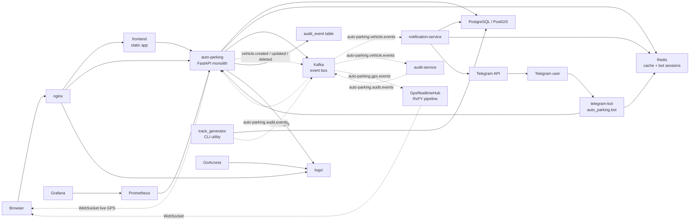
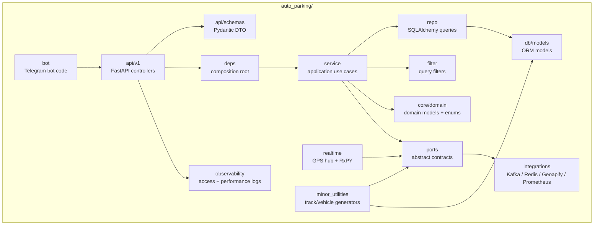
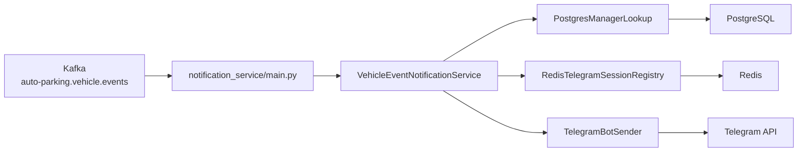
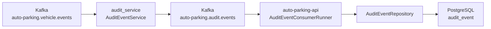

# Структура проекта Auto Parking

Документ фиксирует актуальную архитектуру проекта: основной FastAPI-монолит, отдельные процессы и микросервисы, Kafka/Redis/PostgreSQL, frontend, мониторинг и границы слоев.

## Общая Картина



Ключевые решения:

1. Основной бизнес-код живет в `auto_parking/`. Это монолит с FastAPI API, сервисным слоем, репозиториями, SQLAlchemy-моделями и инфраструктурными адаптерами.
2. Основной `docker-compose.yaml` сейчас заточен под Kafka: `auto-parking`, `telegram-bot`, `notification-service` и `audit-service` ждут `kafka` через `depends_on: condition: service_healthy`.
3. Redis остается обязательной инфраструктурой для cache и Telegram login registry. Также есть Redis-адаптер event bus, но текущая compose-сборка использует Kafka по умолчанию.
4. `notification-service` и `audit-service` являются отдельными top-level микросервисами, а не пакетами внутри монолита.
5. `telegram-bot` запускается отдельным процессом, но кодово остается внутри пакета `auto_parking.bot` и ходит в основной API по HTTP.
6. `audit-service` не пишет в БД. Он читает vehicle events и публикует audit events обратно в Kafka. Основной API читает audit topic и сам сохраняет `audit_event`.

## Корень Проекта

```text
auto_parking/          основной FastAPI-монолит
notification_service/ отдельный микросервис Telegram-уведомлений
audit_service/        отдельный микросервис маршрутизации audit-событий
frontend/             статический frontend
nginx/                reverse proxy config
alembic/              миграции PostgreSQL/PostGIS
monitoring/           Prometheus, Grafana, GoAccess
load_tests/           Locust-сценарии нагрузочного тестирования
logs/                 локальные access/performance отчеты
tests/                controller и unit tests
```

Служебные каталоги `.agents/`, `.codex/`, `.idea/`, `.pytest_cache/`, `.ruff_cache/` не относятся к runtime-архитектуре приложения.

## Основной Монолит



Слои монолита:

```text
auto_parking/api/              HTTP/WebSocket routes и Pydantic schemas
auto_parking/service/          бизнес-сценарии и orchestration
auto_parking/repo/             SQLAlchemy-запросы, фильтры, relation loading
auto_parking/db/               engine, session, ORM-модели, SQLAdmin
auto_parking/deps/             сборка зависимостей FastAPI и фоновых consumers
auto_parking/ports/            протоколы внешних зависимостей
auto_parking/integrations/     конкретные Redis/Kafka/Geoapify/Prometheus адаптеры
auto_parking/realtime/         live GPS consumer, RxPY pipeline, WebSocket broadcast
auto_parking/bot/              Telegram bot process, использует HTTP API
auto_parking/minor_utilities/  CLI-утилиты генерации машин и GPS-треков
auto_parking/observability/    access/performance logging
```

Главное правило: контроллеры не ходят напрямую в БД, репозитории не знают про FastAPI, внешняя инфраструктура подключается через `ports` и `integrations`.

## Микросервисы

Оба микросервиса используют упрощенную структуру, похожую на монолит, но без HTTP/API слоя:

```text
<service_name>/
  core/          настройки
  ports/         протоколы внешних возможностей
  integrations/  Kafka/Redis/PostgreSQL/Telegram адаптеры
  service/       прикладная логика обработки событий
  main.py        composition root и запуск consumer-а
  Dockerfile     отдельный image
```

### notification_service



Назначение:

1. Читает `auto-parking.vehicle.events`.
2. Находит менеджеров предприятия через PostgreSQL.
3. Берет `telegram chat_id` из Redis login registry.
4. Отправляет Telegram-сообщения залогиненным менеджерам.

Важно: `notification_service` не импортирует сервисы и репозитории монолита. Его `service/` зависит от `ports/`, а конкретные клиенты подключаются в `main.py`.

### audit_service



Назначение:

1. Читает `auto-parking.vehicle.events`.
2. Публикует события в `auto-parking.audit.events`.
3. Не подключается к PostgreSQL.
4. БД аудита заполняет только основной API через `AuditEventConsumerRunner`.

## Event Bus

Общий контракт событий находится в `auto_parking/ports/events.py`:

```text
EventEnvelope
EventProducer
EventConsumer
```

Основные topics:

```text
auto-parking.vehicle.events  CRUD-события машин
auto-parking.audit.events    события, которые основной API сохраняет в audit_event
auto-parking.gps.events      live GPS-точки от генератора
```

Kafka consumer groups:

```text
auto-parking-notification-service
auto-parking-audit-service
auto-parking-api-audit-writer
auto-parking-gps-live-<pid>-<uuid>
```

Для live GPS используется уникальная consumer group на процесс API, чтобы каждый worker получил событие и смог отправить его своим WebSocket-клиентам.

Redis-адаптер event bus оставлен как кодовая возможность: при `EVENT_BUS_BACKEND=redis` используются те же `EventProducer/EventConsumer`, но без Kafka partition key, consumer groups и offsets. Основной Docker Compose при этом сейчас ориентирован на Kafka.

## Потоки Событий

CRUD машин:

```text
HTTP request
-> VehicleService.create/update/delete
-> PostgreSQL commit
-> EventProducer
-> Kafka topic auto-parking.vehicle.events
-> notification-service
-> audit-service
```

Audit:

```text
audit-service
-> Kafka topic auto-parking.audit.events
-> auto-parking-api AuditEventConsumerRunner
-> AuditEventService
-> AuditEventRepository
-> PostgreSQL audit_event
```

Live GPS:

```text
track_generator
-> PostgreSQL vehicle_gps_point / trip
-> EventProducer
-> Kafka topic auto-parking.gps.events
-> GpsRealtimeHub
-> RxPY filter/map/deduplicate pipeline
-> WebSocket clients
```

Telegram notification:

```text
Telegram /login
-> telegram-bot
-> auto-parking API auth
-> Redis bot login registry

vehicle event
-> notification-service
-> PostgreSQL manager lookup
-> Redis chat lookup
-> Telegram API
```

## Docker Compose

Текущий `docker-compose.yaml` отражает Kafka-first режим:

```text
auto-parking          depends_on db, redis, kafka
telegram-bot          depends_on db, redis, kafka, auto-parking
notification-service  depends_on db, redis, kafka
audit-service         depends_on redis, kafka
```

`EVENT_BUS_BACKEND` по умолчанию равен `kafka`, а `KAFKA_BOOTSTRAP_SERVERS` по умолчанию равен `kafka:9092`.

Базовый запуск:

```bash
docker compose up -d --build kafka auto-parking nginx frontend
```

С ботом и уведомлениями:

```bash
docker compose --profile bot --profile notifications up -d --build kafka telegram-bot notification-service
```

С audit-service:

```bash
docker compose --profile audit up -d --build kafka audit-service
```

## Frontend И Наблюдаемость

`frontend/app` содержит статический интерфейс. Он обращается к backend только через публичный REST/WebSocket API.

```text
frontend/app/js/api/       HTTP-клиент
frontend/app/js/app/       сборка экранов и состояние
frontend/app/js/features/  отдельные фичи
frontend/app/js/ui/        общие UI-компоненты
```

Наблюдаемость:

```text
auto_parking/observability/  access/performance logging
monitoring/prometheus.yml    Prometheus scrape config
monitoring/grafana/          Grafana dashboards/provisioning
monitoring/goaccess/         GoAccess configs
logs/                        локальные access/performance отчеты
load_tests/locustfile.py     нагрузочные сценарии
```

## Правила Для Новых Изменений

1. HTTP/WebSocket-слой держать тонким.
2. Бизнес-логику размещать в `service`.
3. SQL, фильтрацию и relation loading держать в `repo`.
4. Внешнюю инфраструктуру подключать через `ports` и `integrations`.
5. Для событий использовать общий `EventEnvelope` и абстракции `EventProducer/EventConsumer`.
6. Микросервисы не должны импортировать `auto_parking.repo`, `auto_parking.service` и FastAPI-контроллеры монолита.
7. Агентские и IDE-служебные файлы не считать частью runtime-структуры проекта.
